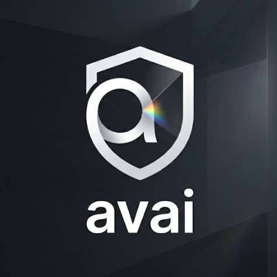
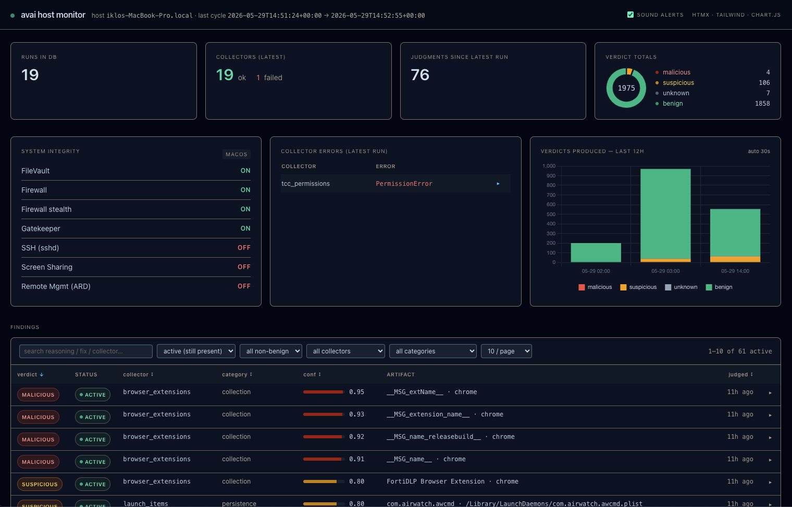
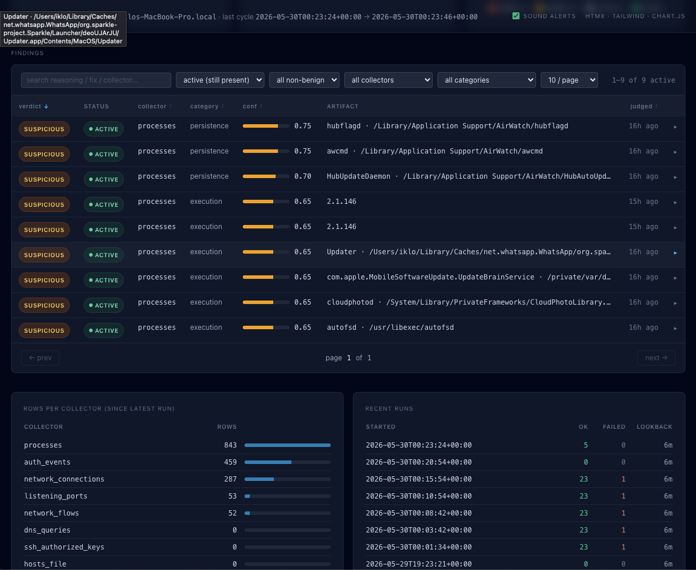
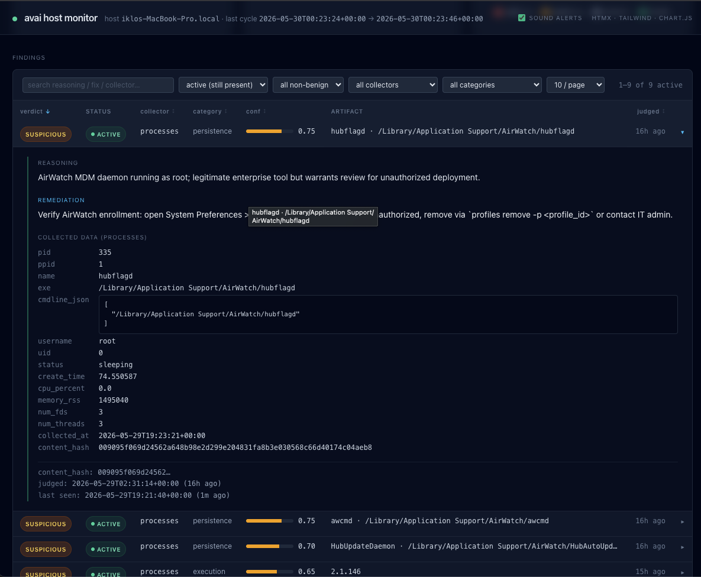
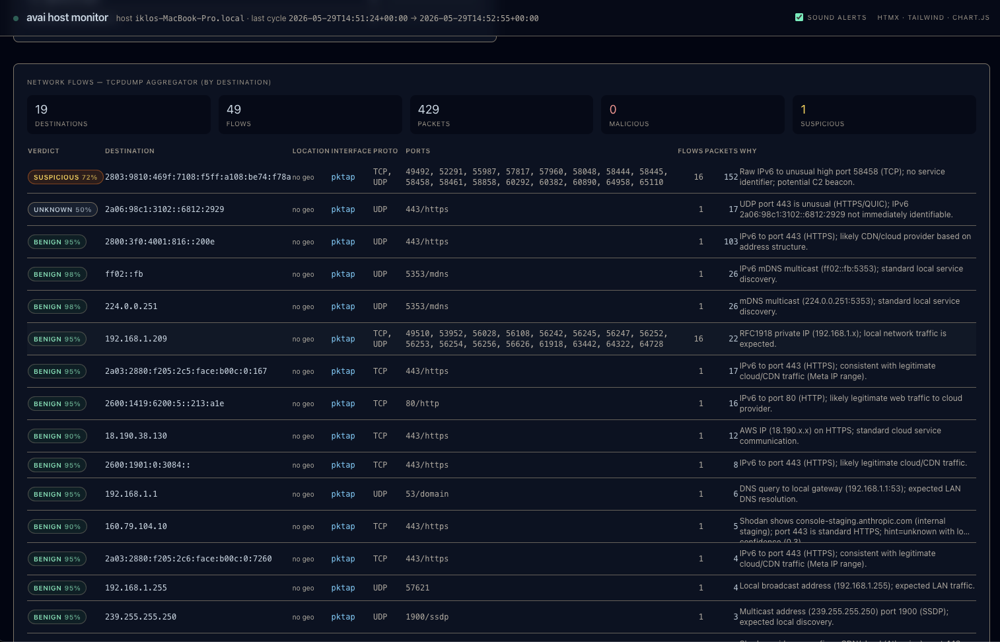
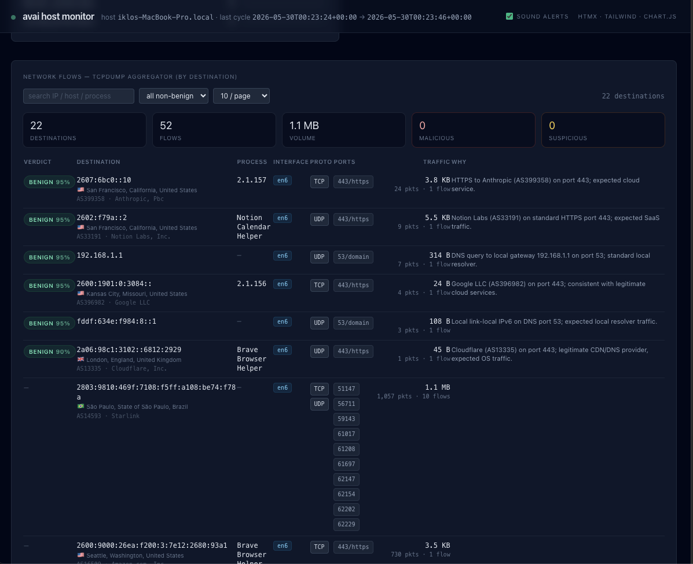
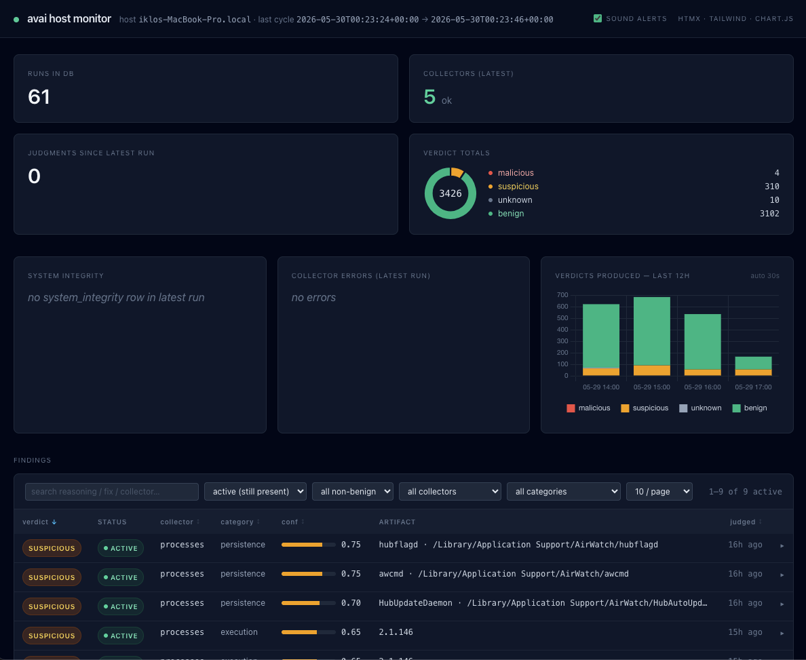

<p align="center">
  
</p>

<h1 align="center">avai</h1>

> **Know what's actually running on your machines.**
> Open-source host telemetry + LLM threat classifier. One `docker run`.

[](https://pypi.org/project/avai-monitor/)
[](https://hub.docker.com/r/iklob1/avai)
[](LICENSE)
[](https://getavai.com)

`avai` snapshots 26 corners of your host on macOS (21 on Linux) —
processes, USB, persistence, file integrity, browser extensions, exec
events — enriches each new finding with up to **17 threat-intel
sources** (VirusTotal, MalwareBazaar, URLhaus, CISA KEV, Shodan,
AbuseIPDB, OSV, NVD, …), and lets a Claude-class LLM tell you which
ones are worth caring about. Verdicts come back as
**malicious** / **suspicious** / **unknown** / **benign** with a
MITRE-aligned category, a confidence, and a one-line remediation.

- No agent contract, no SIEM, no cloud control plane.
- Dedup by content hash — the same artifact is never sent to the LLM twice.
- 17 plug-and-play threat-intel sources behind the LLM — see [`.env.example`](.env.example); missing keys disable a source cleanly.
- Read-only Flask + HTMX + Chart.js dashboard on `:8765`.
- BYO key (`ANTHROPIC_API_KEY` / `CLAUDE_CODE_OAUTH_TOKEN`), or swap to any litellm-supported provider.

→ Marketing site & screenshots: **<https://getavai.com>**
→ Source: <https://github.com/iklobato/avai>

---

## Screenshots

A read-only Flask + HTMX + Chart.js dashboard on `:8765`. Every panel renders
from the same SQLite snapshot the monitor writes — no separate control plane.

### Dashboard — overview

At-a-glance health: runs stored, collectors in the latest cycle (with any
failures), judgments since the last run, and the verdict-totals donut
(malicious / suspicious / unknown / benign). The macOS **System Integrity** panel
surfaces FileVault, Firewall, Gatekeeper and remote-access toggles; **Collector
Errors** shows what failed (e.g. a TCC permission); and the 12-hour chart tracks
verdicts over time. The findings table below streams the active, non-benign
results.



### Findings, collectors & runs

The findings table is filterable by status, verdict, collector and category.
Beneath it, **Rows per collector** shows how much each collector pulled in the
latest run, and **Recent runs** lists run history with ok/failed counts and the
look-back window.



### Finding detail

Expand any finding to see the LLM's **reasoning**, a concrete **remediation**
step, and the exact **collected data** behind the verdict — for a process that
means pid/ppid, the full `cmdline`, the running user/uid, status, the content
hash used for dedup, and when it was first judged vs. last seen.



### Network flows

The tcpdump aggregator groups traffic by destination so the classifier can reason
about it: here an IPv6 connection to an unusual high port is flagged
**suspicious** as a possible C2 beacon, while CDN, mDNS and LAN traffic come back
**benign** — each with a one-line "why".



### Network flows — enriched

The same view enriched per destination with the owning **process**, ASN/geo,
traffic volume, and the rationale for each verdict.



### The same dashboard, another host

Run against a different host/cycle — 61 runs and 3,426 verdicts here — with
suspicious AirWatch/MDM persistence surfaced for review.



---

## One image, two roles

| Run | Command | Where it makes sense |
|---|---|---|
| Dashboard (default) | `docker run iklob1/avai` | any host — read-only Flask + HTMX on :8765 |
| Monitor | `docker run ... iklob1/avai avai monitor ...` | **Linux hosts only** — needs `pid=host`, `network=host`, and host filesystem bind-mounts |

The image's default `CMD` is the dashboard. Override the command at
`docker run` / compose level to run the monitor instead. Native install
is also possible (`pip install avai-monitor`, then `avai monitor` /
`avai dashboard`) but is not the documented path.

The image carries a `HEALTHCHECK` against the dashboard's
`/api/notifications/new` endpoint — `starting → healthy` in ~10 s on
first launch. `docker compose ps` and `docker inspect --format
'{{.State.Health.Status}}'` will both reflect it.

---

## TL;DR — 60-second test, no LLM key

A safe first run on any host (macOS or Linux), no privileges, no
credentials, no host bind-mounts. Produces a populated DB and a
green dashboard you can poke at.

```sh
mkdir -p ~/.avai && cd ~/.avai

# 1. populate the DB with one snapshot of the container's view
docker run --rm -v "$PWD":/data iklob1/avai \
  avai monitor --once --no-streaming --no-judge --db /data/avai.db

# 2. serve it
docker run -d --name avai -p 8765:8765 -v "$PWD":/data iklob1/avai

open http://localhost:8765/      # macOS;  xdg-open on Linux
```

You'll see ~14 collectors' worth of rows (`processes`,
`network_connections`, `listening_ports`, `network_interfaces`,
`usb_devices`, `launch_items`, `installed_apps`, `mounts`,
`setuid_files`, etc.) — read off the container itself rather than the
host, since the run above doesn't bind-mount host state. To get real
data, jump to §2 / §3 below.

Stop with `docker stop avai && docker rm avai`.

---

## 1 — Dashboard only (any host, including macOS)

The dashboard reads a SQLite database written by the monitor (or by a
previous run). It needs no privileges, no host namespace, no
capabilities — just a directory containing `avai.db` mounted at `/data`.

```sh
mkdir -p ~/.avai && cd ~/.avai

docker run -d \
  --name avai-dashboard \
  -p 8765:8765 \
  -v "$PWD":/data \
  iklob1/avai

open http://localhost:8765/
```

If the database file doesn't exist yet, the dashboard creates an
empty schema on launch and every panel renders empty until the
monitor produces rows. Stop with `docker stop avai-dashboard &&
docker rm avai-dashboard`.

### Override port or DB path

```sh
docker run --rm -p 9000:9000 \
  -v /var/lib/avai:/data \
  iklob1/avai \
  avai dashboard --host 0.0.0.0 --port 9000 --db /data/custom.db
```

The image entry point is `avai`; anything after the image name is
passed to it.

---

## 2 — Monitor: one-shot scan (Linux host)

A single cycle on the local Linux host. No streaming, no LLM judge —
fast smoke test that the bind mounts are wired right.

```sh
mkdir -p ~/.avai && cd ~/.avai

docker run --rm \
  --pid=host \
  --network=host \
  --user 0:0 \
  --cap-add SYS_PTRACE --cap-add NET_ADMIN --cap-add NET_RAW --cap-add DAC_READ_SEARCH \
  -e HOST_PREFIX=/host \
  -v /proc:/host/proc:ro \
  -v /sys:/host/sys:ro \
  -v /etc:/host/etc:ro \
  -v /var/lib/bluetooth:/host/var/lib/bluetooth:ro \
  -v /var/lib/dpkg:/host/var/lib/dpkg:ro \
  -v /usr/share/applications:/host/usr/share/applications:ro \
  -v /lib/systemd:/host/lib/systemd:ro \
  -v /usr/lib/systemd:/host/usr/lib/systemd:ro \
  -v /run/systemd:/run/systemd:ro \
  -v /run/dbus:/run/dbus:ro \
  -v /etc/machine-id:/etc/machine-id:ro \
  -v /dev/mapper:/dev/mapper:ro \
  -v /home:/host/home:ro \
  -v /root:/host/root:ro \
  -v "$PWD":/data \
  iklob1/avai \
  avai monitor --once --no-streaming --no-judge --db /data/avai.db
```

When the command exits, `~/.avai/avai.db` contains one
`collection_runs` row plus the populated collector tables. Verify:

```sh
docker run --rm -v "$PWD":/data iklob1/avai python -c "
import sqlite3
c = sqlite3.connect('/data/avai.db')
for n, in c.execute(\"select name from sqlite_master where type='table'\"):
    print(f'{n:<22} {c.execute(f\"select count(*) from {n}\").fetchone()[0]}')"
```

To smoke-test on macOS without the bind-mounts (no host data, but
proves the toolchain works) see §0 above.

---

## 3 — Monitor: continuous, with LLM judge (Linux host)

Same bind mounts as §2 but detached, with the LLM judge enabled. The
judge needs one credential — either `ANTHROPIC_API_KEY` (standard
Anthropic API) or `CLAUDE_CODE_OAUTH_TOKEN` (Claude Code OAuth) — and
defaults to **Claude Haiku 4.5** (`claude-haiku-4-5-20251001`).
Override with `--judge-model` to point litellm at any other provider.

Threat-intel enrichment runs automatically with whatever keys are in
the environment (`VT_API_KEY`, `ABUSE_CH_AUTH_KEY`, `ABUSEIPDB_API_KEY`,
…). Easiest pattern is a project-local `.env`:

```sh
cp .env.example .env  &&  vi .env       # fill in only the keys you have
docker run -d --env-file .env --name avai-monitor ... iklob1/avai
```

See **§ Threat-intel enrichment** below for the full source list and
each source's gate condition.

```sh
mkdir -p ~/.avai && cd ~/.avai

docker run -d --name avai-monitor --restart unless-stopped \
  --pid=host --network=host --user 0:0 \
  --cap-add SYS_PTRACE --cap-add NET_ADMIN --cap-add NET_RAW --cap-add DAC_READ_SEARCH \
  -e HOST_PREFIX=/host \
  -e DBUS_SYSTEM_BUS_ADDRESS=unix:path=/run/dbus/system_bus_socket \
  -e ANTHROPIC_API_KEY \
  -v /proc:/host/proc:ro -v /sys:/host/sys:ro -v /etc:/host/etc:ro \
  -v /var/lib/bluetooth:/host/var/lib/bluetooth:ro \
  -v /var/lib/dpkg:/host/var/lib/dpkg:ro \
  -v /usr/share/applications:/host/usr/share/applications:ro \
  -v /lib/systemd:/host/lib/systemd:ro \
  -v /usr/lib/systemd:/host/usr/lib/systemd:ro \
  -v /var/log/journal:/host/var/log/journal:ro \
  -v /var/spool/cron:/host/var/spool/cron:ro \
  -v /run/systemd:/run/systemd:ro -v /run/dbus:/run/dbus:ro \
  -v /etc/machine-id:/etc/machine-id:ro \
  -v /dev/mapper:/dev/mapper:ro \
  -v /home:/host/home:ro -v /root:/host/root:ro \
  -v "$PWD":/data \
  iklob1/avai \
  avai monitor --db /data/avai.db --interval 300

docker logs -f avai-monitor      # watch the cycle
```

Defaults baked into `avai monitor`:

| Flag | Default | Effect |
|---|---|---|
| `--interval` | `300` | seconds between snapshot cycles |
| `--lookback-min` | `6` | minutes of journal/log history per run |
| `--max-db-mb` | `1024` | rotation cap (0 disables); oldest runs are pruned + `VACUUM`'d after each cycle |
| `--judge-model` | `claude-haiku-4-5-20251001` | any litellm model id |
| `--judge-batch-size` | `20` | entries per LLM call |
| `--judge-max-per-collector` | `25` | per-cycle cap of new entries judged per collector |
| `--no-streaming` | (off) | disables `auth_events` + `process_exec_events` tailers |
| `--no-judge` | (off) | runs collectors but stores no verdicts |
| `--no-enrich` | (off) | skips the whole threat-intel layer; collectors → judge directly |
| `--enrich-only NAME` | (all) | restrict the chain to one named source (repeatable); useful for debugging |

Append any flag to the `docker run … iklob1/avai avai monitor …`
command to override. Full reference: `docker run --rm iklob1/avai
avai monitor --help`.

---

## 4 — Both services with docker-compose (Linux host)

`docker-compose.yml`:

```yaml
x-avai-image: &avai-image
  image: iklob1/avai:latest

services:

  monitor:
    <<: *avai-image
    container_name: avai-monitor
    command: ["avai","monitor","--db","/data/avai.db","--interval","300"]
    user: "0:0"
    pid: host
    network_mode: host
    cap_add: [SYS_PTRACE, NET_ADMIN, NET_RAW, DAC_READ_SEARCH]
    # Loads LLM-judge + every threat-intel API key from .env. Copy
    # .env.example to .env and fill in only the keys you have.
    env_file: [.env]
    environment:
      - HOST_PREFIX=/host
      - DBUS_SYSTEM_BUS_ADDRESS=unix:path=/run/dbus/system_bus_socket
    volumes:
      - ./data:/data
      - /proc:/host/proc:ro
      - /sys:/host/sys:ro
      - /etc:/host/etc:ro
      - /var/lib/bluetooth:/host/var/lib/bluetooth:ro
      - /var/lib/dpkg:/host/var/lib/dpkg:ro
      - /usr/share/applications:/host/usr/share/applications:ro
      - /lib/systemd:/host/lib/systemd:ro
      - /usr/lib/systemd:/host/usr/lib/systemd:ro
      - /var/log/journal:/host/var/log/journal:ro
      - /var/spool/cron:/host/var/spool/cron:ro
      - /run/systemd:/run/systemd:ro
      - /run/dbus:/run/dbus:ro
      - /etc/machine-id:/etc/machine-id:ro
      - /dev/mapper:/dev/mapper:ro
      - /home:/host/home:ro
      - /root:/host/root:ro
    restart: unless-stopped

  dashboard:
    <<: *avai-image
    container_name: avai-dashboard
    # uses the image's default CMD
    ports: ["8765:8765"]
    volumes: ["./data:/data"]
    restart: unless-stopped
```

Then:

```sh
mkdir -p data
cp .env.example .env  &&  vi .env       # fill in the keys you have
docker compose up -d
docker compose logs -f monitor
open http://localhost:8765/
```

---

## 5 — Dashboard against an existing DB (any host)

If you already have an `avai.db` (produced by the monitor on a
different machine, dropped into the current directory, etc.):

```sh
docker run --rm -p 8765:8765 -v "$PWD":/data iklob1/avai
```

The dashboard opens the file with `?mode=ro&immutable=1`, so it never
writes and never holds a lock — fine to point at a live database
being written by the monitor in another container.

---

## 6 — Common operational commands

```sh
# Inspect the bundled CLI
docker run --rm iklob1/avai avai --help
docker run --rm iklob1/avai avai monitor --help
docker run --rm iklob1/avai avai dashboard --help
docker run --rm iklob1/avai avai --version

# Healthcheck + status
docker inspect avai-dashboard --format '{{.State.Health.Status}}'   # healthy|unhealthy|starting
docker compose ps                                                   # if using compose
docker logs -f avai-monitor                                         # follow monitor cycles

# DB rotation in action — watch the size cap kick in
docker exec avai-monitor du -h /data/avai.db

# Stop / clean up
docker compose down                                                  # if using compose
docker stop avai-dashboard avai-monitor 2>/dev/null
docker rm   avai-dashboard avai-monitor 2>/dev/null

# Wipe the database (also wipes verdicts; monitor will re-judge from scratch)
rm -f data/avai.db data/avai.db-wal data/avai.db-shm

# Pull the latest image
docker pull iklob1/avai
```

---

## 7 — Recipes

Practical, copy‑paste scenarios beyond the basics above.

### Native install on a Linux server (full host visibility)

Inside a container on a real Linux host the monitor already works, but
the simplest way to watch a server is to install it natively and let
it see everything directly:

```sh
pip install 'avai-monitor[judge]'          # [judge] pulls litellm + anthropic
export ANTHROPIC_API_KEY=sk-ant-...         # or CLAUDE_CODE_OAUTH_TOKEN
export ABUSE_CH_AUTH_KEY=...                # optional, free — adds 3 sources

sudo -E avai monitor --db /var/lib/avai/avai.db --interval 300 &
avai dashboard --db /var/lib/avai/avai.db --host 0.0.0.0 --port 8765
```

`sudo` lets the collectors read root‑owned state (`/etc/shadow`,
other users' crontabs, every process). `-E` preserves your API keys
across the sudo boundary.

### Keep it running with systemd

`/etc/systemd/system/avai.service`:

```ini
[Unit]
Description=avai host monitor
After=network-online.target

[Service]
Environment=ANTHROPIC_API_KEY=sk-ant-...
Environment=ABUSE_CH_AUTH_KEY=...
ExecStart=/usr/local/bin/avai monitor --db /var/lib/avai/avai.db --interval 300
Restart=always
User=root

[Install]
WantedBy=multi-user.target
```

```sh
sudo systemctl enable --now avai
journalctl -u avai -f          # watch cycles
```

### Read findings straight from the command line (no dashboard)

Everything lives in one SQLite file, so you can query it directly —
handy for scripting, cron mail, or a server with no browser:

```sh
# The active dangerous + suspicious findings, newest first
sqlite3 -box /var/lib/avai/avai.db "
  SELECT verdict, collector, substr(reasoning,1,60) AS why
  FROM judgements
  WHERE verdict IN ('malicious','suspicious')
  ORDER BY created_at DESC LIMIT 20;"

# Count by verdict
sqlite3 /var/lib/avai/avai.db \
  "SELECT verdict, count(*) FROM judgements GROUP BY verdict;"

# What did the threat-intel sources say?
sqlite3 -box /var/lib/avai/avai.db "
  SELECT source, verdict_hint, substr(summary,1,70)
  FROM enrichment_evidence
  WHERE verdict_hint IN ('malicious','suspicious');"
```

### Run a one‑shot scan from cron (instead of the always‑on daemon)

```sh
# /etc/cron.d/avai — scan once an hour, no streaming
0 * * * * root ANTHROPIC_API_KEY=sk-ant-... \
  avai monitor --once --no-streaming --db /var/lib/avai/avai.db
```

### Split setup: monitor on the server, dashboard on your laptop

The monitor writes the DB; the dashboard only reads it. Sync the file
(rsync/scp/NFS) and view it anywhere:

```sh
# on the server (writer)
avai monitor --db /var/lib/avai/avai.db --interval 300

# pull it to your laptop and view (reader — any OS, no privileges)
scp server:/var/lib/avai/avai.db ./avai.db
docker run --rm -p 8765:8765 -v "$PWD":/data iklob1/avai
```

### Keep LLM cost low

```sh
avai monitor \
  --judge-model claude-haiku-4-5-20251001 \   # cheapest tier (default)
  --judge-max-per-collector 20 \              # cap new items judged per cycle
  --judge-batch-size 20                        # entries per API call
```

Cost is near‑zero in steady state anyway — only *new* artifacts are
judged, and threat‑intel verdicts are cached, so quiet hosts make
almost no API calls after the first cycle.

### Turn enrichment on/off and debug one source

```sh
avai monitor --no-enrich                       # collectors + judge only
avai monitor --enrich-only cisa_kev            # just this source (repeatable)
avai monitor --enrich-only virustotal --enrich-only abuseipdb
```

Source names: `malware_bazaar` `urlhaus` `threatfox` `circl_hashlookup`
`shodan_internetdb` `feodo_tracker` `osv` `cisa_kev` `nvd` `endoflife`
`crtsh` `virustotal` `abuseipdb` `greynoise` `safe_browsing`
`phishtank` `github_advisory`.

### Bring your own LLM provider

`--judge-model` is a [litellm](https://docs.litellm.ai/docs/providers)
model id, so any supported provider works:

```sh
avai monitor --judge-model gpt-4o-mini            # OpenAI (OPENAI_API_KEY)
avai monitor --judge-model ollama/llama3.1        # local, free, offline
avai monitor --judge-model gemini/gemini-1.5-pro  # Google
```

---

## What's collected (one-line summary)

Snapshot collectors (run every cycle, default 300s):

| Group | Sources |
|---|---|
| Processes / network | `processes`, `network_connections`, `listening_ports`, `network_interfaces` (psutil) |
| Hardware | `usb_devices` (/sys/bus/usb), `bluetooth_devices` (/var/lib/bluetooth), `wifi_state` (sysfs + `iw`) |
| Persistence | `launch_items` (systemd unit files + cron) |
| Files | `file_integrity` (passwd / shadow / sudoers / SSH config / dotfiles), `setuid_files`, `mounts` |
| Apps | `installed_apps` (dpkg-query + XDG `.desktop`), `browser_extensions` |
| Posture | `system_integrity` (SELinux / AppArmor / ufw / sshd / vnc / LUKS) |
| Posture (macOS only) | `tcc_permissions` (camera/mic/location/screen grants), `quarantine_events`, `mdm_profiles`, `kernel_extensions`, `system_extensions` |

Streaming collectors (events as they happen):

| Collector | Source |
|---|---|
| `auth_events` | `journalctl -f` (Linux) / macOS unified log (macOS), filtered to security-relevant subsystems. LLM-judged by unique `(process, subsystem, message)` pattern — each event template is classified once regardless of how many times it fires. |
| `process_exec_events` | `journalctl -f _AUDIT_TYPE_NAME=EXECVE` (needs auditd `auditctl -a always,exit -F arch=b64 -S execve` rule) |

For every entity collected (deduped by a content hash over the
collector's "judge fields"), the LLM judge classifies it as
`malicious` / `suspicious` / `unknown` / `benign` with a confidence,
MITRE-aligned category, and one-line remediation. Judgments are
persisted; the same artifact is never sent twice.

---

## Dashboard

The Flask + HTMX dashboard at `:8765` has full filter and pagination on every table:

- **Findings** — filter by verdict, collector, category, status (active/resolved), free-text search; sortable columns; configurable page size (10/25/50/100).
- **Network flows** — filter by verdict and IP/host/process search; summary stats (destinations, volume, malicious count).
- **Listening ports** — filter by verdict and bind scope (all interfaces / routable / loopback); process search.
- **DNS queries** — filter by verdict, resolution level (DoH / external DNS / local resolver), domain search.
- **Persistence** — SSH authorized keys, `/etc/hosts` mappings, and privilege config each with independent pagination.
- **Auth events** — aggregated by unique `(process, subsystem, message)` pattern with occurrence counts and last-seen timestamps. Filter by subsystem (TCC, securityd, syspolicy, loginwindow, Authorization) or verdict. Sort by count or verdict severity. LLM verdicts appear as patterns are classified.
- **TCC permissions** (macOS) — every app's camera, microphone, location, screen-recording, and full-disk-access grant/denial, with LLM verdict and auth-status filter.

All sections auto-refresh (30–60 s). Toast notifications + audio alert fire for new malicious/suspicious judgments.

---

## Threat-intel enrichment

Before each finding hits the LLM, avai extracts indicators (SHA256,
IPv4, domain, URL, CVE, package, OS version) and runs them through
external threat-intel APIs. The judge then sees the raw evidence
inline in the prompt, which dramatically tightens verdicts.

Every source is optional. Keyless ones always run. Keyed ones only
register if the env var below is set — see [`.env.example`](.env.example)
for a copy-paste template.

| Source | Indicator | Env var | Quota | What it adds |
|---|---|---|---|---|
| **MalwareBazaar** (abuse.ch) | SHA256/1/MD5 | `ABUSE_CH_AUTH_KEY` | unlimited | Known-malware family |
| **CIRCL hashlookup** (NSRL) | SHA256/1/MD5 | — | unlimited | Known-good vendor binary (whitelist) |
| **Shodan InternetDB** | IPv4 | — | 1 rps | Open ports, CVEs, tags |
| **URLhaus** (abuse.ch) | URL, domain | `ABUSE_CH_AUTH_KEY` | unlimited | Malware-distribution URLs |
| **Feodo Tracker** (abuse.ch) | IPv4 | — | unlimited | Botnet C2 IPs (cached feed) |
| **ThreatFox** (abuse.ch) | IPv4 / domain / URL / hash | `ABUSE_CH_AUTH_KEY` | unlimited | Mixed IOC search |
| **OSV.dev** | CVE, package | — | unlimited | Open-source advisories |
| **CISA KEV** | CVE | — | static feed | Actively-exploited CVEs |
| **NVD** | CVE | `NVD_API_KEY` (optional) | 5 → 50 / 30 s | CVSS + description |
| **crt.sh** | domain | — | gentle | Certificate transparency history |
| **endoflife.date** | OS version | — | unlimited | EOL'd OS / runtime |
| **VirusTotal** | SHA256/1/MD5, URL, domain, IPv4 | `VT_API_KEY` | 4/min, 500/day | Multi-engine reputation |
| **AbuseIPDB** | IPv4 | `ABUSEIPDB_API_KEY` | 1000/day | Abuse confidence score |
| **GreyNoise Community** | IPv4 | `GREYNOISE_API_KEY` | 50/day | "Is this IP just noise?" |
| **Google Safe Browsing** | URL | `GOOGLE_SAFE_BROWSING_API_KEY` | 10k/day | Phishing / malware verdict |
| **PhishTank** | URL | `PHISHTANK_API_KEY` | generous | Community phishing DB |
| **GitHub Advisory** | CVE | `GITHUB_TOKEN` | high | Curated advisories + fix versions |

Per-indicator results are cached in the same SQLite (`enrichment_evidence`
table) with a per-source TTL (6 h – 14 d). Fresh cache hits skip the
network entirely; the cache survives restarts.

Toggle with:

```sh
avai monitor                              # all enabled sources, default
avai monitor --no-enrich                  # collectors + judge, no external lookups
avai monitor --enrich-only malware_bazaar # debugging: only this one
```

---

## Why no macOS in this README

The monitor relies on Linux-native facilities — `pid=host` reaching
the host's `/proc`, sysfs at `/sys/bus/usb`, `journalctl` with
`auditd`, `systemctl is-active`, `dpkg-query`, `dmsetup` for LUKS.
Docker Desktop on macOS only exposes the Linux VM it ships with, not
the macOS host, so a containerised monitor on macOS reports on the VM
(empty/uninteresting) rather than the Mac. The dashboard role works
fine on macOS Docker — you'd just need to write the database from
somewhere else.

If you want full macOS coverage, install natively (`pip install
avai-monitor`) and run `avai monitor` with `sudo`. That's a separate
path not documented here.

---

## Development & tests

The suite is network-free and runs in seconds. The repo's dev Python
may carry plugin conflicts, so run it in a throwaway venv:

```sh
python3 -m venv /tmp/venv && /tmp/venv/bin/pip install -e . pytest
/tmp/venv/bin/python -m pytest tests/ -q       # 320+ unit tests
```

Coverage spans the enrichment framework and all 18 sources, the
indicator extractors, the HTTP client (rate limit / backoff / 429),
the CLI dispatcher, the SQLAlchemy repository + DB rotation, the LLM
judge's parsing, the dashboard endpoints, and the Linux collectors'
file parsing (systemd / cron / `.desktop` / BlueZ). Tests are written
to fail when the implementation breaks — verified by mutation testing,
not just coverage percentage.

Unattended Docker smoke test (builds the image, runs the CLI surface,
a cold collector pass, and the keyless-enrichment registry check):

```sh
tests/local.sh            # all phases; exits non-zero on any failure
```

See [`CHANGELOG.md`](CHANGELOG.md) for version history.

---

## License

MIT — see `LICENSE`.
