# avai — Architecture & Class/Flow Reference

A map of every class, function, and dependency in the codebase, plus the
runtime flows that connect them. Diagrams are [Mermaid](https://mermaid.js.org/)
(render on GitHub or any Mermaid viewer).

> **One-line model:** `avai` is a host-security telemetry engine. Collectors
> snapshot/stream host state → rows land in SQLite → optional threat-intel
> enrichment → an LLM judge classifies novel artifacts → a narrator + risk
> scorer summarise → a read-only Flask/HTMX dashboard renders it all.

---

## 1. Package layout

```
src/avai/
├── __init__.py            # __version__
├── cli.py                 # subcommand dispatcher (monitor | dashboard | migrate)
├── host_monitor/          # THE ENGINE (package): collectors, ORM, Sink, Judge, Runner
│   ├── __init__.py        #   facade — re-exports the full public API (see §3)
│   ├── constants.py · enums.py · shell.py · prompts.py · models.py
│   ├── risk.py · judge.py · narrator.py · sink.py
│   └── collectors.py · streaming.py · runner.py · main.py
├── dashboard/             # Flask + HTMX read-only UI (package)
│   ├── __init__.py        #   facade — re-exports app, query fns, CLI, Base
│   ├── queries.py         #   read-only DB query layer
│   ├── app.py             #   Flask app + config + Jinja filters + routes
│   └── serve.py           #   CLI launcher (waitress / dev server)
├── db_migrate.py          # programmatic Alembic runner
├── migrations/            # Alembic env + versioned migrations
└── enrichers/             # threat-intel enrichment subsystem
    ├── base.py            # Indicator, Evidence, Enricher(ABC), VerdictHint
    ├── http.py            # HttpClient + _TokenBucket (rate limiting)
    ├── cache.py           # EvidenceCache (DB-backed TTL cache)
    ├── chain.py           # EnrichmentChain (chain-of-responsibility)
    ├── registry.py        # auto-discovery + build_default_chain()
    ├── indicators.py      # IndicatorExtractor(ABC) + per-collector extractors
    └── sources/           # ~18 concrete Enricher subclasses (one file = one API)
```

### Module dependency graph

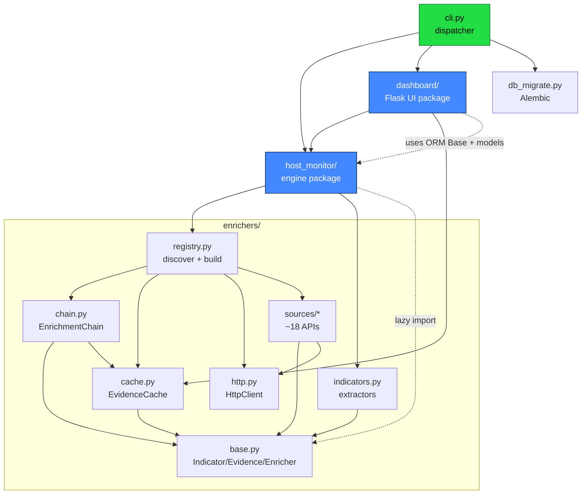

**Key dependency rules (enforced by convention):**
- No `sources/*` module imports another source — they depend only on `base` + `http`.
- `chain` and `registry` are the *only* things that know about every enricher.
- `dashboard` imports the ORM `Base` + models from `host_monitor` (single source of schema truth) but never runs collectors.
- `host_monitor` imports the enrichment chain **lazily** so `requests` stays out of the `--no-enrich` startup path.
- Within each package, submodule imports flow **one way only** (a strict layering), so there are no import cycles. Each package's `__init__.py` is a thin **facade** that re-exports the public API — callers still write `from avai.host_monitor import X` / `from avai.dashboard import Y` unchanged.

---

## 2. Entry points (`cli.py`)

| Function | Responsibility | Delegates to |
|---|---|---|
| `main(argv)` | Parse first token, route subcommand | below |
| `_print_usage(stream)` | Print top-level usage | — |

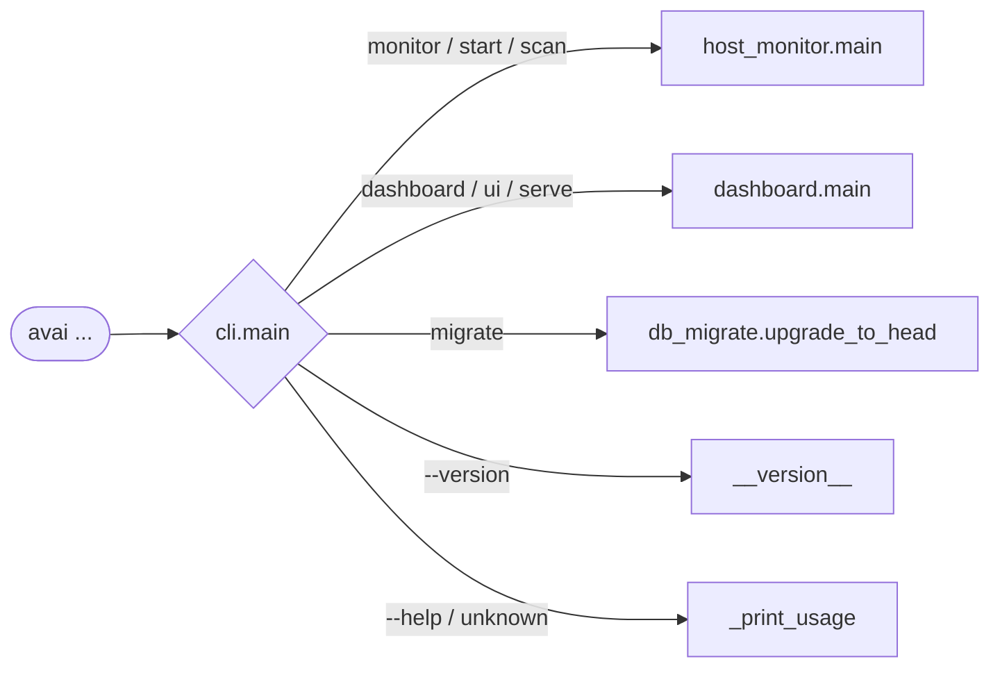

Each subcommand rewrites `sys.argv` and hands the *remaining* argv to the target `main()` unchanged — so `avai monitor --once` becomes `host_monitor.main()` seeing `["--once"]`.

---

## 3. `host_monitor/` — the engine

This package holds the entire collection/judging pipeline, split into focused
modules behind a facade `__init__.py`. The class diagrams and flows below are
organised by responsibility; the table maps each responsibility to its module.

| Module | Holds | §ref |
|---|---|---|
| `enums.py` | `Verdict`, `ThreatCategory`, `LaunchScope`, `Browser` | 3.2 |
| `constants.py` | defaults, pricing tables, `WATCHED_FILES`, `HOST_PREFIX`, … | 3.2 |
| `shell.py` | `run_json`/`run_ndjson`/`host_path`/`content_hash`/… helpers | 3.7 |
| `prompts.py` | `Prompts` (per-collector judge hints) | 3.2 |
| `models.py` | `Base`, `_RowBase`, all ORM row models | 3.5 |
| `risk.py` | `compute_risk_score`, `_risk_grade` | 3.4 |
| `judge.py` | `Judge`/`LlmJudge`/`CompletionClient`/`build_*`/`estimate_cost` | 3.3 |
| `narrator.py` | `IncidentNarrator`, `build_narrator` | 3.3 |
| `sink.py` | `Sink` (the DB gateway) | 3.6 |
| `collectors.py` | `Collector` bases, all collectors, browser readers, builders | 3.7 |
| `streaming.py` | `StreamingWorker` | 3.8 |
| `runner.py` | `Runner` (the orchestrator) | 3.9 |
| `main.py` | `main`, `_build_parser` | 3.10 |

Import layering (one-way, no cycles): `enums/constants/shell → prompts/models → risk/judge → narrator → sink → collectors → streaming → runner → main`.

### 3.1 Class hierarchy overview

```mermaid
classDiagram
    %% ---- LLM judging ----
    class Judge { <<ABC>> +judge(collector, hints, entries) }
    class NullJudge { +judge() returns [] }
    class LlmJudge { -client +judge() +_call() +_parse() +_batches() }
    Judge <|-- NullJudge
    Judge <|-- LlmJudge

    class CompletionClient { <<ABC>> +complete_structured() }
    class LitellmClient
    class AnthropicOAuthClient
    CompletionClient <|-- LitellmClient
    CompletionClient <|-- AnthropicOAuthClient
    LlmJudge --> CompletionClient : uses
    IncidentNarrator --> CompletionClient : uses

    class IncidentNarrator { +narrate(findings) +_clean_timeline() +_clean_actions() }

    %% ---- Collectors ----
    class Collector { <<ABC>> +name +model +judge_fields +table() }
    class SnapshotCollector { <<ABC>> +collect() }
    class StreamingCollector { <<ABC>> +stream(stop_event) }
    Collector <|-- SnapshotCollector
    Collector <|-- StreamingCollector
    SnapshotCollector <|-- ProcessCollector
    SnapshotCollector <|-- NetworkFlowsCollector
    SnapshotCollector <|-- DnsQueriesCollector
    SnapshotCollector <|-- LaunchItemsCollector
    SnapshotCollector <|-- ManyMore["…~20 more snapshot collectors"]
    StreamingCollector <|-- AuthEventsCollector
    StreamingCollector <|-- MacosProcessExecCollector
    StreamingCollector <|-- LinuxProcessExecCollector

    %% ---- Browser readers ----
    class BrowserExtensionReader { <<ABC>> +read(base, browser) }
    BrowserExtensionReader <|-- ChromiumExtensionReader
    BrowserExtensionReader <|-- FirefoxExtensionReader
    BrowserExtensionsCollector --> BrowserExtensionReader : uses

    %% ---- Orchestration ----
    class Runner { +run_once() +run_forever() +start_streaming() }
    class StreamingWorker { +start() +stop() -_run() -_flush() }
    class Sink { +setup() +write() +write_judgments() +correlation_context() +prune_to_size() }
    Runner --> Sink
    Runner --> Collector : drives
    Runner --> Judge : uses
    Runner --> IncidentNarrator : optional
    Runner --> StreamingWorker : supervises
    StreamingWorker --> StreamingCollector
    StreamingWorker --> Sink
```

### 3.2 Configuration & prompts

| Symbol | Kind | Responsibility |
|---|---|---|
| `Prompts` | class | Loads `prompts.toml`; `.load(path)` classmethod, `.hint_for(collector_name)` returns per-collector judge hint |
| `DEFAULT_DB_PATH` | const | `~/.avai/avai.db` |
| `DEFAULT_BASELINE_MIN_RUNS` | const | `12` — runs before host is "baselined" |
| `_CORRELATED_COLLECTOR` | const | `"processes"` — the only collector that gets PID-correlation |
| `WATCHED_FILES`, `WATCHED_FILES_LINUX`, `AUTH_LOG_PREDICATE` | const | OS-specific collection targets |

### 3.3 LLM judging subsystem

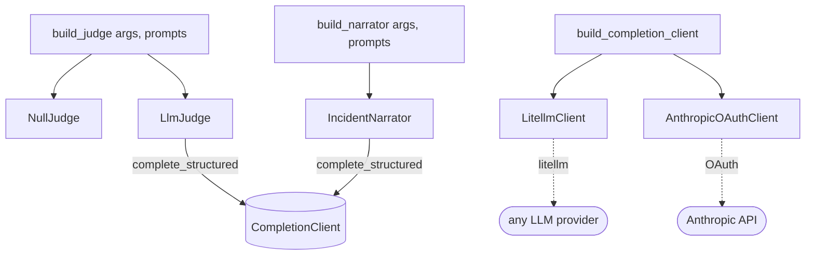

| Symbol | Responsibility |
|---|---|
| `Judge(ABC)` | Interface: `judge(collector, hints, entries) -> list[Judgment]` |
| `NullJudge` | No-op judge (returns `[]`) — used with `--no-judge` |
| `LlmJudge` | Batches unjudged entries, calls the LLM with a JSON schema, parses verdicts. Helpers: `_judgment_schema`, `_batches`, `_call`, `_parse`, `auth_mode` |
| `Judgment` | Dataclass (the in-flight verdict before it becomes a `Judgement` row): `content_hash`, `collector`, `verdict`, `category`, `confidence`, `reasoning`, `remediation`, `model`, `created_at`, `cost_usd` |
| `CompletionClient(ABC)` | Structured-output LLM interface |
| `LitellmClient` | Provider-agnostic via `litellm` |
| `AnthropicOAuthClient` | Direct Anthropic API via OAuth token |
| `build_completion_client()` | Picks client based on env/auth mode |
| `IncidentNarrator` | Second-stage LLM: turns active findings into a human incident digest (`narrate`, `_clean_timeline`, `_clean_actions`) |
| `estimate_cost(model, in, out)` | Token-cost calculator |

### 3.4 Risk scoring (deterministic, no LLM)

| Symbol | Responsibility |
|---|---|
| `compute_risk_score(...)` | Weighted penalty model over posture signals → score + breakdown. Inner helpers `penalise`, `is_off`, `is_on` |
| `_risk_grade(score)` | Maps numeric score → letter grade |

### 3.5 ORM data model (SQLAlchemy)

```mermaid
classDiagram
    class Base { <<DeclarativeBase>> }
    class _RowBase { <<ABC>> id, run_id, collected_at, content_hash }
    Base <|-- _RowBase

    %% run-level tables
    Base <|-- CollectionRun
    Base <|-- CollectorErrorRow
    Base <|-- Judgement
    Base <|-- IncidentNarrativeRow
    Base <|-- RiskScoreRow
    Base <|-- StreamingSession

    %% data row tables (each = one collector's output)
    _RowBase <|-- ProcessRow
    _RowBase <|-- NetworkConnectionRow
    _RowBase <|-- ListeningPortRow
    _RowBase <|-- NetworkFlowRow
    _RowBase <|-- NetworkInterfaceRow
    _RowBase <|-- DnsQueryRow
    _RowBase <|-- AuthEventRow
    _RowBase <|-- ProcessExecRow
    _RowBase <|-- LaunchItemRow
    _RowBase <|-- BrowserExtensionRow
    _RowBase <|-- SystemIntegrityRow
    _RowBase <|-- etc["…UsbDevice, Bluetooth, Wifi, Quarantine,<br/>FileIntegrity, InstalledApp, Mount, SetuidFile,<br/>MdmProfile, KernelExtension, SystemExtension,<br/>SshAuthorizedKey, HostsFile, PrivilegeConfig"]
```

- **`CollectionRun`** — one row per snapshot cycle (run_id, hostname, started/ended, ok/failed counts).
- **`Judgement`** — one LLM verdict, composite PK `(content_hash, collector)`; holds `verdict`/`category`/`confidence`/`reasoning`/`remediation`/`model`/`cost_usd`, `created_at` + `last_seen_at` (active-vs-resolved tracking), `novel` flag, and `context_json` (serialized baseline + related signals).
- **`_RowBase` subclasses** — the raw telemetry; `content_hash` over `judge_fields` is the dedup/identity key linking a row to its judgment.

### 3.6 Persistence — `Sink`

`Sink` wraps the SQLAlchemy `Engine` and is the **only** writer. Selected methods by category:

| Category | Methods |
|---|---|
| Lifecycle | `setup`, `start_run`, `end_run`, `start_streaming_session`, `end_streaming_session` |
| Writes | `write`, `write_error`, `write_judgments`, `write_narrative`, `write_risk_score`, `touch_judgments` |
| Unjudged selection | `unjudged`, `unjudged_all`, `_unjudged_select` |
| Baseline / novelty | `completed_run_count`, `nth_run_started_at`, `first_seen_map`, `prior_run_started_at` |
| Correlation | `correlation_context` (PID→ports/flows/conns/dns/exec for the `processes` collector) |
| Findings & posture | `active_findings`, `latest_narrative_finding_hashes`, `system_integrity_row`, `privilege_risk_counts`, `latest_risk_row` |
| Rotation | `database_size_bytes`, `database_live_bytes`, `prune_to_size` |

Module-level DB helpers: `_set_sqlite_pragmas` (WAL etc.), `_migrate_add_columns` (lightweight additive migration on startup).

### 3.7 Collectors

Two abstract bases:
- **`SnapshotCollector.collect() -> Iterable[dict]`** — point-in-time sweep, run every cycle.
- **`StreamingCollector.stream(stop_event) -> Iterable[dict]`** — long-lived tail of an OS event stream, run in a background thread.

Each collector declares `name`, `model` (its ORM row class), and `judge_fields` (which fields form the `content_hash`).

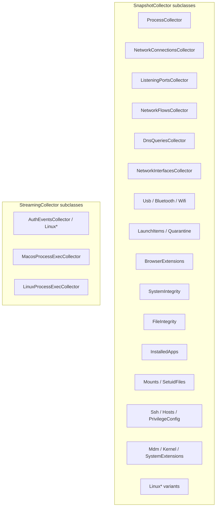

**OS dispatch** — builders pick the right set per platform:
- `_build_macos_snapshot_collectors(prompts)`
- `_build_linux_snapshot_collectors(prompts)`
- `build_snapshot_collectors(prompts)` → dispatches on platform
- `build_streaming_collectors(prompts)`

**Helper collectors / readers:**
- `ProcessConnectionResolver` — maps `(local_ip, port) → (pid, name)` for flow attribution.
- `BrowserExtensionReader(ABC)` → `ChromiumExtensionReader`, `FirefoxExtensionReader` (strategy pattern used by `BrowserExtensionsCollector`).

**Shell/parse utilities** (module-level, used across collectors): `run_json`, `run_ndjson`, `exit_code`, `service_loaded`, `process_running`, `sha256_file`, `read_plist`, `external_sqlite_rows`, `safe_psutil_connections`, `content_hash`, `coerce_enum`, `expand`, `host_path`, `host_paths_for_home`, `utcnow`, `jsonable`.

**Enums:** `Verdict`, `ThreatCategory`, `LaunchScope`, `Browser`.

### 3.8 Streaming worker

| Symbol | Responsibility |
|---|---|
| `StreamingWorker` | Wraps one `StreamingCollector` in a daemon thread. `start()` spawns the thread, `_run()` consumes `stream()` and buffers rows, `_flush()` writes batches to the `Sink`, `stop()` signals the stop event and joins |

### 3.9 Orchestration — `Runner`

`Runner` is the supervisor wiring every piece together.

| Method | Responsibility |
|---|---|
| `setup()` | `sink.setup()` (create tables, migrate) |
| `start_streaming()` / `stop_streaming()` | Spawn/join `StreamingWorker`s |
| `run_once()` | One full cycle (see flow below) |
| `run_forever(interval)` | Loop `run_once()` on a timer until shutdown |
| `request_shutdown()` | Idempotent stop flag (signal-handler safe) |
| `_host_baseline()` | Compute "how learned is this host" (established? cutoff?) |
| `_run_collector()` | Collect → write rows → enrich → annotate → judge → persist verdicts |
| `_enrich_entries()` | Attach threat-intel `evidence` to unjudged entries via the chain |
| `_annotate_baseline()` | Attach novelty signal (`first_seen` vs baseline cutoff) |
| `_attach_correlation()` | Attach PID-correlated behaviour to `processes` entries |
| `_judgment_context()` | Bundle baseline+related signals for persistence |
| `_judge_streaming_collectors()` | Judge rows produced by streaming threads |
| `_generate_narrative()` | Run `IncidentNarrator` over active findings |
| `_generate_risk_score()` | Run `compute_risk_score` + persist |
| `_risk_explanation()` | Human-readable risk delta text |

### 3.10 `main()` boot sequence

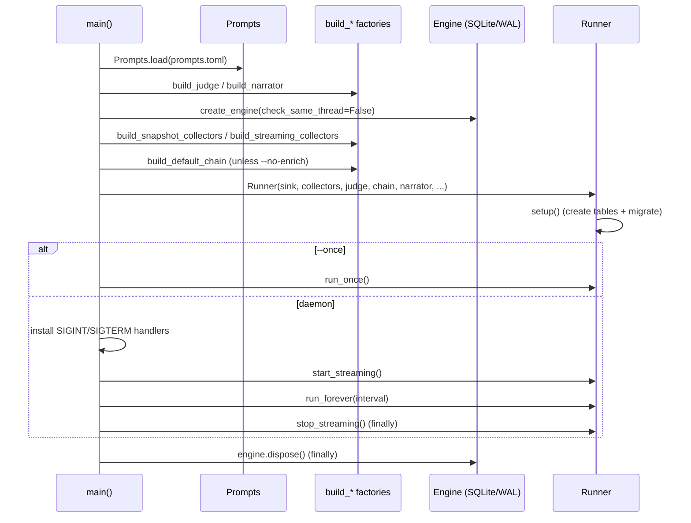

---

## 4. The collection cycle — `Runner.run_once()` in detail

This is the central flow. Each snapshot collector goes through collect → enrich → annotate → judge → persist; then streaming verdicts, narrative, and risk score close the cycle.

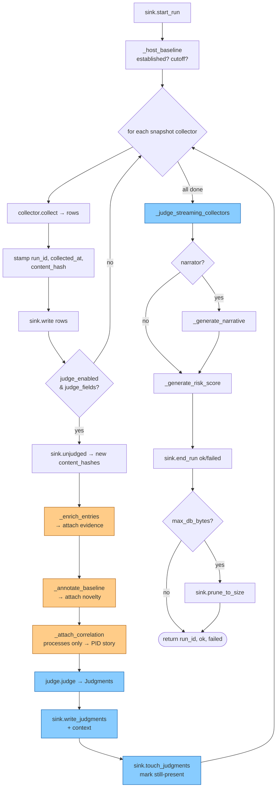

**Why this order matters:**
1. **Baseline first** — computed once per cycle so every collector shares the same novelty cutoff.
2. **Enrich before judge** — the LLM sees external threat-intel `evidence` alongside the raw row.
3. **Correlate `processes`** — a novel binary *beaconing to a flagged IP* is a far stronger signal than either row alone.
4. **`content_hash` dedup** — only *unjudged* (new) hashes hit the LLM, so steady-state cycles are cheap.
5. **`touch_judgments`** — updates `last_seen_at` so the dashboard can derive active vs resolved findings.

---

## 5. Enrichment subsystem (`enrichers/`)

Threat-intel lookups sit between collection and judging. Pluggable, auto-discovered, DB-cached, rate-limited.

### 5.1 Core abstractions (`base.py`)

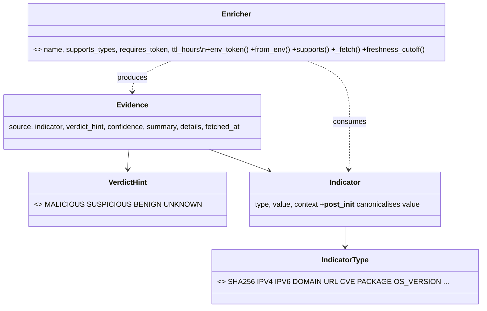

- `worst_hint(hints)` + `_HINT_PRIORITY` — aggregate conflicting hints to worst case (malicious wins).
- `EnricherError` / `RateLimitedError` — chain catches these per-source.

### 5.2 Supporting machinery

| Module | Symbol | Responsibility |
|---|---|---|
| `http.py` | `HttpClient` | Shared `requests` session, per-host rate limiting, timeouts, UA header. `get`/`post`/`set_rate`/`_request` |
| `http.py` | `_TokenBucket` | Per-host rate limiter (`take()` blocks until a token is free) |
| `cache.py` | `EvidenceCache` | DB-backed TTL cache. `get(enricher, indicator)` (fresh-only), `put(evidence)`, `for_indicator(indicator)` |
| `cache.py` | `register_schema(base_cls)` / `get_model` / `_register_model` / `_LazyModel` | Lazily binds the `enrichment_evidence` table to the host's `Base` |
| `cache.py` | `_evidence_from_row(row, indicator)` | Row → `Evidence` reconstruction |
| `chain.py` | `EnrichmentChain` | Chain-of-responsibility dispatcher (see below) |
| `registry.py` | `discover_enricher_classes()` | Walk `sources/`, return concrete `Enricher` subclasses (alphabetical, stable) |
| `registry.py` | `build_default_chain(engine, base_cls, enable=)` | Instantiate every env-gated enricher, wire shared `HttpClient` + `EvidenceCache` |

### 5.3 `EnrichmentChain.enrich()` flow

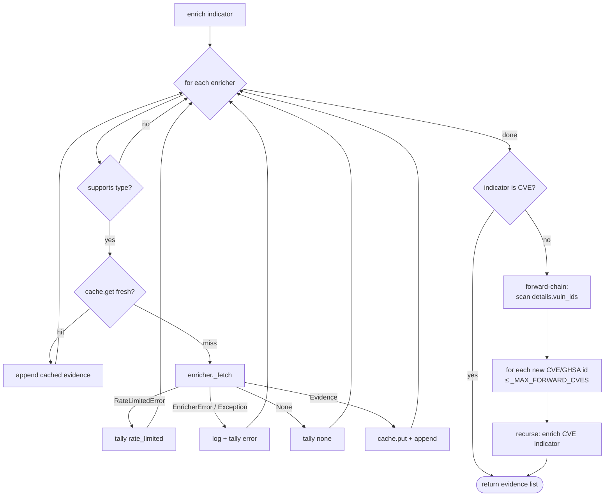

**Forward-chaining** is the clever bit: a `PACKAGE`/`OS_VERSION` lookup (e.g. OSV) reports `vuln_ids`; each discovered CVE is re-run so CVE-typed sources (NVD CVSS, CISA KEV, GitHub Advisory) enrich it. Bounded by `_MAX_FORWARD_CVES`.

### 5.4 Indicator extraction (`indicators.py`)

Turns a collector row into typed `Indicator`s. Strategy-per-collector via a dispatch table.

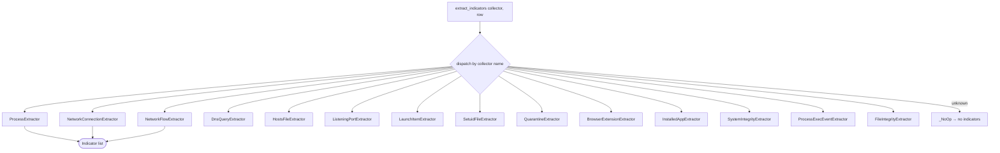

Helpers: `_is_ipv4`, `_is_ipv6`, `_is_private_ip`, `_is_domain`, `_safe_loads`, `_sha256_of_file`. All extractors subclass `IndicatorExtractor(ABC)`.

### 5.5 Concrete sources (`sources/`)

Each file = one external API, subclasses `Enricher`, implements `_fetch()`. Grouped by indicator type they serve:

| Indicator type | Sources |
|---|---|
| IP reputation | `abuseipdb`, `greynoise`, `shodan_internetdb`, `ipwhois_geo`, `feodo_tracker`, `threatfox` |
| File hashes | `virustotal`, `malware_bazaar`, `circl_hashlookup` |
| URLs / domains | `urlhaus`, `phishtank`, `safe_browsing`, `crtsh` |
| CVEs / packages | `nvd`, `osv`, `github_advisory`, `cisa_kev`, `endoflife` |

Adding a source = drop a file in `sources/` subclassing `Enricher`; the registry finds it automatically. No central list to edit.

---

## 6. Dashboard (`dashboard/`)

A **read-only** Flask + HTMX app. It opens the same SQLite DB, runs query functions, and renders Jinja partials. It never writes telemetry. Split into three modules behind a facade `__init__.py`:

| Module | Holds |
|---|---|
| `queries.py` | the read-only DB query layer + data-shaping helpers (`_engine`/`_session`, `latest_run`, `findings`, `network_flows`, …). Uses `current_app` for config — **no** dependency on the Flask `app` object or routing. |
| `app.py` | the Flask `app`, its config, Jinja template filters (`render_markdown`, `_relative_time`, …), and every `@app.route` handler. |
| `serve.py` | `main`, `_build_parser`, `_serve` (waitress/dev), `_ensure_db_exists`. |
| `__init__.py` | facade re-exporting `app`, the query functions, the CLI, and `Base`. |

Layering (one-way): `queries → app → serve`.

### 6.1 Structure

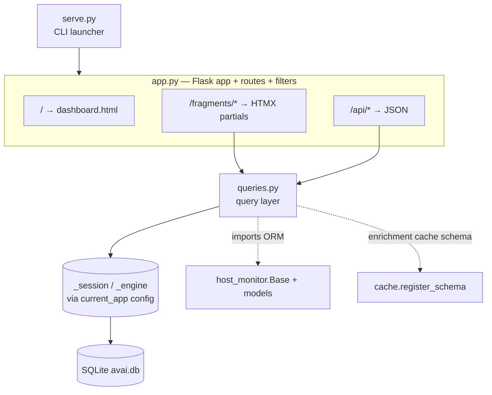

### 6.2 Routes → query functions

| Route | Renders | Backed by query fn(s) |
|---|---|---|
| `/` | `dashboard.html` shell | — |
| `/fragments/header-meta` | `_header_meta` | `latest_run` |
| `/fragments/overview` | `_overview` | `latest_run`, `verdict_counts`, `cost_since`, `judged_since` |
| `/fragments/risk` | `_risk` | `latest_risk`, `risk_trend`, `_sparkline_points` |
| `/fragments/incident` | `_incident` | `latest_narrative` |
| `/fragments/verdicts` | `_verdicts` | `verdict_counts` |
| `/fragments/posture` | `_posture` | `system_integrity` |
| `/fragments/collection` | `_collection` | `recent_runs`, `runs_total` |
| `/fragments/network` | `_network` | (lazy sub-fragments) |
| `/fragments/vulnerabilities` | `_vulnerabilities` | `vulnerabilities` |
| `/fragments/sysint` | `_sysint` | `system_integrity` |
| `/fragments/network-flows` | `_network` | `network_flows` (+ `_attach_ip_enrichment`) |
| `/fragments/listening-ports` | `_network` | `listening_ports` |
| `/fragments/dns-queries` | `_network` | `dns_queries` |
| `/fragments/resources` | `_resources` | `host_resources`, `disk_usage` |
| `/fragments/persistence` | `_findings` | `persistence_tampering` |
| `/fragments/auth-events` | `_auth_events` | `auth_events_aggregated` |
| `/fragments/errors` | `_errors` | `collector_errors` |
| `/fragments/findings` | `_findings` | `findings`, `collector_options`, `category_options` |
| `/fragments/row-counts` | `_row_counts` | `row_counts` |
| `/fragments/runs` | `_runs` | `recent_runs`, `_prior_run` |
| `/api/chart/verdicts` | JSON | `verdict_timeseries` |
| `/api/chart/resources` | JSON | `resource_trend` |
| `/api/notifications/new` | JSON | `new_alerts` |

### 6.3 Query layer (selected)

| Function | Returns |
|---|---|
| `latest_run`, `latest_narrative`, `latest_risk` | most-recent run / narrative / risk row |
| `risk_trend(limit)` | list of scores for the sparkline |
| `vulnerabilities` | CVE findings joined with enrichment evidence |
| `findings(...)` | paginated, filtered LLM findings (active/resolved) |
| `row_counts(...)` | per-table row tallies for a run |
| `network_flows` / `listening_ports` / `dns_queries` | enriched network views |
| `persistence_tampering` | launch items / setuid / quarantine etc. with verdicts |
| `auth_events_aggregated` | grouped auth log analysis |
| `system_integrity` | SIP/FileVault/firewall posture |
| `verdict_counts`, `verdict_timeseries`, `cost_since`, `judged_since` | overview stats |
| `new_alerts(since)` | polled by notifications API |

**Rendering/format helpers:** `render_markdown` (+`_ensure_list_blank_lines`, bleach/markdown), `_relative_time`, `_datetime_fmt`, `_pretty_json`, `_human_bytes`, `_flag_emoji`, `_sparkline_points`, `_geo_from_details`/`_geo_richness`/`_host_from_details`/`_addr_scope`/`_cmdline_str` (network enrichment display), `_paginate`, `_parse_json_list`/`_parse_json_obj`, `_int_arg`.

**Infra helpers:** `_engine` (cached engine + `_set_sqlite_pragmas`), `_session`, `_log_query` (SQL debug logging), `_cache_key`, `_existing_tables`/`_existing_columns` (defensive against partial schemas), `_attach_ip_enrichment` / `_collector_rows_with_verdict` (join rows ↔ judgments ↔ evidence).

**Serving:** `main` → `_build_parser` → `_serve` (waitress in prod / Flask debug) → `_open_browser`, `_ensure_db_exists`.

---

## 7. Migrations (`db_migrate.py` + `migrations/`)

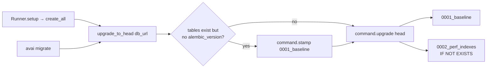

- `upgrade_to_head(db_url)` builds the Alembic `Config` in code (no repo-root `alembic.ini`), stamps `create_all`-made DBs to baseline, then applies incremental migrations.
- `migrations/env.py` — Alembic environment; `versions/0001_baseline.py`, `versions/0002_perf_indexes.py`.

---

## 8. Cross-cutting flows

### 8.1 The identity/dedup chain — how a row becomes a finding

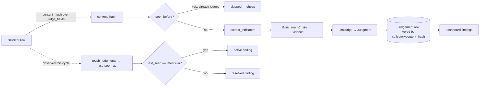

### 8.2 Threading model

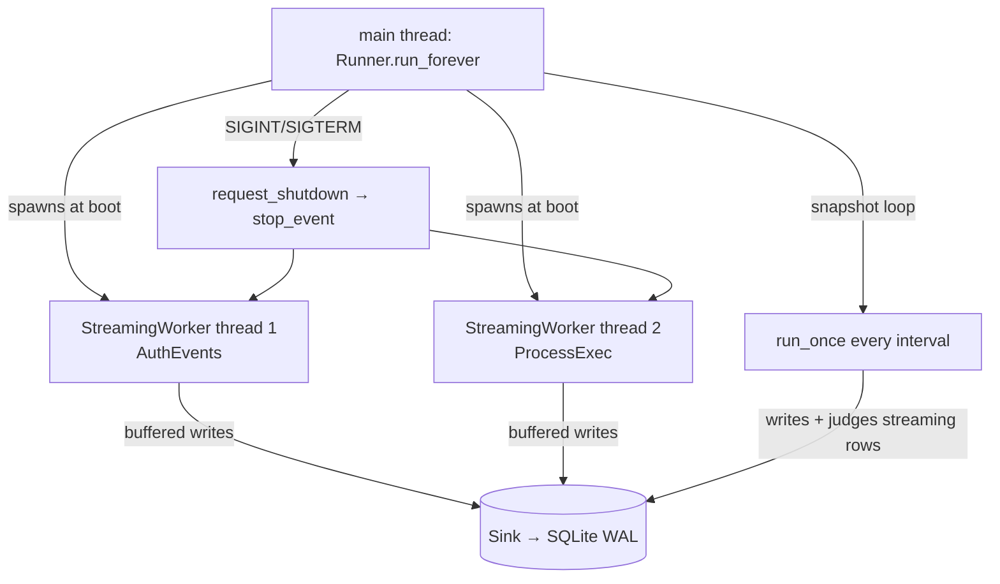

SQLite runs in **WAL mode** with `check_same_thread=False` so streaming-worker threads and the main snapshot loop can share the connection pool; SQLite serialises writes internally.

---

## 9. Quick reference — "where do I look for…"

| I want to… | Go to |
|---|---|
| Add a new telemetry collector | subclass `SnapshotCollector`/`StreamingCollector` in `host_monitor/collectors.py`, add an ORM row model in `models.py`, register in a `_build_*_collectors` fn |
| Add a new threat-intel source | drop a file in `enrichers/sources/` subclassing `Enricher` (auto-discovered) |
| Add indicators from a collector | add an `IndicatorExtractor` + entry in `indicators.py` dispatch |
| Change how findings are scored | `compute_risk_score` (deterministic) or `LlmJudge`/`prompts.toml` (LLM) |
| Add a dashboard panel | query fn in `dashboard/queries.py` + `/fragments/*` route in `dashboard/app.py` + Jinja partial in `templates/partials/` |
| Change the DB schema | edit ORM model in `host_monitor/models.py` + add an Alembic migration in `migrations/versions/` |
| Tune rate limits / timeouts | `HttpClient` in `enrichers/http.py` (per-host `set_rate`) |
| Understand one collection cycle | `Runner.run_once()` (§4) |
```
