# avai: Architecture & Class/Flow Reference

A complete map of the codebase: every package, class and function, the
runtime flows that connect them, and how the pieces are deployed. Diagrams are
[Mermaid](https://mermaid.js.org/) and render on GitHub, in VS Code preview and
in any Mermaid viewer.

Snapshot: `avai-monitor` 0.7.3, branch `refactor/p3-llm-stages` at commit `fea1db3` (2026-09-17).
The inventory in Appendix A was generated from the AST of `src/avai`, so it is
exhaustive: 89 modules, 290 classes, 227 module-level functions, 550 methods,
about 21.0k lines. Tests: 40 modules, 838 test functions.

> **One-line model.** `avai` is a host-security telemetry engine. A platform
> object assembles OS-specific **collectors**; the **Runner** drives them each
> cycle and streams long-lived OS event feeds in worker threads; rows land in
> **SQLite** through the **Sink**; new artifacts are **enriched** with threat
> intel, **judged** by an LLM, **verified** and **investigated** by second
> LLM passes; a **narrator** and a deterministic **risk score** summarise the
> host; a read-only **Flask + HTMX dashboard** renders it all and talks back
> to the monitor through a single `control_state` row.

Contents

1. [System context](#1-system-context)
2. [Package layout and module dependencies](#2-package-layout-and-module-dependencies)
3. [Entry points and processes](#3-entry-points-and-processes)
4. [The engine: `host_monitor/`](#4-the-engine-host_monitor)
   4.1 [Boot: `build_runner`](#41-boot-build_runner) ·
   4.2 [`Runner`: the loop and the cycle](#42-runner-the-loop-and-the-cycle) ·
   4.3 [Platform layer: `hosts/`](#43-platform-layer-hosts) ·
   4.4 [Collectors](#44-collectors) ·
   4.5 [Runtime collaborators: `runtime/`](#45-runtime-collaborators-runtime) ·
   4.6 [Security controls](#46-security-controls) ·
   4.7 [Streaming workers and supervision](#47-streaming-workers-and-supervision) ·
   4.8 [LLM stages, prompts and risk](#48-llm-stages-prompts-and-risk) ·
   4.9 [`Sink`: the DB gateway](#49-sink-the-db-gateway) ·
   4.10 [Data model](#410-data-model)
5. [Enrichment: `enrichers/`](#5-enrichment-enrichers)
6. [Dashboard: `dashboard/`](#6-dashboard-dashboard)
7. [Control plane and operator feedback](#7-control-plane-and-operator-feedback)
8. [Schema management](#8-schema-management)
9. [`hostsfile.py`](#9-hostsfilepy)
10. [Threads and processes](#10-threads-and-processes)
11. [Test map](#11-test-map)
12. [Where do I look for…](#12-where-do-i-look-for)
- [Appendix A: full inventory](#appendix-a-full-inventory-of-classes-and-functions)

---

## 1. System context

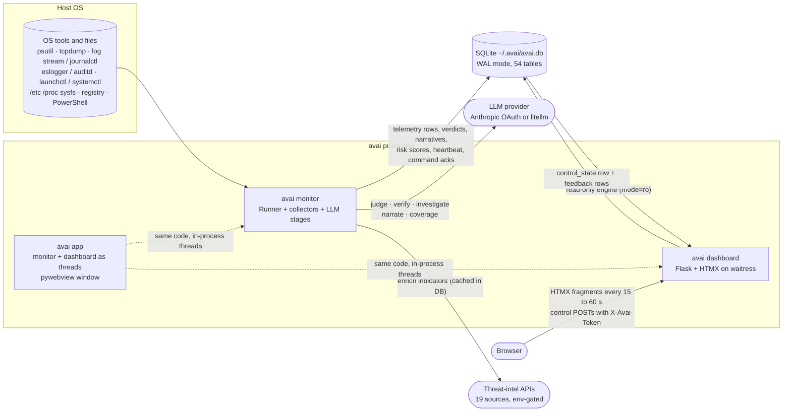
```mermaid
flowchart LR
    subgraph os["Host OS"]
        tools[("OS tools and files<br/>psutil · tcpdump · log stream / journalctl<br/>eslogger / auditd · launchctl / systemctl<br/>/etc /proc sysfs · registry · PowerShell")]
    end
    subgraph procs["avai processes"]
        mon["avai monitor<br/>Runner + collectors + LLM stages"]
        dash["avai dashboard<br/>Flask + HTMX on waitress"]
        app["avai app<br/>monitor + dashboard as threads<br/>pywebview window"]
    end
    db[("SQLite ~/.avai/avai.db<br/>WAL mode, 54 tables")]
    llm(["LLM provider<br/>Anthropic OAuth or litellm"])
    ti(["Threat-intel APIs<br/>19 sources, env-gated"])
    browser(["Browser"])

    tools --> mon
    mon -- "telemetry rows, verdicts, narratives,<br/>risk scores, heartbeat, command acks" --> db
    mon -- "judge · verify · investigate<br/>narrate · coverage" --> llm
    mon -- "enrich indicators (cached in DB)" --> ti
    db -- "read-only engine (mode=ro)" --> dash
    dash -- "control_state row + feedback rows" --> db
    browser -- "HTMX fragments every 15 to 60 s<br/>control POSTs with X-Avai-Token" --> dash
    app -. "same code, in-process threads" .-> mon
    app -. "same code, in-process threads" .-> dash
```

Key properties:

- **The monitor is the only writer of telemetry.** The dashboard opens a
  read-only engine for queries and a second, writable engine that touches only
  the `control_state` and `feedback` tables.
- **No IPC.** Monitor and dashboard coordinate exclusively through the shared
  SQLite file (heartbeat, pause, scan-now, maintenance commands, feedback).
- **Observe-only.** Nothing is quarantined, killed or blocked. The LLM produces
  verdicts and remediation text; humans act.
- **Every LLM stage is optional and degrades to off** when credentials or
  libraries are missing (`NullJudge`, `None` narrator, and so on).

---

## 2. Package layout and module dependencies

```
src/avai/
├── __init__.py                 __version__
├── cli.py                      subcommand dispatcher (monitor | dashboard | app | rules | install-hosts | migrate)
├── desktop.py                  in-process desktop app (dashboard + monitor threads + pywebview)
├── hostsfile.py                avai.local -> loopback mapping in the OS hosts file
├── db_migrate.py               programmatic Alembic runner
├── prompts.toml                every LLM prompt (judge, narrator, yara_coverage, verifier, investigator, collector_hints)
├── rules/                      YARA pack: eicar.yar, hash_denylist.txt, vendor/signature-base (fetched by scripts/update_rules.py)
├── templates/                  dashboard.html + 27 HTMX partials
├── static/vendor/              htmx, tailwind (Play build), chart.js
├── migrations/                 Alembic env + 12 versioned migrations
├── host_monitor/               THE ENGINE
│   ├── __init__.py             facade: re-exports the public API
│   ├── main.py                 `avai monitor` argparse + LlmStages + build_runner() + main()
│   ├── runner.py               Runner: control loop, collection cycle, LLM pipeline orchestration
│   ├── sink.py                 Sink: the single DB gateway (schema, runs, writes, lookups, rotation)
│   ├── models.py               SQLAlchemy ORM: Base, _RowBase, 52 mapped tables
│   ├── collectors.py           Collector bases + 41 snapshot/streaming collectors + parsers + YARA compile
│   ├── net_collectors.py       ARP / NDP / routes / DNS resolvers (source-injected) + OS parsers
│   ├── exposure_collectors.py  proxy / sessions / shares / promisc / trusted roots + OS parsers
│   ├── persistence_collectors.py injection env / kernel modules / ssh known_hosts + parsers
│   ├── hosts/                  platform layer: capabilities (Protocols), factory, macos, linux, windows
│   ├── runtime/                injectable collaborators: clock, commands, digest, paths, probes, sources
│   ├── security_controls.py    ServiceSpec + NetworkServiceControl (posture + behaviour per service)
│   ├── slices.py               Slice catalog: each telemetry table's name, model and streaming flag, once
│   ├── streaming.py            StreamingWorker (one thread per StreamingCollector)
│   ├── supervision.py          restart policy: outcomes, backoff, sleeper, listener
│   ├── llm.py                  LlmCredentials, CompletionRequest, CompletionClient strategies, StructuredCall
│   ├── judge.py                Judge / LlmJudge / NullJudge, cost estimate
│   ├── verifier.py             MaliciousVerdictVerifier (skeptic second opinion)
│   ├── investigator.py         UnknownFindingInvestigator (deep re-judge of unknowns)
│   ├── narrator.py             IncidentNarrator (incident digest)
│   ├── coverage.py             YaraCoverageAssessor (ruleset coverage vs host)
│   ├── risk.py                 compute_risk_score (deterministic 0-100 + grade)
│   ├── prompts.py              Prompts dataclass (loads prompts.toml)
│   ├── constants.py            defaults, tunables, pricing, static tables
│   └── enums.py                Verdict, ThreatCategory, FeedbackLabel, LaunchScope, Browser
├── enrichers/                  threat-intel layer
│   ├── base.py                 IndicatorType, VerdictHint, Indicator, Evidence, Enricher(ABC)
│   ├── http.py                 HttpClient + _TokenBucket
│   ├── cache.py                EvidenceCache (enrichment_evidence table, TTL)
│   ├── chain.py                EnrichmentChain (chain of responsibility + CVE forward-chaining)
│   ├── registry.py             discover_enricher_classes + build_default_chain
│   ├── indicators.py           IndicatorExtractor + 19 per-collector extractors + dispatch table
│   └── sources/                19 concrete Enricher subclasses, one file per external API
└── dashboard/                  read-only Flask + HTMX UI
    ├── __init__.py             facade
    ├── app.py                  Flask app, CSP, Jinja filters, 38 routes
    ├── queries.py              read-only query layer (uses current_app for config)
    ├── control.py              writable control plane (control_state + feedback rows)
    └── serve.py                `avai dashboard` CLI + waitress launcher

packaging/    PyInstaller spec, Inno Setup (Windows), .deb builder (Linux), cask + entitlements (macOS)
docker/       supervisord.conf (monitor + dashboard in one container)
tools/        seed_demo_db.py (synthetic DB for demos)
scripts/      update_rules.py (fetch pinned YARA packs into rules/vendor)
tests/        39 pytest modules
```

### Module dependency graph

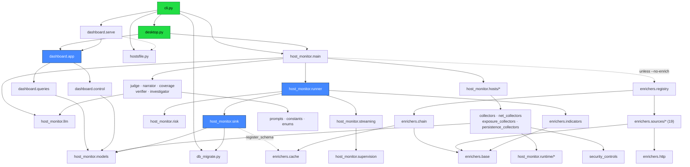
```mermaid
graph TD
    cli["cli.py"] --> hmmain["host_monitor.main"]
    cli --> serve["dashboard.serve"]
    cli --> desktop["desktop.py"]
    cli --> hostsfile["hostsfile.py"]
    cli --> dbm["db_migrate.py"]
    desktop --> hmmain
    desktop --> dapp["dashboard.app"]
    serve --> dapp
    serve -.-> hostsfile
    dapp --> queries["dashboard.queries"]
    dapp --> control["dashboard.control"]
    queries --> models["host_monitor.models"]
    control --> models

    hmmain --> runner["host_monitor.runner"]
    hmmain --> hosts["host_monitor.hosts/*"]
    hmmain --> stages["judge · narrator · coverage<br/>verifier · investigator"]
    hmmain -. "unless --no-enrich" .-> reg["enrichers.registry"]
    hmmain --> llm["host_monitor.llm"]
    runner --> sink["host_monitor.sink"]
    runner --> streaming["host_monitor.streaming"]
    runner --> risk["host_monitor.risk"]
    runner --> ind["enrichers.indicators"]
    streaming --> supervision["host_monitor.supervision"]
    hosts --> collectors["collectors · net_collectors<br/>exposure_collectors · persistence_collectors"]
    collectors --> runtime["host_monitor.runtime/*"]
    collectors --> seccontrols["security_controls"]
    collectors --> models
    stages --> prompts["prompts · constants · enums"]
    stages --> llm
    sink --> models
    sink --> dbm
    sink -. "register_schema" .-> cache["enrichers.cache"]

    reg --> chain["enrichers.chain"]
    reg --> sources["enrichers.sources/* (19)"]
    chain --> cache
    chain --> base["enrichers.base"]
    sources --> http["enrichers.http"]
    sources --> base
    ind --> base

    classDef entry fill:#2d4,stroke:#063,color:#000
    classDef big fill:#48f,stroke:#024,color:#fff
    class cli,desktop entry
    class runner,sink,dapp big
```

**Layering rules (by convention, no cycles):**

- `host_monitor` layering, one way only:
  `enums → constants → runtime → prompts / models → risk / llm → judge → verifier / investigator / narrator / coverage → sink → security_controls / collectors → net / exposure / persistence collectors → hosts → supervision → streaming → runner → main`.
- `hosts/factory.py` is the **only** place that reads `platform.system()`.
- `runtime/command_runner.py` is the **only** subprocess seam; collectors never call `subprocess` directly.
- `sink.py` is the **only** telemetry writer. The dashboard's `control.py` writes two tables and nothing else.
- `enrichers/sources/*` depend only on `base` and `http`; `registry` and `chain` are the only modules that know every source.
- `host_monitor` imports `enrichers` at module level. `requests` loads on every boot anyway, because
  `Sink.setup()` registers the `enrichers.cache` tables.
- Each package `__init__.py` is a thin facade; callers write `from avai.host_monitor import X`.

---

## 3. Entry points and processes

### 3.1 `cli.py`

| Command | Aliases | Handler | Delegates to |
|---|---|---|---|
| `avai monitor` | `start`, `scan` | `main` | `host_monitor.main.main()` (argv passed through) |
| `avai dashboard` | `ui`, `serve` | `main` | `dashboard.serve.main()` |
| `avai app` | `gui`, `desktop` | `main` | `desktop.main()` |
| `avai rules [--list] [--rules-dir]` | | `_cmd_rules` | `collectors._compile_yara_rules` (no DB) |
| `avai install-hosts [--remove] [--hostname]` | | `_cmd_install_hosts` | `hostsfile.HostsRegistrar` |
| `avai migrate [--db]` | | `main` | `db_migrate.upgrade_to_head` |
| `avai --version` / `--help` | `-v`, `-h`, `help` | `main` / `_print_usage` | |

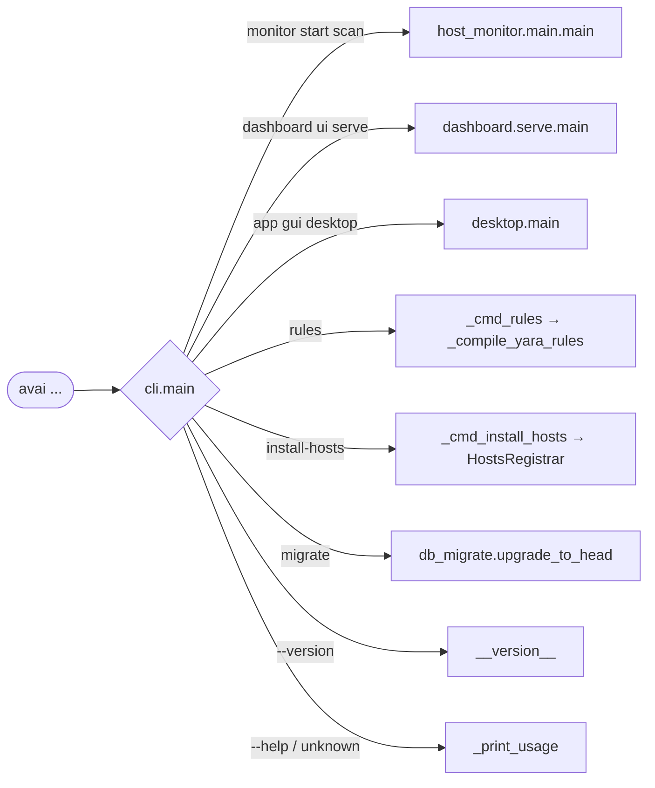
```mermaid
graph LR
    u(["avai ..."]) --> m{"cli.main"}
    m -->|monitor start scan| hm["host_monitor.main.main"]
    m -->|dashboard ui serve| dm["dashboard.serve.main"]
    m -->|app gui desktop| ap["desktop.main"]
    m -->|rules| r["_cmd_rules → _compile_yara_rules"]
    m -->|install-hosts| ih["_cmd_install_hosts → HostsRegistrar"]
    m -->|migrate| mg["db_migrate.upgrade_to_head"]
    m -->|--version| v["__version__"]
    m -->|--help / unknown| usage["_print_usage"]
```

### 3.2 The four ways avai runs

| Mode | What runs | Wiring | Notes |
|---|---|---|---|
| **CLI, two processes** | `avai monitor` + `avai dashboard` | `host_monitor.main.main` / `dashboard.serve.main` | Default install (`pip install avai-monitor`). Monitor often runs as root; `os.umask(0o002)` + `_relax_db_permissions` keep the DB group-writable so the dashboard can write `control_state`. |
| **Desktop app** | one process: `avai-dashboard` thread (waitress), `avai-monitor` thread (`build_runner` + `run_forever`), pywebview on the main thread | `desktop.main` → `_start_dashboard`, `_start_monitor` | Sets `AVAI_CONTROL_OPEN=1` (no token needed on loopback) and `AVAI_APP_MODE=1` (protection-home layout). API key read from `~/.avai/config.json`; without it the judge is `NullJudge`. Window close → `runner.request_shutdown()`. |
| **Docker** | one image, `supervisord` runs `avai monitor --db /data/avai.db` and `avai dashboard --host 0.0.0.0 --port 8765` | `Dockerfile`, `docker/supervisord.conf`, `docker-compose.yml` | Compose's `monitor` service (profile `linux`) runs as root with `pid: host`, `network_mode: host`, bind-mounts the host under `/host` and sets `HOST_PREFIX=/host` (see `runtime.HostPaths`). Healthcheck hits `/api/notifications/new`. |
| **Frozen installers** | `packaging/avai_app.py` → `desktop.main` | `packaging/avai.spec` (PyInstaller), `windows/avai.iss`, `linux/build_deb.sh`, `macos/avai-cask.rb` | Built by `.github/workflows/release.yml` on `v*` tags (Windows exe unsigned, Linux .deb, macOS signed + notarized dmg + cask bump). Marked **unverified until a real tag runs**. |

CI (`.github/workflows/ci.yml`): ruff + pytest on ubuntu / macos / windows × Python 3.11 / 3.12.

---

## 4. The engine: `host_monitor/`

### 4.1 Boot: `build_runner`

`host_monitor.main` owns the argparse definition (`_build_parser`) and the
composition root (`build_runner`). The desktop app reuses both, so there is one
wiring path for every mode.

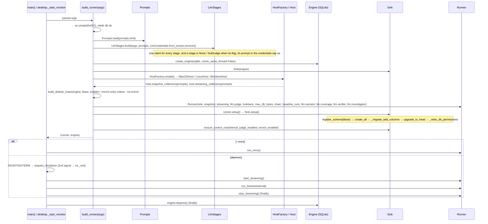
```mermaid
sequenceDiagram
    participant M as main() / desktop._start_monitor
    participant B as build_runner(args)
    participant P as Prompts
    participant L as LlmStages
    participant H as HostFactory / Host
    participant E as Engine (SQLite)
    participant S as Sink
    participant R as Runner

    M->>B: parsed args
    B->>B: os.umask(0o002), mkdir db dir
    B->>P: Prompts.load(prompts.toml)
    B->>L: LlmStages.build(args, prompts, LlmCredentials.from_env(os.environ))
    Note over L: one client for every stage, and a stage is None / NullJudge when its flag, its prompt or the credentials say so
    B->>E: create_engine(sqlite, check_same_thread=False)
    B->>S: Sink(engine)
    B->>H: HostFactory.create() → MacOSHost / LinuxHost / WindowsHost
    H-->>B: host.snapshot_collectors(prompts), host.streaming_collectors(prompts)
    B->>B: build_default_chain(engine, Base, enable=--enrich-only) unless --no-enrich
    B->>R: Runner(sink, snapshot, streaming, llm.judge, lookback, max_db_bytes, chain, baseline_runs, llm.narrator, llm.coverage, llm.verifier, llm.investigator)
    B->>S: runner.setup() → Sink.setup()
    Note over S: register_schema(Base) → create_all → _migrate_add_columns → upgrade_to_head → _relax_db_permissions
    B->>S: ensure_control_row(interval, judge_enabled, enrich_enabled)
    B-->>M: (runner, engine)
    alt --once
        M->>R: run_once()
    else daemon
        M->>M: SIGINT/SIGTERM → request_shutdown (2nd signal → os._exit)
        M->>R: start_streaming()
        M->>R: run_forever(interval)
        M->>R: stop_streaming() (finally)
    end
    M->>E: engine.dispose() (finally)
```

Monitor flags (all in `_build_parser`): `--db`, `--interval`, `--lookback-min`,
`--once`, `--prompts-file`, `--no-judge`, `--judge-model`, `--judge-batch-size`,
`--judge-max-per-collector`, `--baseline-runs`, `--no-narrative`,
`--narrative-model`, `--no-coverage`, `--no-verify`, `--no-investigate`,
`--no-streaming`, `--max-db-mb`, `--no-enrich`, `--enrich-only NAME`, `--verbose`.

### 4.2 `Runner`: the loop and the cycle

`Runner` (runner.py, 1057 lines) is the supervisor. It owns the control cache,
the snapshot loop, the streaming workers and the whole per-finding LLM
pipeline. Every method:

| Group | Method | Responsibility |
|---|---|---|
| Lifecycle | `setup` | `sink.setup()` |
| | `start_streaming` / `stop_streaming` | spawn / join one `StreamingWorker` per streaming collector |
| | `request_shutdown` | idempotent, signal-safe stop flag |
| | `run_forever(interval)` | control-poll loop (below) |
| | `run_once` | one full cycle (below) |
| Control plane | `_refresh_control` | read the `control_state` row into `self._control` |
| | `_disabled_collectors`, `_judge_on`, `_enrich_on` | effective settings (row value or CLI default) |
| | `_heartbeat(status, interval)` | full heartbeat: pid, status, interval, `last_seen_at` |
| | `_progress_heartbeat` | throttled `last_seen_at` touch inside long cycles (every 30 s) |
| | `_run_pending_command` / `_dispatch_command` | one-shot maintenance: `prune`, `clear`, `rejudge`, `renarrate`, `reset_baseline`, then `ack_command` |
| Per collector | `_run_collector(c, run_id, started, baseline)` | collect → stamp → write → judge pipeline → touch |
| | `_enrich_entries` | `extract_indicators` per row → `chain.enrich` → `entry["evidence"]` |
| | `_annotate_baseline` | `entry["baseline"]`: first_seen, times_seen, novel, intermittent |
| | `_attach_correlation` | `entry["related"]`: ports, flows, conns, DNS, exec lineage by PID (processes and launch_items only) |
| | `_behavior_pid_map` → `_process_pid_map` / `_launch_item_pid_map` | content_hash → PIDs and names |
| | `_related_from_ctx` | assemble the bounded `related` object from a correlation context |
| | `_attach_yara_context` | `entry["rule_meta"]`, `entry["matched_strings"]` for `file_scan` |
| | `_judge_hints` | static hints + this host's operator feedback examples |
| | `_verify_judgments` | skeptic pass on `malicious` (≤ 10 per collector); refuted → `suspicious` |
| | `_investigate_unknowns` | deep pass on `unknown` (≤ 10 per collector) with full-history context |
| | `_full_history_context`, `_host_context` | inputs for the investigator |
| | `_judgment_context`, `_loads_or_none` | bundle `baseline` + `related` for `write_judgments` |
| Cycle end | `_judge_streaming_collectors` | judge new hashes from streaming tables (`unjudged_all`) |
| | `_apply_feedback` | pin operator corrections before judging |
| | `_generate_narrative` | narrator over active findings, only when the finding set changed |
| | `_generate_risk_score` + `_risk_explanation` | deterministic score, delta text vs previous |
| | `_write_yara_status` | persist `FileScanCollector.compile_stats` (+ rule inventory) |
| | `_generate_coverage` + `_ruleset_fingerprint` | coverage assessment, only when the ruleset changed |
| Baseline | `_host_baseline` | `established` after `baseline_min_runs`, `cutoff_at` |

#### `run_forever`: the control-poll loop

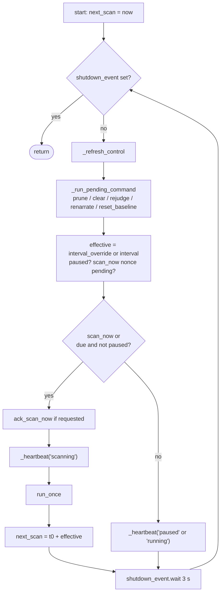
```mermaid
flowchart TD
    A[start: next_scan = now] --> B{shutdown_event set?}
    B -->|yes| Z([return])
    B -->|no| C[_refresh_control]
    C --> D[_run_pending_command<br/>prune / clear / rejudge / renarrate / reset_baseline]
    D --> E["effective = interval_override or interval<br/>paused? scan_now nonce pending?"]
    E --> F{scan_now or<br/>due and not paused?}
    F -->|yes| G[ack_scan_now if requested] --> H["_heartbeat('scanning')"] --> I[run_once] --> J[next_scan = t0 + effective]
    F -->|no| K["_heartbeat('paused' or 'running')"]
    J --> L[shutdown_event.wait 3 s]
    K --> L
    L --> B
```

#### `run_once`: one collection cycle

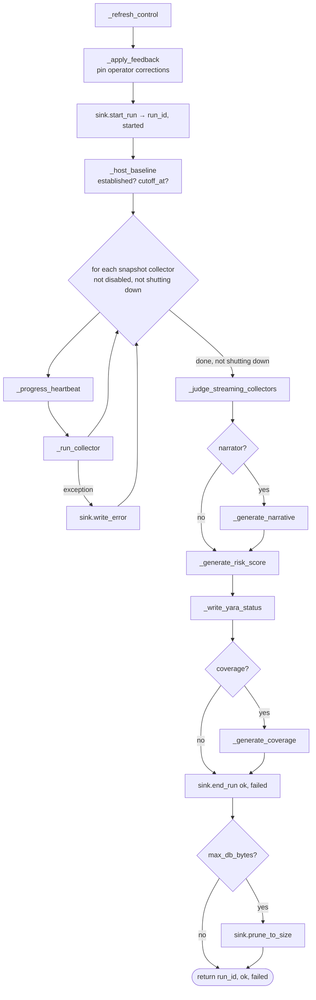
```mermaid
flowchart TD
    A[_refresh_control] --> B[_apply_feedback<br/>pin operator corrections]
    B --> C[sink.start_run → run_id, started]
    C --> D[_host_baseline<br/>established? cutoff_at?]
    D --> E{for each snapshot collector<br/>not disabled, not shutting down}
    E --> F[_progress_heartbeat]
    F --> G[_run_collector]
    G -->|exception| H[sink.write_error] --> E
    G --> E
    E -->|done, not shutting down| I[_judge_streaming_collectors]
    I --> J{narrator?}
    J -->|yes| K[_generate_narrative]
    J -->|no| L
    K --> L[_generate_risk_score]
    L --> M[_write_yara_status]
    M --> N{coverage?}
    N -->|yes| O[_generate_coverage]
    N -->|no| P
    O --> P[sink.end_run ok, failed]
    P --> Q{max_db_bytes?}
    Q -->|yes| R[sink.prune_to_size]
    Q -->|no| S([return run_id, ok, failed])
    R --> S
```

#### `_run_collector`: the per-finding pipeline

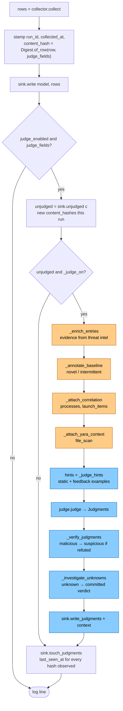
```mermaid
flowchart TD
    A[rows = collector.collect] --> B["stamp run_id, collected_at,<br/>content_hash = Digest.of_row(row, judge_fields)"]
    B --> C[sink.write model, rows]
    C --> D{judge_enabled and judge_fields?}
    D -->|no| Z([log line])
    D -->|yes| E[unjudged = sink.unjudged c<br/>new content_hashes this run]
    E --> F{unjudged and _judge_on?}
    F -->|no| T
    F -->|yes| G[_enrich_entries<br/>evidence from threat intel]
    G --> H[_annotate_baseline<br/>novel / intermittent]
    H --> I[_attach_correlation<br/>processes, launch_items]
    I --> J[_attach_yara_context<br/>file_scan]
    J --> K[hints = _judge_hints<br/>static + feedback examples]
    K --> L[judge.judge → Judgments]
    L --> M[_verify_judgments<br/>malicious → suspicious if refuted]
    M --> N[_investigate_unknowns<br/>unknown → committed verdict]
    N --> O[sink.write_judgments + context]
    O --> T[sink.touch_judgments<br/>last_seen_at for every hash observed]
    T --> Z

    classDef enrich fill:#fc8,stroke:#a50,color:#000
    classDef judge fill:#8cf,stroke:#05a,color:#000
    class G,H,I,J enrich
    class K,L,M,N,O judge
```

Why the order matters: the baseline is computed once per cycle so every
collector shares a cutoff; enrichment happens before judging so the LLM sees
evidence; correlation turns "novel binary" plus "beacons to a flagged IP" into
one strong signal; only unjudged hashes reach the LLM so steady-state cycles
are cheap; `touch_judgments` lets the dashboard derive active vs resolved.

### 4.3 Platform layer: `hosts/`

The OS is resolved exactly once. Collectors depend on two narrow capability
Protocols instead of branching on the platform.

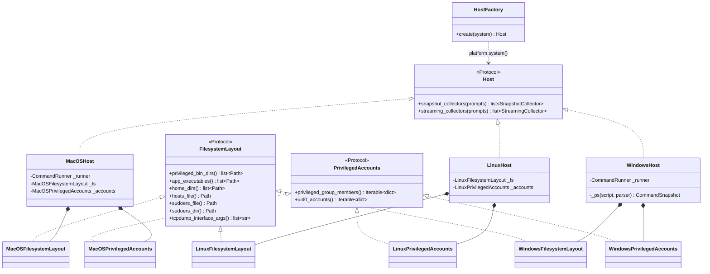
```mermaid
classDiagram
    class Host {
        <<Protocol>>
        +snapshot_collectors(prompts) list~SnapshotCollector~
        +streaming_collectors(prompts) list~StreamingCollector~
    }
    class FilesystemLayout {
        <<Protocol>>
        +privileged_bin_dirs() list~Path~
        +app_executables() list~Path~
        +home_dirs() list~Path~
        +hosts_file() Path
        +sudoers_file() Path
        +sudoers_dir() Path
        +tcpdump_interface_args() list~str~
    }
    class PrivilegedAccounts {
        <<Protocol>>
        +privileged_group_members() Iterable~dict~
        +uid0_accounts() Iterable~dict~
    }
    class HostFactory {
        +create(system)$ Host
    }
    class MacOSHost {
        -CommandRunner _runner
        -MacOSFilesystemLayout _fs
        -MacOSPrivilegedAccounts _accounts
    }
    class LinuxHost {
        -LinuxFilesystemLayout _fs
        -LinuxPrivilegedAccounts _accounts
    }
    class WindowsHost {
        -CommandRunner _runner
        -_ps(script, parser) CommandSnapshot
    }
    Host <|.. MacOSHost
    Host <|.. LinuxHost
    Host <|.. WindowsHost
    HostFactory ..> Host : platform.system()
    FilesystemLayout <|.. MacOSFilesystemLayout
    FilesystemLayout <|.. LinuxFilesystemLayout
    FilesystemLayout <|.. WindowsFilesystemLayout
    PrivilegedAccounts <|.. MacOSPrivilegedAccounts
    PrivilegedAccounts <|.. LinuxPrivilegedAccounts
    PrivilegedAccounts <|.. WindowsPrivilegedAccounts
    MacOSHost *-- MacOSFilesystemLayout
    MacOSHost *-- MacOSPrivilegedAccounts
    LinuxHost *-- LinuxFilesystemLayout
    LinuxHost *-- LinuxPrivilegedAccounts
    WindowsHost *-- WindowsFilesystemLayout
    WindowsHost *-- WindowsPrivilegedAccounts
```

Each `*Host.snapshot_collectors` is the composition root for its OS: it
instantiates every collector with its judge hint (`prompts.hint_for(name)`),
injects the capability adapters, and for the source-injected collectors builds
a `CommandSnapshot(runner, command, Parser())` or `FileSnapshot(path, Parser())`.
`LinuxFilesystemLayout` routes absolute paths through `HostPaths.translate` so
the same code works inside the container with `HOST_PREFIX=/host`.

**Collector set per OS**, keyed by logical slice (`Collector.name`):

| Slice (`name`) | macOS | Linux | Windows | Table |
|---|---|---|---|---|
| `processes` | `ProcessCollector` | same | same | `processes` |
| `network_connections` | `NetworkConnectionsCollector` | same | same | `network_connections` |
| `listening_ports` | `ListeningPortsCollector` | same | same | `listening_ports` |
| `network_flows` | `NetworkFlowsCollector` (tcpdump) | same | n/a | `network_flows` |
| `dns_queries` | `DnsQueriesCollector` (tcpdump) | same | n/a | `dns_queries` |
| `network_interfaces` | `NetworkInterfacesCollector` | same | same | `network_interfaces` |
| `host_resources` | `HostResourcesCollector` | same | same | `host_resources` |
| `disk_usage` | `DiskUsageCollector` | same | same | `disk_usage` |
| `log_entries` | n/a | `LogTailCollector` (journald + tailed files) | n/a | `log_entries` |
| `usb_devices` | `UsbDevicesCollector` | `LinuxUsbDevicesCollector` | `WindowsUsbDevicesCollector` | `usb_devices` |
| `bluetooth_devices` | `BluetoothCollector` | `LinuxBluetoothCollector` | `WindowsBluetoothCollector` | `bluetooth_devices` |
| `wifi_state` | `WifiCollector` | `LinuxWifiCollector` | `WindowsWifiCollector` | `wifi_state` |
| `launch_items` | `LaunchItemsCollector` (launchd plists) | `LinuxLaunchItemsCollector` (systemd units, cron) | `WindowsLaunchItemsCollector` (Run keys, schtasks) | `launch_items` |
| `quarantine_events` | `QuarantineCollector` | n/a | n/a | `quarantine_events` |
| `browser_extensions` | `BrowserExtensionsCollector` | same | n/a | `browser_extensions` |
| `system_integrity` | `SystemIntegrityCollector` | `LinuxSystemIntegrityCollector` | `WindowsSystemIntegrityCollector` | `system_integrity` |
| `file_integrity` | `FileIntegrityCollector` | same | n/a | `file_integrity` |
| `file_scan` | `FileScanCollector` (YARA) | same | n/a | `file_scan` |
| `installed_apps` | `InstalledAppsCollector` | `LinuxInstalledAppsCollector` | `WindowsInstalledAppsCollector` | `installed_apps` |
| `mounts` | `MountsCollector` | same | same | `mounts` |
| `setuid_files` | `SetuidFilesCollector` | same | n/a | `setuid_files` |
| `mdm_profiles` | `MdmProfilesCollector` | n/a | n/a | `mdm_profiles` |
| `kernel_extensions` | `KernelExtensionsCollector` | n/a | n/a | `kernel_extensions` |
| `system_extensions` | `SystemExtensionsCollector` | n/a | n/a | `system_extensions` |
| `ssh_authorized_keys` | `SshAuthorizedKeysCollector` | same | same | `ssh_authorized_keys` |
| `hosts_file` | `HostsFileCollector` | same | same | `hosts_file` |
| `privilege_config` | `PrivilegeConfigCollector` | same | same | `privilege_config` |
| `arp_table` | `ArpTableCollector` + `MacosArpParser` | + `IpNeighParser` | + `PsNeighborParser` | `arp_table` |
| `ndp_neighbors` | `NdpNeighborsCollector` + `MacosNdpParser` | + `IpNeighParser` | + `PsNeighborParser` | `ndp_neighbors` |
| `routes` | `RoutesCollector` + `MacosRouteParser` | + `IpRouteParser` | + `PsRouteParser` | `routes` |
| `dns_resolvers` | `DnsResolversCollector` + `MacosDnsParser` | + `ResolvConfParser` | + `PsDnsParser` | `dns_resolvers` |
| `proxy_config` | `ProxyConfigCollector` + `MacosProxyParser` | + `LinuxProxyEnvParser` | + `WindowsProxyParser` | `proxy_config` |
| `login_sessions` | `LoginSessionsCollector` + `WhoParser` | + `WhoParser` | + `WindowsSessionParser` | `login_sessions` |
| `network_shares` | `NetworkSharesCollector` + `MacosMountSharesParser` | + `ProcMountsSharesParser` | + `WindowsSharesParser` | `network_shares` |
| `promiscuous_ifaces` | `PromiscuousInterfacesCollector` + `MacosPromiscParser` | + `LinuxPromiscParser` | n/a | `promiscuous_ifaces` |
| `trusted_roots` | `TrustedRootsCollector` + `MacosCertParser` | + `LinuxTrustListParser` | + `WindowsCertParser` | `trusted_roots` |
| `injection_env` | `InjectionEnvCollector` + `EnvValueParser` | + `LdSoPreloadParser` | + `WindowsAppInitParser` | `injection_env` |
| `kernel_modules` | n/a (kexts cover it) | `KernelModulesCollector` + `ProcModulesParser` | + `WindowsDriverParser` | `kernel_modules` |
| `ssh_known_hosts` | `SshKnownHostsCollector` | same | same | `ssh_known_hosts` |
| `auth_events` (stream) | `AuthEventsCollector` (`log stream`) | `LinuxAuthEventsCollector` (`journalctl -f`) | `WindowsAuthEventsCollector` (Get-WinEvent) | `auth_events` |
| `process_exec_events` (stream) | `MacosProcessExecCollector` (`eslogger exec`) | `LinuxProcessExecCollector` (auditd via journalctl) | `WindowsProcessExecCollector` (event 4688) | `process_exec_events` |

Totals: macOS 37 snapshot + 2 streaming, Linux 35 + 2, Windows 27 + 2.

### 4.4 Collectors

Two abstract shapes, one contract each:

- `SnapshotCollector.collect() -> Iterable[dict]`: point-in-time sweep, run every cycle by the Runner.
- `StreamingCollector.stream(stop_event) -> Iterable[dict]`: long-lived tail of an OS event feed, run once in a `StreamingWorker` thread.

Every collector points at its `slice` in `slices.py`, which holds the slice
`name`, its ORM `model` and whether it streams. `Collector.name` and
`Collector.model` read from it, so the name is declared once no matter how many
OS variants write the slice. Each collector class still declares
`judge_enabled` and `judge_fields` (the columns hashed into `content_hash`,
which is the identity of a finding), because those differ by OS:
`process_exec_events` judges `username` on Windows and `uid` elsewhere. Collectors with
`judge_enabled = False` (`network_interfaces`, `host_resources`, `disk_usage`,
`log_entries`) are pure telemetry and never reach the LLM.

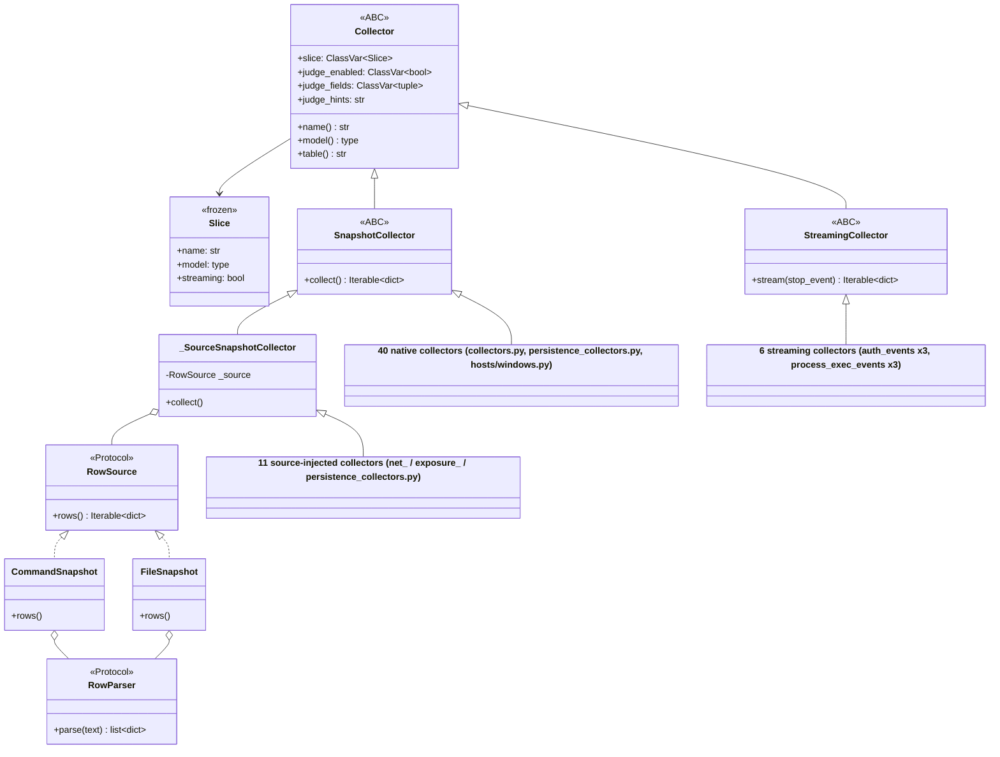
```mermaid
classDiagram
    class Collector {
        <<ABC>>
        +slice: ClassVar~Slice~
        +name() str
        +model() type
        +judge_enabled: ClassVar~bool~
        +judge_fields: ClassVar~tuple~
        +judge_hints: str
        +table() str
    }
    class Slice {
        <<frozen>>
        +name: str
        +model: type
        +streaming: bool
    }
    Collector --> Slice
    class SnapshotCollector {
        <<ABC>>
        +collect() Iterable~dict~
    }
    class StreamingCollector {
        <<ABC>>
        +stream(stop_event) Iterable~dict~
    }
    class _SourceSnapshotCollector {
        -RowSource _source
        +collect()
    }
    class RowSource {
        <<Protocol>>
        +rows() Iterable~dict~
    }
    class RowParser {
        <<Protocol>>
        +parse(text) list~dict~
    }
    class CommandSnapshot {
        +rows()
    }
    class FileSnapshot {
        +rows()
    }
    Collector <|-- SnapshotCollector
    Collector <|-- StreamingCollector
    SnapshotCollector <|-- _SourceSnapshotCollector
    _SourceSnapshotCollector o-- RowSource
    RowSource <|.. CommandSnapshot
    RowSource <|.. FileSnapshot
    CommandSnapshot o-- RowParser
    FileSnapshot o-- RowParser

    class Native["40 native collectors (collectors.py, persistence_collectors.py, hosts/windows.py)"]
    class Sourced["11 source-injected collectors (net_ / exposure_ / persistence_collectors.py)"]
    class Streams["6 streaming collectors (auth_events x3, process_exec_events x3)"]
    SnapshotCollector <|-- Native
    _SourceSnapshotCollector <|-- Sourced
    StreamingCollector <|-- Streams
```

**Native snapshot collectors** implement `collect()` themselves against psutil,
the filesystem, plists, external SQLite DBs, or `CommandRunner`:
`ProcessCollector`, `NetworkConnectionsCollector`, `ListeningPortsCollector`,
`NetworkFlowsCollector`, `DnsQueriesCollector`, `NetworkInterfacesCollector`,
`HostResourcesCollector`, `DiskUsageCollector`, `UsbDevicesCollector`,
`BluetoothCollector`, `WifiCollector`, `LaunchItemsCollector`,
`QuarantineCollector`, `BrowserExtensionsCollector`, `SystemIntegrityCollector`,
`FileIntegrityCollector`, `FileScanCollector`, `InstalledAppsCollector`,
`MountsCollector`, `SetuidFilesCollector`, `SshAuthorizedKeysCollector`,
`HostsFileCollector`, `PrivilegeConfigCollector`, `MdmProfilesCollector`,
`KernelExtensionsCollector`, `SystemExtensionsCollector`, `LogTailCollector`,
`SshKnownHostsCollector`, the `Linux*` variants (`LinuxInstalledAppsCollector`,
`LinuxLaunchItemsCollector`, `LinuxUsbDevicesCollector`,
`LinuxBluetoothCollector`, `LinuxWifiCollector`,
`LinuxSystemIntegrityCollector`) and the `Windows*` variants
(`WindowsInstalledAppsCollector`, `WindowsLaunchItemsCollector`,
`WindowsSystemIntegrityCollector`, `WindowsUsbDevicesCollector`,
`WindowsBluetoothCollector`, `WindowsWifiCollector`).

**Source-injected collectors** (`_SourceSnapshotCollector`) hold no OS logic at
all; the Host wires a `RowSource` whose `RowParser` is one of the Strategy
classes below. This is how one collector class serves three operating systems.

| Parser (Strategy) | Input | Emits rows for |
|---|---|---|
| `MacosArpParser`, `IpNeighParser(state_key)`, `PsNeighborParser(state_key)` | `arp -an` / `ip neigh` / `Get-NetNeighbor` | `arp_table`, `ndp_neighbors` |
| `MacosNdpParser` | `ndp -an` | `ndp_neighbors` |
| `MacosRouteParser`, `IpRouteParser`, `PsRouteParser` | `netstat -rn` / `ip route` / `Get-NetRoute` | `routes` |
| `MacosDnsParser`, `ResolvConfParser`, `PsDnsParser` | `scutil --dns` / `/etc/resolv.conf` / `Get-DnsClientServerAddress` | `dns_resolvers` |
| `MacosProxyParser`, `LinuxProxyEnvParser`, `WindowsProxyParser` | `scutil --proxy` / `/etc/environment` / Internet Settings registry | `proxy_config` |
| `WhoParser`, `WindowsSessionParser` | `who` / `query user` | `login_sessions` |
| `MacosMountSharesParser`, `ProcMountsSharesParser`, `WindowsSharesParser` | `mount` / `/proc/mounts` / `Get-SmbConnection` | `network_shares` |
| `MacosPromiscParser`, `LinuxPromiscParser` | `ifconfig` / `ip link` | `promiscuous_ifaces` |
| `MacosCertParser`, `LinuxTrustListParser`, `WindowsCertParser` | `security find-certificate` / `trust list` / `Cert:\LocalMachine\Root` | `trusted_roots` |
| `EnvValueParser(variable, scope)`, `LdSoPreloadParser`, `WindowsAppInitParser` | `launchctl getenv` / `/etc/ld.so.preload` / `AppInit_DLLs` | `injection_env` |
| `ProcModulesParser`, `WindowsDriverParser` | `/proc/modules` / `driverquery /fo csv` | `kernel_modules` |

**Streaming collectors** wrap a `JsonLineStreamSource(command, LineParser)` and
a per-OS `LineParser` Strategy: `UnifiedLogAuthParser` (macOS `log stream
--style ndjson`), `JournalAuthParser` (Linux `journalctl --output=json`),
`WinSecurityAuthParser` (Windows Security log), `EsloggerExecParser` (macOS
`eslogger exec`), `AuditExecParser` (Linux audit `execve`),
`WinSecurityExecParser` (event 4688).

**Other helper objects in `collectors.py`:**

- `BrowserExtensionReader(ABC)` → `ChromiumExtensionReader`, `FirefoxExtensionReader`: used by `BrowserExtensionsCollector` over the `BROWSER_PROFILES` table.
- `ProcessConnectionResolver`: `(local_ip, port) → (pid, name)` so tcpdump flows and DNS questions get attributed to a process.
- `FileScanCollector`: compiles the YARA pack once (`_ruleset` → `_compile_yara_rules`), then scans a bounded target set (`_targets`: privileged bin dirs, app executables, recently modified Downloads), capped by `YARA_MAX_FILES_PER_CYCLE`; `_scan_file` emits one row per `(file, rule)` with redacted match strings (`_redact_match_strings`, `_redact_one_match`) and rule provenance (`_rule_source`). `compile_stats` is read by the Runner to persist `yara_status` and `yara_rule`.
- Module functions: `_payload_bytes` (tcpdump packet length), `_crypto_hint` (why a rule failed to compile), `_file_type` (magic-bytes `filetype` external), `_journal_us_to_iso`, `_sniff_text_level` (log level from plain-text lines).

### 4.5 Runtime collaborators: `runtime/`

Everything that touches the OS, the clock or hashing lives behind a small
injectable object so collectors are testable with fakes.


```mermaid
classDiagram
    class Clock { +now_iso() str }
    class FrozenClock { +now_iso() str }
    Clock <|-- FrozenClock
    class Coerce { +jsonable(obj)$ +enum(value, enum_cls, default)$ }
    class Digest { +sha256_file(path)$ +of_row(row, fields)$ +ssh_fingerprint(b64key)$ }
    class CommandRunner { +exists(name) +json(cmd) +ndjson(cmd) +exit_code(cmd) +text(cmd) }
    class HostPaths { +translate(p)$ +expand(p)$ +for_home(template)$ +read_sysfs(path)$ +read_plist(path)$ }
    class ExternalSqliteReader { +rows(path, table, columns) }
    class PsutilConnections { +inet()$ }
    class SystemMetrics { +virtual_memory() +swap_memory() +cpu_sample() +load_average() +cpu_count() +boot_time() +task_counts() }
    class DiskMetrics { +partitions() +usage(mountpoint) +io_counters() }
    class ServiceManager { <<Protocol>> +enabled(unit) }
    class PortInspector { <<Protocol>> +listening(port) +established(port) }
    class ProcessInspector { <<Protocol>> +running(name) }
    ServiceManager <|.. LaunchdServiceManager
    ServiceManager <|.. SystemdServiceManager
    PortInspector <|.. PsutilPortInspector
    ProcessInspector <|.. PsutilProcessInspector
    class RowSource { <<Protocol>> +rows() }
    class RowParser { <<Protocol>> +parse(text) }
    RowSource <|.. CommandSnapshot
    RowSource <|.. FileSnapshot
    class LineParser { <<Protocol>> +parse(event) dict }
    class JsonLineStreamSource { +stream(stop_event) }
    JsonLineStreamSource o-- LineParser
    CommandSnapshot o-- CommandRunner
    LaunchdServiceManager o-- CommandRunner
    SystemdServiceManager o-- CommandRunner
```

`HostPaths.translate` prepends `HOST_PREFIX` (default empty; `/host` in
Docker) so `/etc/...` reads become `/host/etc/...`. `DiskMetrics` reads the host
mount table under the rootfs mount (`_parse_mounts`, `_host_partitions`,
`_join_rootfs`, `_statvfs_usage`, `_unescape_mount_field`) so `disk_usage`
reports real host filesystems inside the container. `tri_or` folds 1/0/None
signals for the integrity checks.

### 4.6 Security controls

**`security_controls.py`** gives the system-integrity collectors a per-topic
object that combines posture (is the service enabled) with behaviour (is it
listening, is the process running):

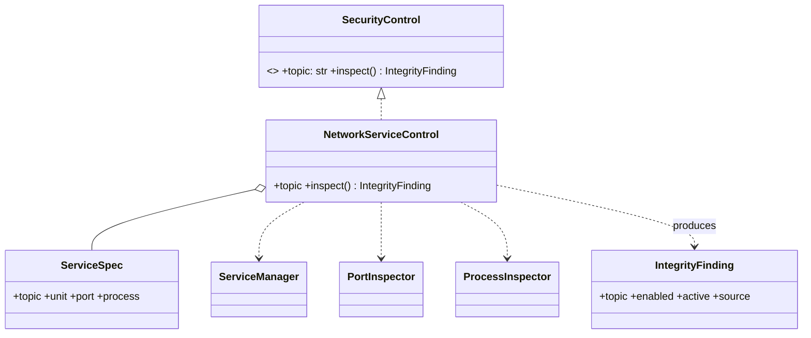
```mermaid
classDiagram
    class SecurityControl { <<Protocol>> +topic: str +inspect() IntegrityFinding }
    class IntegrityFinding { +topic +enabled +active +source }
    class ServiceSpec { +topic +unit +port +process }
    class NetworkServiceControl { +topic +inspect() IntegrityFinding }
    SecurityControl <|.. NetworkServiceControl
    NetworkServiceControl o-- ServiceSpec
    NetworkServiceControl ..> ServiceManager
    NetworkServiceControl ..> PortInspector
    NetworkServiceControl ..> ProcessInspector
    NetworkServiceControl ..> IntegrityFinding : produces
```

`SystemIntegrityCollector` (macOS) builds one `NetworkServiceControl` per
`ServiceSpec` for `remote_login` (sshd :22), screen sharing and remote
management; `LinuxSystemIntegrityCollector` does the same for `ssh.service`.
This is what fixed the "enabled but idle" false negative in 0.7.3.

### 4.7 Streaming workers and supervision

One `StreamingWorker` per streaming collector. The worker owns a thread, a
write buffer (flushed at `batch_size` = 50 rows or `flush_interval_s` = 5 s),
and a `StreamingSession` row per session. Restart policy is delegated to
injected collaborators so tests can drive it deterministically.

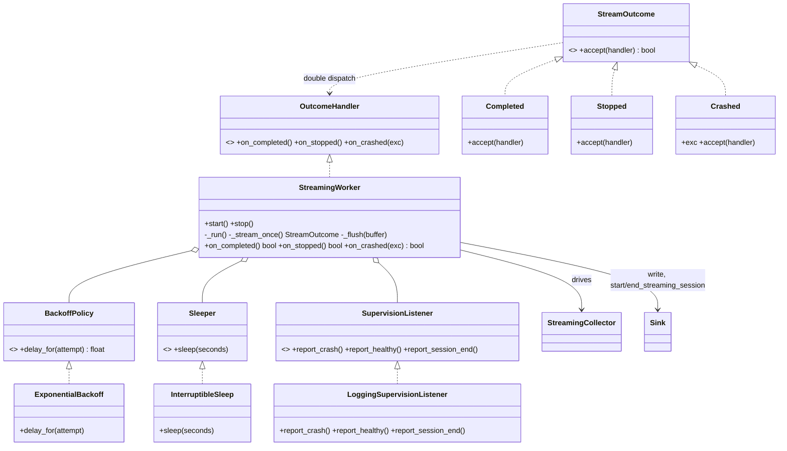
```mermaid
classDiagram
    class StreamingWorker {
        +start() +stop()
        -_run() -_stream_once() StreamOutcome -_flush(buffer)
        +on_completed() bool +on_stopped() bool +on_crashed(exc) bool
    }
    class OutcomeHandler { <<Protocol>> +on_completed() +on_stopped() +on_crashed(exc) }
    class StreamOutcome { <<Protocol>> +accept(handler) bool }
    class Completed { +accept(handler) }
    class Stopped { +accept(handler) }
    class Crashed { +exc +accept(handler) }
    class BackoffPolicy { <<Protocol>> +delay_for(attempt) float }
    class ExponentialBackoff { +delay_for(attempt) }
    class Sleeper { <<Protocol>> +sleep(seconds) }
    class InterruptibleSleep { +sleep(seconds) }
    class SupervisionListener { <<Protocol>> +report_crash() +report_healthy() +report_session_end() }
    class LoggingSupervisionListener { +report_crash() +report_healthy() +report_session_end() }
    OutcomeHandler <|.. StreamingWorker
    StreamOutcome <|.. Completed
    StreamOutcome <|.. Stopped
    StreamOutcome <|.. Crashed
    BackoffPolicy <|.. ExponentialBackoff
    Sleeper <|.. InterruptibleSleep
    SupervisionListener <|.. LoggingSupervisionListener
    StreamingWorker o-- BackoffPolicy
    StreamingWorker o-- Sleeper
    StreamingWorker o-- SupervisionListener
    StreamingWorker --> StreamingCollector : drives
    StreamingWorker --> Sink : write, start/end_streaming_session
    StreamOutcome ..> OutcomeHandler : double dispatch
```

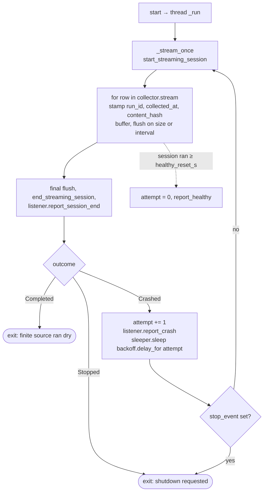
```mermaid
flowchart TD
    A[start → thread _run] --> B[_stream_once<br/>start_streaming_session]
    B --> C[for row in collector.stream<br/>stamp run_id, collected_at, content_hash<br/>buffer, flush on size or interval]
    C --> D[final flush, end_streaming_session,<br/>listener.report_session_end]
    D --> E{outcome}
    E -->|Completed| F([exit: finite source ran dry])
    E -->|Stopped| G([exit: shutdown requested])
    E -->|Crashed| H[attempt += 1<br/>listener.report_crash<br/>sleeper.sleep backoff.delay_for attempt]
    H --> I{stop_event set?}
    I -->|no| B
    I -->|yes| G
    C -. "session ran ≥ healthy_reset_s" .-> J[attempt = 0, report_healthy]
```

Tuning constants (`constants.py`): `STREAM_RESTART_BASE_BACKOFF_S`,
`STREAM_RESTART_MAX_BACKOFF_S`, `STREAM_RESTART_BACKOFF_FACTOR`,
`STREAM_CRASH_ESCALATE_THRESHOLD` (WARNING → ERROR after N crashes),
`STREAM_HEALTHY_RESET_S`; `default_backoff()` wires them.

### 4.8 LLM stages, prompts and risk

Five LLM stages share one `CompletionClient` instance and one `Prompts`
object. `LlmStages.build` (in `main.py`, the composition root) builds that
client once from `LlmCredentials` and injects it. Each stage holds a
`StructuredCall`: its fixed `CompletionRequest` (model, system prompt, user
template, schema, token cap, temperature) plus the client. Every stage enforces
structured output (JSON schema via litellm JSON-mode, or a `tool_use` block via
the Anthropic OAuth flow).


```mermaid
classDiagram
    class LlmCredentials { <<frozen dataclass>> oauth_token has_api_key +from_env(environ)$ +can_call() bool +client() CompletionClient }
    class LlmStages { <<frozen dataclass>> judge narrator coverage verifier investigator +build(args, prompts, credentials)$ }
    class CompletionRequest { <<frozen dataclass>> model system user schema schema_name max_tokens temperature }
    class CompletionClient { <<ABC>> +complete_structured(request) dict }
    class LitellmClient { +complete_structured(request) }
    class AnthropicOAuthClient { +OAUTH_BETA_HEADER +SYSTEM_PROMPT_PREFIX +complete_structured(request) }
    class StructuredCall { <<frozen dataclass>> label client request +ask(fields) dict +ask_or_none(fields) dict }
    CompletionClient <|-- LitellmClient
    CompletionClient <|-- AnthropicOAuthClient
    LlmCredentials ..> CompletionClient : builds one
    LlmStages ..> LlmCredentials : reads
    StructuredCall o-- CompletionClient
    StructuredCall o-- CompletionRequest
    CompletionClient ..> CompletionRequest : takes

    class Judge { <<ABC>> +judge(collector, hints, entries) list~Judgment~ }
    class NullJudge { +judge() []
    }
    class LlmJudge { +SCHEMA_NAME +judge() -_batches() -_call() -_parse() -_judgment_schema()$ }
    class Judgment { <<frozen dataclass>> content_hash collector verdict category confidence reasoning remediation model created_at cost_usd }
    Judge <|-- NullJudge
    Judge <|-- LlmJudge
    LlmJudge ..> Judgment : produces

    class MaliciousVerdictVerifier { +verify(finding) dict }
    class UnknownFindingInvestigator { +investigate(collector, finding) dict }
    class IncidentNarrator { +SEVERITIES +PRIORITIES +MAX_FINDINGS +narrate(findings) dict -_cap() -_clean_timeline() -_clean_actions() }
    class YaraCoverageAssessor { +POSTURES +assess(ruleset, host) dict -_clean_items()$ }
    class Prompts { <<frozen dataclass>> system user_template collector_hints narrator_* coverage_* verifier_* investigator_* +load(path)$ +hint_for(name) }

    LlmJudge o-- StructuredCall
    MaliciousVerdictVerifier o-- StructuredCall
    UnknownFindingInvestigator o-- StructuredCall
    IncidentNarrator o-- StructuredCall
    YaraCoverageAssessor o-- StructuredCall
    LlmStages o-- LlmJudge
    LlmJudge --> Prompts
    MaliciousVerdictVerifier --> Prompts
    UnknownFindingInvestigator --> Prompts
    IncidentNarrator --> Prompts
    YaraCoverageAssessor --> Prompts
```

| Stage | Class | When it runs | Input | Output |
|---|---|---|---|---|
| Judge | `LlmJudge` (`--no-judge` → `NullJudge`) | every new `content_hash` of a judged collector | batch of entries (≤ `--judge-batch-size`, ≤ `--judge-max-per-collector` per cycle) with `evidence`, `baseline`, `related`, `rule_meta` | `Judgment` per entry: verdict, category (MITRE-style `ThreatCategory`), confidence, reasoning, remediation, cost |
| Verifier | `MaliciousVerdictVerifier` (`--no-verify`) | each `malicious` verdict (≤ 10 per collector per cycle) | the finding | `refuted` + reasoning; refuted → downgraded to `suspicious` |
| Investigator | `UnknownFindingInvestigator` (`--no-investigate`) | each `unknown` verdict (≤ 10 per collector) | finding + `related_full` (all history) + `host_context` (15 other non-benign findings) | a committed verdict replacing `unknown` |
| Narrator | `IncidentNarrator` (`--no-narrative` or `--no-judge`) | end of cycle, only if the active-finding set changed | active non-benign findings (capped by `MAX_FINDINGS`) | `incident_narratives` row: severity, headline, summary, timeline, actions |
| Coverage | `YaraCoverageAssessor` (`--no-coverage`) | end of cycle, only if the ruleset fingerprint changed | `yara_status` summary + host profile | `yara_coverage` row: posture, gaps, recommendations |

Credential rule (`LlmCredentials`, the only place it lives):
`CLAUDE_CODE_OAUTH_TOKEN` → `AnthropicOAuthClient`; else `ANTHROPIC_API_KEY` /
`OPENAI_API_KEY` with litellm installed → `LitellmClient`; otherwise, or when
the client cannot be built, `NullJudge` and every optional stage `None`. The
flag in the table above, or a missing prompt section, turns off one stage.
`estimate_cost(model, in, out)` uses `MODEL_PRICING` / `DEFAULT_PRICING` and is
stored per judgment (`cost_usd`) and summed by the dashboard.

`prompts.toml` sections: `[judge]`, `[narrator]`, `[yara_coverage]`,
`[verifier]`, `[investigator]`, `[collector_hints]` (one hint per collector
`name`). Templates use `string.Template` with `$verdicts`, `$categories`,
`$collector`, `$hints`, `$entries`.

**Risk score (`risk.py`, no LLM):** `compute_risk_score(integrity, malicious,
suspicious, nopasswd_sudoers, extra_uid0)` applies `RISK_WEIGHTS` penalties
and maps the result through `RISK_GRADES` (`_risk_grade`). The Runner stores
one `risk_scores` row per run with `prev_score` and a deterministic
explanation of what changed.

### 4.9 `Sink`: the DB gateway

`Sink` wraps the SQLAlchemy engine and is the single telemetry writer and the
Runner's only read path. All 49 methods by category:

| Category | Methods |
|---|---|
| Schema / lifecycle | `setup`, `start_run`, `end_run`, `start_streaming_session`, `end_streaming_session` |
| Writes | `write(model, rows)`, `write_error`, `write_judgments(judgments, context)`, `touch_judgments`, `write_narrative`, `write_risk_score`, `write_yara_status`, `write_yara_rules`, `write_yara_coverage` |
| Unjudged selection | `unjudged(collector)` (this run), `unjudged_all(collector)` (streaming tables), `_unjudged_select` |
| Baseline / novelty | `completed_run_count`, `nth_run_started_at`, `run_started_ats`, `first_seen_map(model, hashes)`, `prior_run_started_at` |
| Correlation | `correlation_context(pids, names, since, per_pid_cap)`: PID → ports / flows / conns, name → DNS, PID → exec lineage; `pids_by_executable(exes, since)` |
| Findings and posture | `active_findings(started)`, `recent_nonbenign(limit)`, `latest_narrative_finding_hashes`, `system_integrity_row`, `privilege_risk_counts`, `latest_risk_row`, `coverage_profile`, `latest_yara_coverage_fingerprint`, `read_yara_status` |
| Operator feedback | `apply_feedback` (pins verdicts, marks rows applied), `feedback_examples(collector, limit)` |
| Control plane | `ensure_control_row`, `read_control`, `write_heartbeat`, `touch_heartbeat`, `ack_scan_now`, `ack_command` |
| Maintenance | `database_size_bytes`, `database_live_bytes`, `prune_to_size(max_bytes)` (drops oldest completed runs and their child rows, trims `auth_events` by `collected_at`, always keeps one run), `clear_data`, `clear_judgements`, `clear_narratives`, `reset_baseline` |

Module-level: `_set_sqlite_pragmas` (WAL, busy timeout), `_migrate_add_columns`
(additive ALTER for columns missing on older DBs), `_relax_db_permissions`
(group-writable DB dir and files), `_is_benign_concurrent_ddl` (tolerate two
processes bootstrapping the same file).

### 4.10 Data model

`models.py` defines `Base` and 52 mapped classes. `_RowBase` (abstract) gives
every collector table `id`, `run_id`, `collected_at`, `content_hash`. The
enrichment table is registered at runtime by `enrichers.cache.register_schema`
so it exists even when enrichment is off.


```mermaid
classDiagram
    class Base { <<DeclarativeBase>> }
    class _RowBase { <<abstract>> id run_id collected_at content_hash }
    Base <|-- _RowBase

    class CollectionRun { run_id started_at finished_at hostname collectors_ok collectors_failed lookback_min }
    class CollectorErrorRow { run_id collector error_class message occurred_at }
    class StreamingSession { run_id collector hostname started_at finished_at row_count }
    class Judgement { content_hash collector verdict category confidence reasoning remediation model created_at last_seen_at novel context_json cost_usd }
    class FeedbackRow { content_hash collector label note artifact created_at applied }
    class IncidentNarrativeRow { created_at run_id model severity headline summary timeline_json actions_json narrative recommended_actions finding_count finding_hashes }
    class RiskScoreRow { created_at run_id score grade prev_score drivers_json explanation }
    class YaraCoverageRow { created_at run_id model posture headline summary gaps_json recommendations_json ruleset_fingerprint }
    class YaraStatusRow { id=1 compiled_at rules_loaded files_loaded files_skipped rules_dir sources_json skip_reasons_json by_category_json }
    class YaraRuleRow { identifier tags author source category }
    class ControlState { id=1 paused interval_override judge_enabled enrich_enabled disabled_collectors scan_now_nonce scan_now_applied command command_nonce command_applied command_result applied_at last_seen_at pid status current_interval }
    class EnrichmentRow { source indicator_type indicator_value verdict_hint confidence summary details_json fetched_at }

    Base <|-- CollectionRun
    Base <|-- CollectorErrorRow
    Base <|-- StreamingSession
    Base <|-- Judgement
    Base <|-- FeedbackRow
    Base <|-- IncidentNarrativeRow
    Base <|-- RiskScoreRow
    Base <|-- YaraCoverageRow
    Base <|-- YaraStatusRow
    Base <|-- YaraRuleRow
    Base <|-- ControlState
    Base <|-- EnrichmentRow

    class CollectorTables["41 collector tables (one per slice, see 4.3)"]
    _RowBase <|-- CollectorTables
    CollectionRun "1" --> "*" CollectorTables : run_id
    CollectionRun "1" --> "*" CollectorErrorRow : run_id
    StreamingSession "1" --> "*" CollectorTables : run_id (streaming rows)
    Judgement "1" --> "0..1" FeedbackRow : content_hash + collector
    CollectorTables ..> Judgement : content_hash
```

**Identity chain.** `content_hash = Digest.of_row(row, judge_fields)` is
computed per row, stored on the row, and is the primary key of `Judgement`
together with `collector`. A row observed in a later run with the same hash is
not re-judged; `touch_judgments` updates `last_seen_at`, and the dashboard
calls a finding *active* when `last_seen_at` equals the latest run.

Collector tables and the columns that form a finding's identity:

| Table | Model | `name` | Judged | `judge_fields` |
|---|---|---|---|---|
| `processes` | `ProcessRow` | processes | yes | name, exe, cmdline_json, username |
| `network_connections` | `NetworkConnectionRow` | network_connections | yes | raddr_ip, raddr_port, status |
| `listening_ports` | `ListeningPortRow` | listening_ports | yes | process_name, family, type, laddr_ip, laddr_port |
| `network_flows` | `NetworkFlowRow` | network_flows | yes | iface, proto, dst_ip, dst_port |
| `dns_queries` | `DnsQueryRow` | dns_queries | yes | qname, qtype, server_ip |
| `network_interfaces` | `NetworkInterfaceRow` | network_interfaces | no | |
| `host_resources` | `HostResourceRow` | host_resources | no | |
| `disk_usage` | `DiskUsageRow` | disk_usage | no | |
| `log_entries` | `LogEntryRow` | log_entries | no | |
| `usb_devices` | `UsbDeviceRow` | usb_devices | yes | name, vendor_id, product_id, manufacturer |
| `bluetooth_devices` | `BluetoothDeviceRow` | bluetooth_devices | yes | name, address, minor_type |
| `wifi_state` | `WifiStateRow` | wifi_state | yes | ssid, bssid, security |
| `launch_items` | `LaunchItemRow` | launch_items | yes | scope, label, program, program_arguments_json, user_name, run_at_load, keep_alive |
| `quarantine_events` | `QuarantineEventRow` | quarantine_events | yes | agent_bundle_id, agent_name, origin_url, data_url |
| `browser_extensions` | `BrowserExtensionRow` | browser_extensions | yes | browser, extension_id, name, permissions_json, host_permissions_json |
| `system_integrity` | `SystemIntegrityRow` | system_integrity | yes | filevault_active, firewall_global_state (+ firewall_stealth on macOS), gatekeeper_assessments_enabled, remote_login_enabled, screen_sharing_enabled, remote_management_enabled |
| `auth_events` | `AuthEventRow` | auth_events (stream) | yes | process, subsystem, event_message |
| `process_exec_events` | `ProcessExecRow` | process_exec_events (stream) | yes | exe_path, exe_args_json, uid (username on Windows), parent_path |
| `file_integrity` | `FileIntegrityRow` | file_integrity | yes | path, sha256, exists_flag |
| `file_scan` | `FileScanRow` | file_scan | yes | path, sha256, rule, namespace, tags_json |
| `installed_apps` | `InstalledAppRow` | installed_apps | yes | bundle_id, name, path |
| `mounts` | `MountRow` | mounts | yes | device, mountpoint, fstype, opts |
| `setuid_files` | `SetuidFileRow` | setuid_files | yes | path, uid, setuid, setgid |
| `mdm_profiles` | `MdmProfileRow` | mdm_profiles | yes | identifier, display_name, organization, profile_scope |
| `kernel_extensions` | `KernelExtensionRow` | kernel_extensions | yes | bundle_id, name, team_id |
| `system_extensions` | `SystemExtensionRow` | system_extensions | yes | bundle_id, team_id |
| `ssh_authorized_keys` | `SshAuthorizedKeyRow` | ssh_authorized_keys | yes | path, owner, key_type, fingerprint |
| `hosts_file` | `HostsFileRow` | hosts_file | yes | ip, hostnames |
| `privilege_config` | `PrivilegeConfigRow` | privilege_config | yes | kind, subject, detail |
| `arp_table` | `ArpEntryRow` | arp_table | yes | ip, mac, interface, flags |
| `ndp_neighbors` | `NdpNeighborRow` | ndp_neighbors | yes | ip, mac, interface, state |
| `routes` | `RouteRow` | routes | yes | destination, gateway, interface, flags |
| `dns_resolvers` | `DnsResolverRow` | dns_resolvers | yes | server, scope, search, interface |
| `proxy_config` | `ProxyConfigRow` | proxy_config | yes | scope, host, port, pac_url |
| `login_sessions` | `LoginSessionRow` | login_sessions | yes | user, tty, source |
| `network_shares` | `NetworkShareRow` | network_shares | yes | remote, mountpoint, fstype |
| `promiscuous_ifaces` | `PromiscuousInterfaceRow` | promiscuous_ifaces | yes | interface, promiscuous, flags |
| `trusted_roots` | `TrustedRootRow` | trusted_roots | yes | subject, fingerprint |
| `injection_env` | `InjectionEnvRow` | injection_env | yes | scope, variable, value |
| `kernel_modules` | `KernelModuleRow` | kernel_modules | yes | name, size, used_by |
| `ssh_known_hosts` | `SshKnownHostRow` | ssh_known_hosts | yes | host, key_type, fingerprint |

Enums (`enums.py`): `Verdict` (benign / suspicious / malicious / unknown),
`ThreatCategory` (`none` plus 13 MITRE-style tactics), `FeedbackLabel` (false_positive /
confirmed), `LaunchScope`, `Browser`.

---

## 5. Enrichment: `enrichers/`

Threat-intel lookups sit between collection and judging: pluggable,
auto-discovered, cached in the DB with a per-source TTL, rate-limited per host.

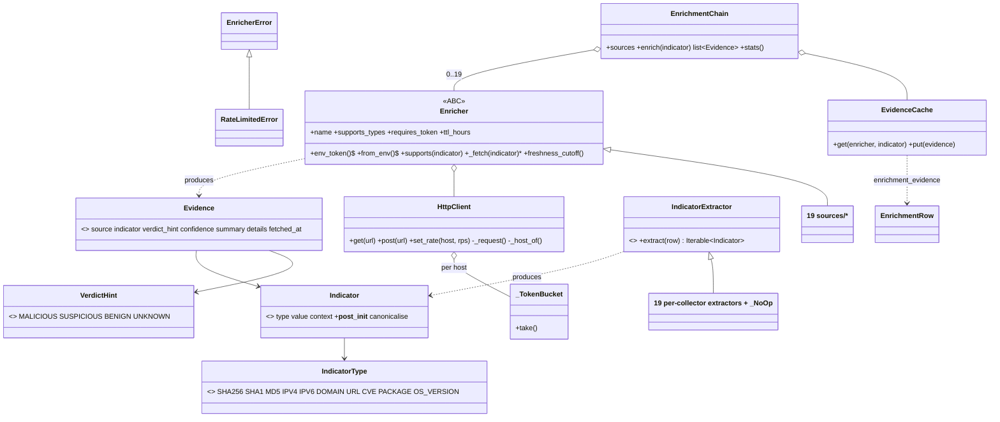
```mermaid
classDiagram
    class IndicatorType { <<StrEnum>> SHA256 SHA1 MD5 IPV4 IPV6 DOMAIN URL CVE PACKAGE OS_VERSION }
    class VerdictHint { <<StrEnum>> MALICIOUS SUSPICIOUS BENIGN UNKNOWN }
    class Indicator { <<frozen>> type value context +__post_init__ canonicalise }
    class Evidence { <<frozen>> source indicator verdict_hint confidence summary details fetched_at }
    class Enricher {
        <<ABC>>
        +name +supports_types +requires_token +ttl_hours
        +env_token()$ +from_env()$ +supports(indicator) +_fetch(indicator)* +freshness_cutoff()
    }
    class EnricherError
    class RateLimitedError
    EnricherError <|-- RateLimitedError
    class HttpClient { +get(url) +post(url) +set_rate(host, rps) -_request() -_host_of() }
    class _TokenBucket { +take() }
    HttpClient o-- _TokenBucket : per host
    class EvidenceCache { +get(enricher, indicator) +put(evidence) }
    class EnrichmentChain { +sources +enrich(indicator) list~Evidence~ +stats() }
    class IndicatorExtractor { <<ABC>> +extract(row) Iterable~Indicator~ }

    Indicator --> IndicatorType
    Evidence --> Indicator
    Evidence --> VerdictHint
    Enricher ..> Evidence : produces
    Enricher o-- HttpClient
    EnrichmentChain o-- Enricher : 0..19
    EnrichmentChain o-- EvidenceCache
    EvidenceCache ..> EnrichmentRow : enrichment_evidence
    IndicatorExtractor ..> Indicator : produces
    class Extractors["19 per-collector extractors + _NoOp"]
    class Sources["19 sources/*"]
    IndicatorExtractor <|-- Extractors
    Enricher <|-- Sources
```

### 5.1 Build and dispatch

`build_default_chain(engine, Base, enable=)` → `discover_enricher_classes()`
walks `sources/` with `pkgutil`, keeps concrete `Enricher` subclasses, drops
those whose `env_token()` is missing (or not in `--enrich-only`), constructs
each with the shared `HttpClient`, and returns `EnrichmentChain(enrichers,
EvidenceCache)`. No source is named anywhere: adding one is a new file.

`extract_indicators(collector, row)` looks up the `EXTRACTORS` dispatch
table by collector `name` (falling back to `_NoOp`), dedupes within the row and
returns typed `Indicator`s:

| Extractor | Collector | Indicator types emitted |
|---|---|---|
| `ProcessExtractor` | processes | SHA256 of the executable |
| `NetworkConnectionExtractor` | network_connections | IPV4 (public remote) |
| `NetworkFlowExtractor` | network_flows | IPV4, IPV6 (public destination) |
| `DnsQueryExtractor` | dns_queries | DOMAIN |
| `HostsFileExtractor` | hosts_file | IPV4, IPV6, DOMAIN |
| `ListeningPortExtractor` | listening_ports | IPV4 |
| `LaunchItemExtractor` | launch_items | SHA256 of the program |
| `SetuidFileExtractor` | setuid_files | SHA256 |
| `QuarantineExtractor` | quarantine_events | URL, DOMAIN, IPV4 (origin) |
| `BrowserExtensionExtractor` | browser_extensions | DOMAIN (host_permissions) |
| `InstalledAppExtractor` | installed_apps | PACKAGE |
| `SystemIntegrityExtractor` | system_integrity | OS_VERSION |
| `ProcessExecEventExtractor` | process_exec_events | SHA256 |
| `FileIntegrityExtractor` | file_integrity | SHA256 |
| `FileScanExtractor` | file_scan | SHA256 of the matched file |
| `DnsResolverExtractor` | dns_resolvers | IPV4, IPV6 (public nameserver) |
| `ProxyConfigExtractor` | proxy_config | IPV4, IPV6, DOMAIN, URL (PAC) |
| `NetworkShareExtractor` | network_shares | IPV4, DOMAIN (share server) |
| `LoginSessionExtractor` | login_sessions | IPV4, IPV6, DOMAIN (remote source) |

Helpers: `_is_ipv4`, `_is_ipv6`, `_is_private_ip`, `_is_domain`,
`_safe_loads`, `_sha256_of_file`, `_share_server`.

### 5.2 `EnrichmentChain.enrich()`

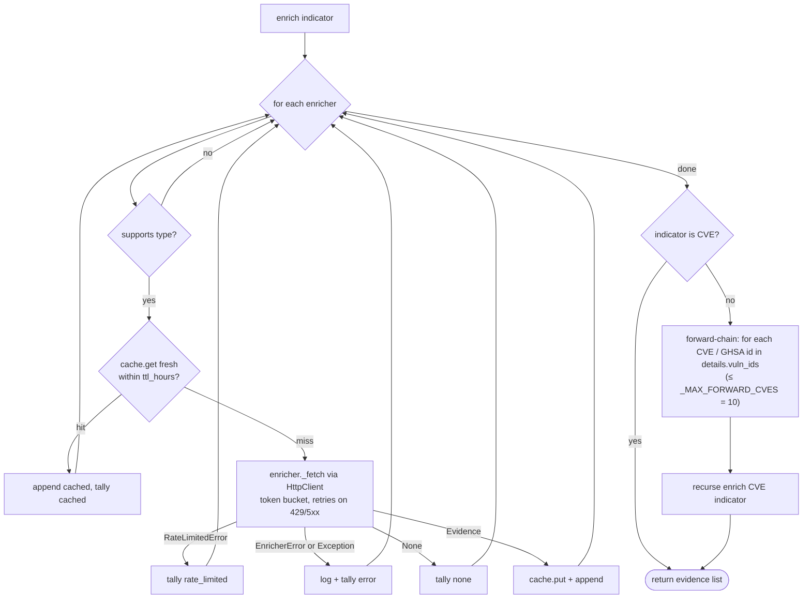
```mermaid
flowchart TD
    A[enrich indicator] --> B{for each enricher}
    B --> C{supports type?}
    C -->|no| B
    C -->|yes| D{cache.get fresh<br/>within ttl_hours?}
    D -->|hit| E[append cached, tally cached] --> B
    D -->|miss| F[enricher._fetch via HttpClient<br/>token bucket, retries on 429/5xx]
    F -->|RateLimitedError| G[tally rate_limited] --> B
    F -->|EnricherError or Exception| H[log + tally error] --> B
    F -->|None| I[tally none] --> B
    F -->|Evidence| J[cache.put + append] --> B
    B -->|done| K{indicator is CVE?}
    K -->|yes| Z([return evidence list])
    K -->|no| L["forward-chain: for each CVE / GHSA id in details.vuln_ids<br/>(≤ _MAX_FORWARD_CVES = 10)"]
    L --> M[recurse enrich CVE indicator] --> Z
```

The chain never aggregates: the judge sees every `Evidence` entry as
`{src, type, value, hint, confidence, note}`. `worst_hint()` exists for callers
that need one summary.

### 5.3 Sources (`sources/`)

| Source `name` | Class | Indicator types | Token env var | TTL (h) |
|---|---|---|---|---|
| `abuseipdb` | `AbuseIpDbEnricher` | IPV4 | `ABUSEIPDB_API_KEY` | 12 |
| `circl_hashlookup` | `CirclHashlookupEnricher` | SHA256, SHA1, MD5 | none | 336 |
| `cisa_kev` | `CisaKevEnricher` | CVE | none (feed cached in memory) | 12 |
| `crtsh` | `CrtShEnricher` | DOMAIN | none | 24 |
| `endoflife` | `EndOfLifeEnricher` | OS_VERSION | none | 168 |
| `feodo_tracker` | `FeodoTrackerEnricher` | IPV4 | none (feed cached in memory) | 6 |
| `github_advisory` | `GitHubAdvisoryEnricher` | CVE | `GITHUB_TOKEN` | 24 |
| `greynoise` | `GreyNoiseEnricher` | IPV4 | `GREYNOISE_API_KEY` | 24 |
| `ipwhois_geo` | `IpwhoisGeoEnricher` | IPV4, IPV6 | none | 168 |
| `local_denylist` | `LocalHashDenylistEnricher` | SHA256, SHA1, MD5 | none (offline `rules/hash_denylist.txt`) | 8760 |
| `malware_bazaar` | `MalwareBazaarEnricher` | SHA256, SHA1, MD5 | `ABUSE_CH_AUTH_KEY` | 24 |
| `nvd` | `NvdEnricher` | CVE | none | 168 |
| `osv` | `OSVEnricher` | PACKAGE, CVE | none | 24 |
| `phishtank` | `PhishTankEnricher` | URL | `PHISHTANK_API_KEY` | 12 |
| `safe_browsing` | `SafeBrowsingEnricher` | URL | `GOOGLE_SAFE_BROWSING_API_KEY` | 12 |
| `shodan_internetdb` | `ShodanInternetDBEnricher` | IPV4 | none | 24 |
| `threatfox` | `ThreatFoxEnricher` | IPV4, DOMAIN, URL, SHA256, SHA1, MD5 | `ABUSE_CH_AUTH_KEY` | 12 |
| `urlhaus` | `URLhausEnricher` | URL, DOMAIN | `ABUSE_CH_AUTH_KEY` | 12 |
| `virustotal` | `VirusTotalEnricher` | SHA256, SHA1, MD5, IPV4, DOMAIN, URL | `VT_API_KEY` | 24 |

Sources with no token are always on. Each class implements only `_fetch`;
`HttpClient` handles UA, timeouts, per-host rate (`set_rate`) and retry
backoff (`_RETRY_STATUS`, `_RETRY_BACKOFFS`).

---

## 6. Dashboard: `dashboard/`

A read-only Flask + HTMX app. `dashboard.html` is a shell; every panel is a
partial fetched over HTMX on `load` and re-fetched on an interval. The page
never renders data server-side on first paint.

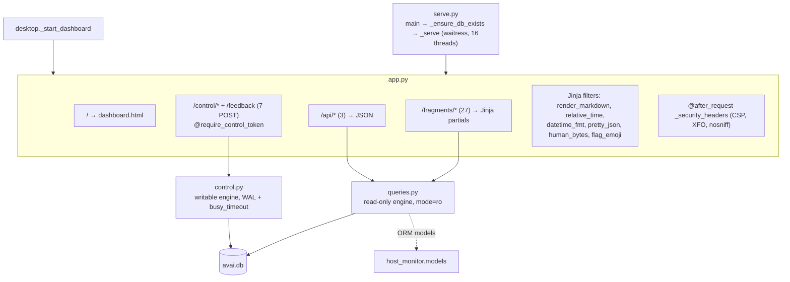
```mermaid
graph TD
    serve["serve.py<br/>main → _ensure_db_exists → _serve (waitress, 16 threads)"] --> appmod
    desktop["desktop._start_dashboard"] --> appmod
    subgraph appmod["app.py"]
        idx["/ → dashboard.html"]
        frags["/fragments/* (27) → Jinja partials"]
        api["/api/* (3) → JSON"]
        ctl["/control/* + /feedback (7 POST)<br/>@require_control_token"]
        filters["Jinja filters: render_markdown, relative_time,<br/>datetime_fmt, pretty_json, human_bytes, flag_emoji"]
        hdrs["@after_request _security_headers (CSP, XFO, nosniff)"]
    end
    frags --> Q["queries.py<br/>read-only engine, mode=ro"]
    api --> Q
    ctl --> C["control.py<br/>writable engine, WAL + busy_timeout"]
    Q --> DB[("avai.db")]
    C --> DB
    Q -. "ORM models" .-> HM["host_monitor.models"]
```

### 6.1 Routes

| Route | Handler | Renders | Query / control functions | Refresh |
|---|---|---|---|---|
| `/` | `index` | `dashboard.html` (`app_mode` flag) | | |
| `/fragments/header-meta` | `fragment_header_meta` | `_header_meta` | `latest_run` | 30 s |
| `/fragments/triage` | `fragment_triage` | `_triage` | `findings` ×2, `latest_risk`, `latest_run`, `read_control_state`, `monitor_alive` | 30 s |
| `/fragments/control` | `fragment_control` | `_control` | `read_control_state`, `monitor_alive` | 15 s |
| `/fragments/overview` | `fragment_overview` | `_overview` | `latest_run`, `runs_total`, `verdict_counts`, `judged_since`, `cost_since` | 30 s |
| `/fragments/resources` | `fragment_resources` | `_resources` | `host_resources`, `disk_usage`, `primary_filesystems`, `mount_tree` | 30 s |
| `/fragments/incident` | `fragment_incident` | `_incident` | `latest_narrative` | 60 s |
| `/fragments/vulnerabilities` | `fragment_vulnerabilities` | `_vulnerabilities` | `vulnerabilities` | 60 s |
| `/fragments/log-summary` | `fragment_log_summary` | `_log_summary` | `log_aggregates` | 60 s |
| `/fragments/logs` | `fragment_logs` | `_logs` | `log_entries` | 60 s |
| `/fragments/risk` | `fragment_risk` | `_risk` | `latest_risk`, `risk_trend`, `_sparkline_points` | 60 s |
| `/fragments/verdicts` | `fragment_verdicts` | `_verdicts` (chart via `/api/chart/verdicts`) | | 30 s |
| `/fragments/sysint` | `fragment_sysint` | `_sysint` | `system_integrity` | 60 s |
| `/fragments/posture` | `fragment_posture` | `_posture` | `latest_risk`, `risk_trend`, `system_integrity` | nested |
| `/fragments/findings` | `fragment_findings` | `_findings` | `findings`, `collector_options`, `category_options` | load, paginated |
| `/fragments/network` | `fragment_network` | `_network` (tabs) | | load |
| `/fragments/network-flows` | `fragment_network_flows` | `_network_flows` | `network_flows` (+ `_attach_ip_enrichment`) | tab |
| `/fragments/listening-ports` | `fragment_listening_ports` | `_listening_ports` | `listening_ports` | tab |
| `/fragments/dns-queries` | `fragment_dns_queries` | `_dns_queries` | `dns_queries` | tab |
| `/fragments/network-topology` | `fragment_network_topology` | `_network_topology` | `network_topology` | tab |
| `/fragments/network-exposure` | `fragment_network_exposure` | `_network_exposure` | `network_exposure` | tab |
| `/fragments/collection` | `fragment_collection` | `_collection` | `recent_runs`, `row_counts`, `collector_errors` | 30 s |
| `/fragments/row-counts` | `fragment_row_counts` | `_row_counts` | `row_counts`, `_prior_run` | nested |
| `/fragments/runs` | `fragment_runs` | `_runs` | `recent_runs` | nested |
| `/fragments/errors` | `fragment_errors` | `_errors` | `collector_errors` | nested |
| `/fragments/persistence` | `fragment_persistence` | `_persistence` | `persistence_tampering` | 60 s |
| `/fragments/file-scan` | `fragment_file_scan` | `_file_scan` | `file_scan` (+ `yara_status`, `yara_coverage`) | 60 s |
| `/fragments/auth-events` | `fragment_auth_events` | `_auth_events` | `auth_events_aggregated` | 30 s |
| `/api/chart/verdicts` | `api_chart_verdicts` | JSON | `verdict_timeseries` | |
| `/api/chart/resources` | `api_chart_resources` | JSON | `resource_trend` | |
| `/api/notifications/new` | `api_notifications_new` | JSON | `new_alerts(since)` | JS poll; Docker healthcheck |
| `POST /control/pause`, `/control/resume` | `control_pause` / `control_resume` | `_control` | `set_paused` | token |
| `POST /control/scan-now` | `control_scan_now` | `_control` | `bump_scan_now` | token |
| `POST /control/collector/<name>/<on,off>` | `control_collector` | `_control` | `set_collector` | token |
| `POST /control/settings` | `control_settings` | `_control` | `set_settings(interval, judge, enrich)` | token |
| `POST /control/maintenance/<action>` | `control_maintenance` | `_control` | `queue_command` (`prune`, `clear`, `rejudge`, `renarrate`, `reset_baseline`) | token |
| `POST /feedback/<collector>/<hash>/<label>` | `feedback_record` | inline HTML | `record_feedback` | token |

`require_control_token` reads `AVAI_CONTROL_TOKEN` and compares it with the
`X-Avai-Token` header (constant-time); unset token → 403 (fails closed). The
desktop app bypasses it with `AVAI_CONTROL_OPEN=1` (`_control_open`).

### 6.2 Query layer (`queries.py`, 2774 lines)

| Group | Functions |
|---|---|
| Engine / session | `_engine` (process-wide read-only engine, cached per path, `mode=ro`), `_session`, `_log_query` (optional SQL log), `_cache_key`, `_existing_tables`, `_existing_columns` (defensive against DBs written by older monitors) |
| Run and posture | `latest_run`, `latest_narrative`, `latest_risk`, `risk_trend`, `system_integrity`, `host_resources`, `disk_usage`, `primary_filesystems`, `mount_tree` (+ `_path_components`, `_is_ancestor`), `resource_trend` |
| Findings | `findings` (paginated, filters: verdict, status, collector, category, q, sort), `collector_options`, `category_options`, `_row_and_artifact` (source row for a judgment), `new_alerts`, `verdict_counts`, `verdict_timeseries`, `judged_since`, `cost_since` |
| Vulnerabilities | `vulnerabilities` (CVE / EOL evidence joined to running and exposed software), `_severity_from_cvss`, `_item_severity`, `_normalize_software`, `_software_presence` |
| Collection health | `recent_runs`, `runs_total`, `row_counts` (per collector, delta vs previous run), `collector_errors` |
| Network | `network_flows` (aggregated by destination, geo and host from cached evidence: `_attach_ip_enrichment`, `_geo_from_details`, `_geo_richness`, `_host_from_details`, `_port_sort_key`), `listening_ports` (`_addr_scope`, `_cmdline_str`), `dns_queries` (`_dns_resolution_level`), `network_topology`, `network_exposure`, `_collector_rows_with_verdict` (generic rows + verdict join) |
| File scan | `yara_status`, `file_scan`, `yara_coverage` |
| Persistence | `persistence_tampering` (SSH keys, hosts file, privilege config, each paginated) |
| Auth events | `auth_events_aggregated` (grouped by content_hash, cached per window: `_auth_summary`, `_auth_subsystem_tabs`) |
| Logs | `log_entries`, `log_aggregates` (`_normalize_log_message`, `_log_group_by_unit` / `_source` / `_message`) |
| Utilities | `_paginate`, `_parse_json_list`, `_parse_json_obj` |

Constants worth knowing: `COLLECTOR_MODELS` (collector `name` → model, built
from `host_monitor.slices`; used by findings, row counts, the control panel and
feedback validation),
`SEVERITY_ORDER`, `VERDICTS`, `PER_PAGE_OPTIONS`, `DEFAULT_PER_PAGE`,
`DEFAULT_DB_PATH`.

`DISPLAY_FIELDS` is still kept by hand. It has no entry for 15 slices: the 12
source-injected network, exposure and persistence slices, plus `auth_events`,
`log_entries` and `network_interfaces`. Findings from the judged ones show an
empty artifact label.

### 6.3 `control.py` and `serve.py`

`control.py`: `_write_engine` (cached writable engine, `_on_connect` sets WAL
and `busy_timeout=5000`), `_ensure_row`, `_update`, `set_paused`,
`bump_scan_now`, `set_settings`, `set_collector`, `queue_command`,
`record_feedback` (latest-wins per finding), `read_control_state`,
`monitor_alive` (`last_seen_at` within `MONITOR_LIVENESS_WINDOW_S` = 120 s).

`serve.py`: `_build_parser` (`--db`, `--host`, `--port` 8765, `--debug`,
`--open`), `main`, `_ensure_db_exists` (runs `Sink.setup()` on a temporary
write engine so every table exists before the read-only engine opens),
`_serve` → `_run_server` (waitress, 16 threads; Werkzeug only with `--debug`),
`_open_browser`, `_hosts_notice` (best-effort `avai.local` mapping banner),
`_http_url`, `_bind_error_message`.

---

## 7. Control plane and operator feedback

The dashboard cannot signal the monitor; both poll the same row.

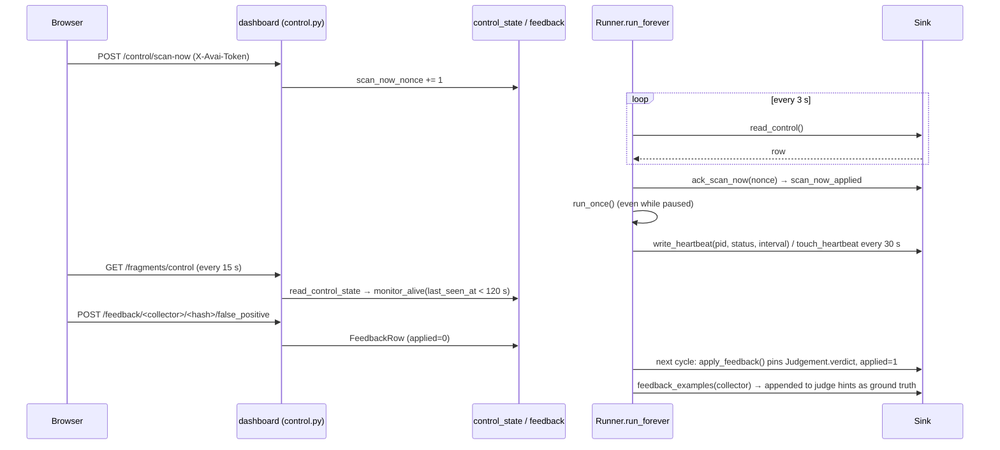
```mermaid
sequenceDiagram
    participant B as Browser
    participant D as dashboard (control.py)
    participant DB as control_state / feedback
    participant R as Runner.run_forever
    participant S as Sink

    B->>D: POST /control/scan-now (X-Avai-Token)
    D->>DB: scan_now_nonce += 1
    loop every 3 s
        R->>S: read_control()
        S-->>R: row
    end
    R->>S: ack_scan_now(nonce) → scan_now_applied
    R->>R: run_once() (even while paused)
    R->>S: write_heartbeat(pid, status, interval) / touch_heartbeat every 30 s
    B->>D: GET /fragments/control (every 15 s)
    D->>DB: read_control_state → monitor_alive(last_seen_at < 120 s)

    B->>D: POST /feedback/<collector>/<hash>/false_positive
    D->>DB: FeedbackRow (applied=0)
    R->>S: next cycle: apply_feedback() pins Judgement.verdict, applied=1
    R->>S: feedback_examples(collector) → appended to judge hints as ground truth
```

Other control fields: `paused`, `interval_override`, `judge_enabled`,
`enrich_enabled`, `disabled_collectors` (comma list; a disabled streaming
collector keeps its worker but is no longer judged), and the one-shot
`command` / `command_nonce` / `command_applied` / `command_result` triple.

---

## 8. Schema management

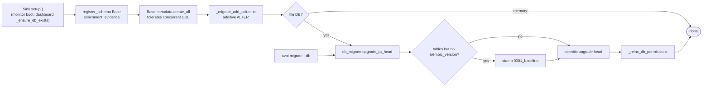
```mermaid
flowchart LR
    A["Sink.setup()<br/>(monitor boot, dashboard _ensure_db_exists)"] --> B[register_schema Base<br/>enrichment_evidence]
    B --> C[Base.metadata.create_all<br/>tolerates concurrent DDL]
    C --> D[_migrate_add_columns<br/>additive ALTER]
    D --> E{file DB?}
    E -->|":memory:"| Z([done])
    E -->|yes| F[db_migrate.upgrade_to_head]
    F --> G{tables but no alembic_version?}
    G -->|yes| H[stamp 0001_baseline]
    G -->|no| I
    H --> I[alembic upgrade head]
    I --> J[_relax_db_permissions] --> Z
    cli["avai migrate --db"] --> F
```

| Revision | Adds |
|---|---|
| `0001_baseline` | the schema as built by `create_all` (no-op body) |
| `0002_perf_indexes` | indexes for hot dashboard paths (`IF NOT EXISTS`) |
| `0003_control_state` | `control_state` row |
| `0004_host_resources` | `host_resources`, `disk_usage` + indexes |
| `0005_file_scan` | `file_scan` + indexes |
| `0006_file_scan_meta` | `file_scan.meta_json` |
| `0007_yara_status` | `yara_status` |
| `0008_yara_rule` | `yara_rule` + indexes |
| `0009_file_scan_strings` | `file_scan.strings_json` |
| `0010_yara_coverage` | `yara_coverage` |
| `0011_feedback` | `feedback` |
| `0012_log_entries` | `log_entries` + indexes |

`migrations/env.py` (`run_migrations_offline` / `run_migrations_online`)
imports `Base` from `host_monitor` and registers the enrichment schema so
autogenerate sees the full metadata.

---

## 9. `hostsfile.py`

Maps `avai.local` to loopback so the dashboard is reachable by name. Pure
transform over the file text, platform facts behind a Protocol, atomic write.

```mermaid
classDiagram
    class Platform { <<Protocol>> +hosts_path() Path +elevation_hint(path) str }
    class _PosixPlatform
    class _WindowsPlatform
    Platform <|.. _PosixPlatform
    Platform <|.. _WindowsPlatform
    class HostsTable { <<frozen>> text +resolves(hostname) +with_mapping(hostname, ips) +without(hostname) }
    class Outcome { <<Enum>> CREATED REMOVED UNCHANGED NEEDS_PRIVILEGE }
    class HostsRegistrar { +for_current_platform()$ +hosts_path +resolves() +install(hostname, ips) +remove(hostname) +ensure_reachable() -_read() -_write() }
    class HostsError
    class UnsupportedPlatformError
    class HostsPermissionError
    HostsError <|-- UnsupportedPlatformError
    HostsError <|-- HostsPermissionError
    HostsRegistrar o-- Platform
    HostsRegistrar ..> HostsTable
    HostsRegistrar ..> Outcome
```

Functions: `resolve_platform`, `_entry_hostnames`, `_validate_hostname`,
`_atomic_write`. Entry points: `avai install-hosts` (`cli._cmd_install_hosts`)
and the dashboard launch banner (`serve._hosts_notice` → `ensure_reachable`,
which reports `NEEDS_PRIVILEGE` instead of failing when not elevated). The
managed block is delimited by `_BLOCK_BEGIN` / `_BLOCK_END` markers.

---

## 10. Threads and processes

```mermaid
graph TD
    subgraph monitor["avai monitor process"]
        main["main thread<br/>Runner.run_forever → run_once"]
        s1["stream-auth_events thread<br/>StreamingWorker"]
        s2["stream-process_exec_events thread<br/>StreamingWorker"]
        p1["subprocess: log stream / journalctl -f / Get-WinEvent"]
        p2["subprocess: eslogger exec / journalctl auditd / 4688 events"]
        main -->|start_streaming| s1
        main -->|start_streaming| s2
        s1 --> p1
        s2 --> p2
        main -->|"collect(): tcpdump, arp, scutil, ..."| p3["short-lived subprocesses via CommandRunner"]
    end
    subgraph dashboard["avai dashboard process"]
        w["waitress, 16 worker threads"]
        ro["read-only engine (mode=ro), cached per DB path"]
        rw["write engine (control_state, feedback)"]
        w --> ro
        w --> rw
    end
    db[("avai.db, WAL")]
    main -->|writes| db
    s1 -->|buffered writes| db
    s2 -->|buffered writes| db
    ro -->|reads| db
    rw -->|control writes| db
    sig["SIGINT / SIGTERM"] -->|request_shutdown → shutdown_event| main
    main -->|stop_streaming → stop_event| s1
    main -->|stop_streaming → stop_event| s2
```

- SQLite runs in WAL mode; the engine is created with
  `check_same_thread=False` so worker threads share the pool. SQLite serialises
  writes; readers never block.
- The desktop app collapses both boxes into one process: threads
  `avai-dashboard` (waitress) and `avai-monitor` (`build_runner` +
  `run_forever`), with pywebview blocking the main thread.
- Docker runs both under `supervisord` in one container; compose can split
  them into `monitor` (root, host namespaces) and `dashboard` services.

---

## 11. Test map

| Test module | Covers |
|---|---|
| `test_cli.py`, `test_desktop.py`, `test_serve.py` | `cli.main`, `desktop`, `dashboard.serve` |
| `test_runner.py`, `test_integration.py`, `test_host_monitor.py` | `Runner` cycle, correlation, feedback, verify / investigate, end-to-end cycle against a temp DB |
| `test_streaming_worker.py`, `test_stream_parsers.py` | `StreamingWorker` + supervision, `LineParser` strategies |
| `test_collectors.py`, `test_new_collectors.py`, `test_listening_ports.py`, `test_network_flows.py`, `test_resources.py`, `test_disk_container.py`, `test_browser_readers.py`, `test_file_scan.py`, `test_security_controls.py` | snapshot collectors, tcpdump parsing, resource and disk metrics, YARA scanning, service controls |
| `test_net_collectors.py`, `test_exposure_collectors.py`, `test_persistence_collectors.py`, `test_hosts.py`, `test_windows.py` | source-injected collectors and every OS parser, host composition roots |
| `test_runtime.py`, `test_row_source.py`, `test_misc_helpers.py` | `runtime/*`, `CommandSnapshot` / `FileSnapshot`, coercion and digest helpers |
| `test_llm_judge.py`, `test_judge_auth.py` | `LlmJudge` parsing and batching, cost; the credential rule (one table-driven test) and `LlmStages.build` wiring |
| `test_sink_rotation.py`, `test_sink_setup_concurrency.py`, `test_migrations.py` | `prune_to_size`, concurrent `setup()`, Alembic upgrade path |
| `test_enrichers.py`, `test_enricher_sources.py`, `test_more_sources.py`, `test_indicators_edge.py`, `test_http.py`, `test_registry.py` | chain, cache, every source, extractors, `HttpClient`, discovery |
| `test_dashboard.py` | routes, query layer, control plane, feedback |
| `test_hostsfile.py` | `HostsTable`, `HostsRegistrar`, platforms |
| `test_layering.py` | import rules between packages (a lower layer never imports a higher one) |
| `test_slices.py` | the slice catalog matches the row models, collector classes, prompt hints and enrichment extractors |

Run with `PYTEST_DISABLE_PLUGIN_AUTOLOAD=1 pytest -q` (avoids a thinc / numpy
plugin crash on this machine).

---

## 12. Where do I look for…

| I want to… | Go to |
|---|---|
| Add a telemetry slice | ORM row in `models.py` (+ migration), collector in `collectors.py` (or a `_SourceSnapshotCollector` + `RowParser` in `net_/exposure_/persistence_collectors.py`), wire it in each `hosts/*Host.snapshot_collectors`, add a hint in `prompts.toml [collector_hints]`, declare it in `host_monitor/slices.py` (`tests/test_slices.py` fails until every step is done), optionally an `IndicatorExtractor` |
| Support a new OS quirk | the `FilesystemLayout` / `PrivilegedAccounts` adapter in `hosts/<os>.py`; never branch on `platform.system()` elsewhere |
| Add a threat-intel source | new file in `enrichers/sources/` subclassing `Enricher` with `_fetch`; auto-discovered |
| Change what the LLM is told | `prompts.toml`; the context bundle is built in `Runner._run_collector` (`evidence`, `baseline`, `related`, `rule_meta`) |
| Change verdict post-processing | `Runner._verify_judgments`, `_investigate_unknowns`, `_apply_feedback` |
| Change the posture score | `risk.compute_risk_score` + `RISK_WEIGHTS` / `RISK_GRADES` |
| Add a dashboard panel | query fn in `dashboard/queries.py`, route in `dashboard/app.py`, partial in `templates/partials/`, `hx-get` in `dashboard.html` |
| Add a control action | `dashboard/control.py` + route with `@require_control_token`, then handle it in `Runner._dispatch_command` |
| Tune DB size, intervals, LLM caps | `constants.py`, `--max-db-mb`, `Sink.prune_to_size` |
| Debug a streaming collector that keeps dying | `supervision.py` constants and `LoggingSupervisionListener` output; `streaming_sessions` table |
| Ship a release | `pyproject.toml` version, `CHANGELOG.md`, tag `vX.Y.Z` → `release.yml`; `scripts/update_rules.py` refreshes the YARA pack before building the wheel |

---

## Appendix A: full inventory of classes and functions

Generated from the AST of `src/avai` at the snapshot above. Every module,
class (with base classes, decorators, fields and methods) and module-level
function, with its line number and the first line of its docstring. Method
signatures omit `self` / `cls`.


### A.1 Entry points and utilities


#### `avai` · `avai/__init__.py` · 16 lines

_avai: macOS / Linux host security telemetry collector with an LLM_


#### `avai.cli` · `avai/cli.py` · 186 lines

_avai CLI: subcommand dispatcher._

Constants: `_USAGE`

- `_print_usage(stream) -> None` (L44)
- `_cmd_rules(rules_dir, do_list) -> int` (L48) : Compile the file-scanner ruleset and report what loaded: the
- `_cmd_install_hosts(hostname, remove) -> int` (L68) : Add/remove the ``hostname -> 127.0.0.1`` mapping in the OS hosts file.
- `main(argv) -> int` (L95)

#### `avai.desktop` · `avai/desktop.py` · 107 lines

_In-process desktop app: the dashboard and the monitor run as threads in one_

Constants: `CONFIG_PATH`

- `_free_port() -> int` (L25)
- `_load_api_key(path) -> str | None` (L33) : Read the LLM key the settings screen wrote, or None (viz-only).
- `_start_dashboard(db, port) -> threading.Thread` (L41) : Serve the existing Flask dashboard on a daemon thread. Read-only, so no
- `_start_monitor(db, api_key)` (L64) : Build the monitor in-process and run its loop on a daemon thread.
- `main() -> int` (L89)

#### `avai.db_migrate` · `avai/db_migrate.py` · 48 lines

_Programmatic Alembic runner._

Constants: `_HERE`, `_SCRIPT_LOCATION`, `_BASELINE`

- `_config(db_url)` (L19)
- `upgrade_to_head(db_url) -> None` (L28) : Apply all pending migrations to ``db_url``.

#### `avai.hostsfile` · `avai/hostsfile.py` · 331 lines

_Map ``avai.local`` (or any name) onto loopback in the OS hosts file so the_

Constants: `DASHBOARD_HOSTNAME`, `LOOPBACK_IPV4`, `LOOPBACK_IPV6`, `LOOPBACK_ADDRESSES`, `_BLOCK_BEGIN`, `_BLOCK_END`, `_BLOCK_NOTE`, `_LABEL`, `_HOSTNAME_RE`

- **class `HostsError(RuntimeError)`** (L59) : Base class for hosts-file management failures.
- **class `UnsupportedPlatformError(HostsError)`** (L63)
  - `__init__(system) -> None`
- **class `HostsPermissionError(HostsError)`** (L69) : The hosts file exists but can't be written without more privilege.
  - `__init__(path, hint) -> None`
- **class `Platform(Protocol)`** `@runtime_checkable` (L79) : OS-varying hosts-file facts the registrar depends on (DIP).
  - `hosts_path() -> Path`
  - `elevation_hint(path) -> str`
- **class `_PosixPlatform`** (L91) : macOS and Linux: ``/etc/hosts``, writable by root.
  - `hosts_path() -> Path`
  - `elevation_hint(path) -> str`
- **class `_WindowsPlatform`** (L101) : Windows: ``%SystemRoot%\System32\drivers\etc\hosts``, writable by
  - `hosts_path() -> Path`
  - `elevation_hint(path) -> str`
- **class `HostsTable`** `@dataclass(frozen=True)` (L139) : An I/O-free view of a hosts file's text.
  - fields: `text: str`
  - `resolves(hostname) -> bool`
  - `with_mapping(hostname, ips) -> 'HostsTable'`
  - `without(hostname) -> 'HostsTable'`
  - `_newline() -> str`
  - `_split_block() -> tuple[list[str], list[str], list[str]]`
  - `_block_entries() -> dict[str, list[str]]`
  - `_rewrite(entries) -> str`
- **class `Outcome(Enum)`** (L216)
  - fields: `CREATED`, `REMOVED`, `UNCHANGED`, `NEEDS_PRIVILEGE`
- **class `HostsRegistrar`** (L267) : Read → transform → atomic-write the hosts file through a ``Platform``.
  - `__init__(platform_) -> None`
  - `for_current_platform() -> 'HostsRegistrar'` `@classmethod`
  - `hosts_path() -> Path` `@property`
  - `resolves(hostname) -> bool`
  - `install(hostname, ips) -> Outcome`
  - `remove(hostname) -> Outcome`
  - `ensure_reachable(hostname, ips) -> Outcome`
  - `_read() -> HostsTable`
  - `_write(text) -> None`
- `resolve_platform(system) -> Platform` (L115) : Select the hosts-file strategy for the current (or a named) OS.
- `_entry_hostnames(line) -> list[str]` (L129) : Hostnames declared by an active (non-comment) hosts line; ``[]`` for
- `_validate_hostname(hostname) -> None` (L223)
- `_atomic_write(path, text) -> None` (L228) : Write ``text`` to ``path`` via a same-directory temp file + ``os.replace``

### A.2 host_monitor (engine)


#### `avai.host_monitor` · `avai/host_monitor/__init__.py` · 328 lines

_avai.host_monitor: package facade._


#### `avai.host_monitor.collectors` · `avai/host_monitor/collectors.py` · 3301 lines

_Snapshot + streaming collectors and their platform builders._

Constants: `_YARA_EXTERNALS`, `_SYSLOG_LEVELS`, `_TEXT_LEVEL_PATTERNS`

- **class `Collector(ABC)`** (L67) : Common base for any host-state collector. Subclass
  - fields: `slice: ClassVar[slices.Slice]`, `judge_enabled: ClassVar[bool]`, `judge_fields: ClassVar[tuple[str, ...]]`
  - `__init__(judge_hints)`
  - `name() -> str` `@property`
  - `model() -> type[_RowBase]` `@property`
  - `table() -> str` `@property`
- **class `SnapshotCollector(Collector)`** (L96) : Pull model: the Runner calls :meth:`collect` once per cycle and
  - `collect() -> Iterable[dict]` `@abstractmethod`
- **class `StreamingCollector(Collector)`** (L109) : Push model: the Runner starts :meth:`stream` once in a dedicated
  - fields: `judge_enabled: ClassVar[bool]`
  - `stream(stop_event) -> Iterable[dict]` `@abstractmethod`
- **class `BrowserExtensionReader(ABC)`** (L130)
  - `read(base, browser) -> Iterable[dict]` `@abstractmethod`
- **class `ChromiumExtensionReader(BrowserExtensionReader)`** (L135)
  - `read(base, browser)`
- **class `FirefoxExtensionReader(BrowserExtensionReader)`** (L173)
  - `read(base, browser)`
- **class `ProcessCollector(SnapshotCollector)`** (L204)
  - fields: `slice`, `judge_fields`, `_ATTRS`
  - `collect()`
- **class `NetworkConnectionsCollector(SnapshotCollector)`** (L244)
  - fields: `slice`, `judge_fields`
  - `collect()`
- **class `ListeningPortsCollector(SnapshotCollector)`** (L268)
  - fields: `slice`, `judge_fields`
  - `collect()`
- **class `ProcessConnectionResolver`** (L308) : Resolves which local process owns a socket to a remote endpoint by
  - `snapshot() -> dict[tuple[str, int], tuple[str, int]]`
  - `_proc_name(pid) -> str` `@staticmethod`
- **class `NetworkFlowsCollector(SnapshotCollector)`** (L346) : tcpdump-based flow aggregator.
  - fields: `slice`, `judge_fields`, `CAPTURE_SECONDS`, `MAX_PACKETS`, `MAX_FLOWS`
  - `__init__(judge_hints, resolver, iface_args)`
  - `collect()`
  - `_capture() -> tuple[str, Optional[str]]`
  - `_iface_from_banner(stderr) -> Optional[str]` `@staticmethod`
  - `_normalize_default_iface(iface) -> Optional[str]` `@staticmethod`
  - `_aggregate(output, default_iface) -> dict`
  - `_parse_line(line)` `@staticmethod`
  - `_service(port, proto)` `@staticmethod`
- **class `DnsQueriesCollector(SnapshotCollector)`** (L528) : tcpdump-based DNS visibility.
  - fields: `slice`, `judge_fields`, `CAPTURE_SECONDS`, `MAX_PACKETS`, `MAX_QUERIES`, `_DOH_IPS`
  - `__init__(judge_hints, resolver, iface_args)`
  - `collect()`
  - `_capture() -> tuple[str, Optional[str]]`
  - `_aggregate(output, default_iface, proc_map)`
  - `_parse_dns_line(line)` `@staticmethod`
- **class `NetworkInterfacesCollector(SnapshotCollector)`** (L702)
  - fields: `slice`, `judge_enabled`
  - `collect()`
- **class `HostResourcesCollector(SnapshotCollector)`** (L739) : Aggregate resource meters (memory, swap, CPU, load, uptime, tasks) , 
  - fields: `slice`, `judge_enabled`, `CPU_INTERVAL`
  - `__init__(metrics, clock, judge_hints)`
  - `collect()`
  - `_cpu_aggregate(sample) -> dict` `@staticmethod`
- **class `DiskUsageCollector(SnapshotCollector)`** (L848) : Per-filesystem capacity + best-effort per-device I/O counters: the
  - fields: `slice`, `judge_enabled`
  - `__init__(metrics, judge_hints)`
  - `collect()`
  - `_io_for(io, device)` `@staticmethod`
- **class `UsbDevicesCollector(SnapshotCollector)`** (L897)
  - fields: `slice`, `judge_fields`
  - `collect()`
  - `_walk(items, parent_location)`
- **class `BluetoothCollector(SnapshotCollector)`** (L926)
  - fields: `slice`, `judge_fields`, `_GROUPS`, `_PAIRED_GROUPS`
  - `collect()`
- **class `WifiCollector(SnapshotCollector)`** (L964)
  - fields: `slice`, `judge_fields`
  - `collect()`
- **class `LaunchItemsCollector(SnapshotCollector)`** (L991)
  - fields: `slice`, `judge_fields`
  - `collect()`
  - `_row(scope, path)` `@staticmethod`
- **class `QuarantineCollector(SnapshotCollector)`** (L1049)
  - fields: `slice`, `judge_fields`, `_COLUMN_MAP`
  - `collect()`
- **class `BrowserExtensionsCollector(SnapshotCollector)`** (L1075)
  - fields: `slice`, `judge_fields`
  - `__init__(readers, default_reader, judge_hints, profiles)`
  - `collect()`
- **class `SystemIntegrityCollector(SnapshotCollector)`** (L1109)
  - fields: `slice`, `judge_fields`, `_SERVICES`
  - `__init__(judge_hints, services, ports, processes) -> None`
  - `collect()`
- **class `UnifiedLogAuthParser`** (L1198) : Strategy: macOS ``log stream --style ndjson`` event → auth row.
  - `parse(event) -> dict`
- **class `AuthEventsCollector(StreamingCollector)`** (L1214) : Tails the macOS unified log forever via ``log stream``. Each
  - fields: `slice`, `judge_enabled`, `judge_fields`
  - `__init__(predicate, judge_hints)`
  - `stream(stop_event)`
- **class `FileIntegrityCollector(SnapshotCollector)`** (L1242)
  - fields: `slice`, `judge_fields`
  - `__init__(watched, judge_hints)`
  - `collect()`
  - `_missing(p)` `@staticmethod`
- **class `FileScanCollector(SnapshotCollector)`** (L1503) : Signature scanning: match YARA rules against a bounded set of
  - fields: `slice`, `judge_fields`, `_SECONDS_PER_DAY`
  - `__init__(judge_hints, fs, rules_dir, clock)`
  - `_ruleset()`
  - `collect()`
  - `_targets()`
  - `_recent_cutoff() -> float`
  - `_scan_file(path, source, rules)`
  - `_match_externals(path, st) -> dict` `@staticmethod`
- **class `InstalledAppsCollector(SnapshotCollector)`** (L1675)
  - fields: `slice`, `judge_fields`
  - `collect()`
- **class `LinuxInstalledAppsCollector(SnapshotCollector)`** (L1706) : Linux equivalent of :class:`InstalledAppsCollector`. Sources:
  - fields: `slice`, `judge_fields`, `_DPKG_FIELDS`
  - `collect()`
  - `_dpkg_rows()`
  - `_desktop_rows()`
- **class `LinuxLaunchItemsCollector(SnapshotCollector)`** (L1838) : Linux equivalent of :class:`LaunchItemsCollector`.
  - fields: `slice`, `judge_fields`, `_UNIT_DIRS`, `_CRON_FILE`, `_CRON_DROP_INS`, `_USER_CRONS`, `_ALWAYS_RESTART`
  - `collect()`
  - `_unit_row(scope, path)` `@staticmethod`
  - `_cron_rows(scope, path, has_user_col, default_user)` `@staticmethod`
- **class `LinuxAuthEventsCollector(StreamingCollector)`** (L2122) : Linux equivalent of :class:`AuthEventsCollector`: tails
  - fields: `slice`, `judge_enabled`, `judge_fields`, `_MATCH_GROUPS`
  - `__init__(judge_hints, priority)`
  - `_cmd() -> list[str]`
  - `stream(stop_event)`
- **class `JournalAuthParser`** (L2187) : Strategy: ``journalctl --output=json`` event → auth row.
  - `parse(event) -> dict`
- **class `LinuxUsbDevicesCollector(SnapshotCollector)`** (L2220) : Linux equivalent of :class:`UsbDevicesCollector`.
  - fields: `slice`, `judge_fields`, `_ATTRS`
  - `collect()`
- **class `LinuxBluetoothCollector(SnapshotCollector)`** (L2281) : Linux equivalent of :class:`BluetoothCollector`.
  - fields: `slice`, `judge_fields`
  - `collect()`
- **class `LinuxWifiCollector(SnapshotCollector)`** (L2346) : Linux equivalent of :class:`WifiCollector`.
  - fields: `slice`, `judge_fields`
  - `collect()`
  - `_iw_link(iface) -> dict` `@staticmethod`
- **class `LinuxSystemIntegrityCollector(SnapshotCollector)`** (L2420) : Linux equivalent of :class:`SystemIntegrityCollector`.
  - fields: `slice`, `judge_fields`, `_SSH`, `_VNC_PORT`
  - `__init__(judge_hints, services, ports, processes) -> None`
  - `collect()`
  - `_selinux_state() -> Optional[str]` `@staticmethod`
  - `_apparmor_state() -> dict` `@staticmethod`
  - `_ufw_active() -> bool` `@staticmethod`
  - `_service_active(unit) -> bool` `@staticmethod`
  - `_luks_count() -> int` `@staticmethod`
- **class `MountsCollector(SnapshotCollector)`** (L2588) : Cross-platform mount-table snapshot via ``psutil.disk_partitions``.
  - fields: `slice`, `judge_fields`
  - `collect()`
- **class `SetuidFilesCollector(SnapshotCollector)`** (L2625) : Enumerate setuid / setgid files in common executable directories.
  - fields: `slice`, `judge_fields`
  - `__init__(judge_hints, fs)`
  - `collect()`
- **class `SshAuthorizedKeysCollector(SnapshotCollector)`** (L2686) : Enumerate every key in every user's ``authorized_keys``: each one
  - fields: `slice`, `judge_fields`, `_KEY_TYPES`
  - `__init__(judge_hints, fs)`
  - `collect()`
  - `_parse_authorized_keys(content, path, owner)` `@classmethod`
- **class `HostsFileCollector(SnapshotCollector)`** (L2751) : Snapshot ``/etc/hosts``. A mapping that points a real domain at an
  - fields: `slice`, `judge_fields`
  - `__init__(judge_hints, fs)`
  - `collect()`
  - `_parse_hosts(content, path)` `@staticmethod`
- **class `PrivilegeConfigCollector(SnapshotCollector)`** (L2792) : Enumerate the host's privilege-granting configuration: sudoers
  - fields: `slice`, `judge_fields`
  - `__init__(judge_hints, fs, accounts)`
  - `collect()`
  - `_sudoers()`
  - `_parse_sudoers(content, path)` `@staticmethod`
- **class `MdmProfilesCollector(SnapshotCollector)`** (L2852) : macOS configuration profiles (MDM payloads). Unauthorized MDM
  - fields: `slice`, `judge_fields`
  - `collect()`
  - `_walk(items)` `@classmethod`
- **class `KernelExtensionsCollector(SnapshotCollector)`** (L2902) : macOS kernel extensions (kexts). Apple has deprecated them in
  - fields: `slice`, `judge_fields`
  - `collect()`
- **class `SystemExtensionsCollector(SnapshotCollector)`** (L2963) : macOS System Extensions: the post-Catalina replacement for
  - fields: `slice`, `judge_fields`
  - `collect()`
- **class `MacosProcessExecCollector(StreamingCollector)`** (L3007) : Tails ``eslogger exec``: Apple's Endpoint-Security CLI, shipped
  - fields: `slice`, `judge_enabled`, `judge_fields`, `_EVENTS`
  - `stream(stop_event)`
- **class `EsloggerExecParser`** (L3033) : Strategy: macOS ``eslogger exec`` Endpoint-Security event → exec row.
  - `parse(event) -> dict`
- **class `LinuxProcessExecCollector(StreamingCollector)`** (L3063) : Tails the Linux audit subsystem for ``execve`` events via
  - fields: `slice`, `judge_enabled`, `judge_fields`
  - `_cmd() -> list[str]`
  - `stream(stop_event)`
- **class `AuditExecParser`** (L3096) : Strategy: Linux audit ``journalctl --output=json`` event → exec row.
  - `parse(event) -> dict`
- **class `LogTailCollector(SnapshotCollector)`** (L3186) : Generic host log capture: a per-cycle snapshot of the most recent log
  - fields: `slice`, `judge_enabled`, `MAX_JOURNAL_LINES`, `MAX_FILE_LINES`, `_TAIL_BYTES`, `_JOURNAL_TIMEOUT_S`, `_DEFAULT_FILES`
  - `__init__(judge_hints, files)`
  - `collect()`
  - `_journald()`
  - `_parse_journal(line) -> Optional[dict]` `@staticmethod`
  - `_tail_file(path_str)`
- `_payload_bytes(parts) -> int` (L292) : Pull the payload length tcpdump prints for one packet (so flows
- `_crypto_hint(exc) -> str` (L1285) : Append an actionable hint when a ruleset fails to compile because
- `_file_type(path) -> str` (L1317) : Best-effort ``filetype`` external from leading magic bytes, using the
- `_redact_one_match(identifier, offset, data) -> dict` (L1344) : Render one matched byte run for the judge: printable runs as ``text``,
- `_redact_match_strings(match) -> list[dict]` (L1360) : A bounded, redacted view of the bytes a YARA match fired on.
- `_rule_source(path, rules_dir) -> str` (L1395) : Label a rule file by where it came from: top-level files are
- `_compile_yara_rules(rules_dir)` (L1405) : Compile every ``*.yar`` / ``*.yara`` under ``rules_dir`` into one
- `_journal_us_to_iso(value) -> Optional[str]` (L3166) : journald ``__REALTIME_TIMESTAMP`` (microseconds since epoch) → ISO-8601
- `_sniff_text_level(line) -> Optional[str]` (L3178)


#### `avai.host_monitor.constants` · `avai/host_monitor/constants.py` · 281 lines

_Defaults, tunables, pricing tables, and static data tables._

Constants: `LOG`, `_PKG_DIR`, `DEFAULT_DB_PATH`, `DEFAULT_INTERVAL`, `DEFAULT_LOOKBACK_MIN`, `DEFAULT_JUDGE_MODEL`, `DEFAULT_JUDGE_BATCH`, `DEFAULT_JUDGE_MAX_PER_COLLECTOR`, `DEFAULT_JUDGE_TIMEOUT_S`, `DEFAULT_BASELINE_MIN_RUNS`, `MONITOR_LIVENESS_WINDOW_S`, `MONITOR_PROGRESS_HEARTBEAT_S`, `STREAM_RESTART_BASE_BACKOFF_S`, `STREAM_RESTART_MAX_BACKOFF_S`, `STREAM_RESTART_BACKOFF_FACTOR`, `STREAM_CRASH_ESCALATE_THRESHOLD`, `STREAM_HEALTHY_RESET_S`, `_CORRELATED_COLLECTOR`, `_FILE_SCAN_COLLECTOR`, `_LAUNCH_ITEM_COLLECTOR`, `DEFAULT_NARRATIVE_MODEL`, `RISK_WEIGHTS`, `RISK_GRADES`, `MODEL_PRICING`, `DEFAULT_PRICING`, `DEFAULT_PROMPTS_PATH`, `WATCHED_FILES`, `WATCHED_FILES_LINUX`, `AUTH_LOG_PREDICATE`, `APP_INFO_KEYS`, `HOST_PREFIX`, `YARA_RULES_DIR`, `YARA_MAX_FILE_BYTES`, `YARA_MATCH_TIMEOUT_S`, `YARA_MAX_FILES_PER_CYCLE`, `YARA_DOWNLOADS_RECENT_DAYS`, `YARA_MAX_MATCH_STRINGS`, `YARA_MATCH_STRING_MAX_BYTES`, `HASH_DENYLIST_PATH`


#### `avai.host_monitor.coverage` · `avai/host_monitor/coverage.py` · 118 lines

_Second-stage LLM that assesses YARA ruleset coverage for the host._

- **class `YaraCoverageAssessor`** (L20) : Second-stage LLM that reads the loaded YARA ruleset + a host profile
  - fields: `SCHEMA_NAME`, `POSTURES`, `TEMPERATURE`, `MAX_TOKENS`
  - `_coverage_schema() -> dict` `@classmethod`
  - `__init__(prompts, client, model)`
  - `assess(ruleset, host) -> Optional[dict]`
  - `_clean_items(raw, label_key) -> list[dict]` `@staticmethod`

#### `avai.host_monitor.enums` · `avai/host_monitor/enums.py` · 55 lines

_Typed categorical enums shared across the monitor._

- **class `Verdict(StrEnum)`** (L8)
  - fields: `BENIGN`, `SUSPICIOUS`, `MALICIOUS`, `UNKNOWN`
- **class `ThreatCategory(StrEnum)`** (L15)
  - fields: `NONE`, `PERSISTENCE`, `PRIVILEGE_ESCALATION`, `DEFENSE_EVASION`, `CREDENTIAL_ACCESS`, `DISCOVERY`, `LATERAL_MOVEMENT`, `COLLECTION`, `COMMAND_AND_CONTROL`, `EXFILTRATION`, `IMPACT`, `INITIAL_ACCESS`, `EXECUTION`, `RECONNAISSANCE`
- **class `FeedbackLabel(StrEnum)`** (L32) : Operator correction on a finding, fed back into judging.
  - fields: `FALSE_POSITIVE`, `CONFIRMED`
- **class `LaunchScope(StrEnum)`** (L39)
  - fields: `USER_AGENT`, `SYSTEM_AGENT`, `SYSTEM_DAEMON`, `APPLE_AGENT`, `APPLE_DAEMON`
- **class `Browser(StrEnum)`** (L47)
  - fields: `CHROME`, `CHROME_BETA`, `CHROMIUM`, `BRAVE`, `EDGE`, `ARC`, `VIVALDI`, `FIREFOX`

#### `avai.host_monitor.exposure_collectors` · `avai/host_monitor/exposure_collectors.py` · 399 lines

_Network exposure & MITM-surface collectors (Tier 2)._

Constants: `_NET_FS`

- **class `ProxyConfigCollector(_SourceSnapshotCollector)`** (L24)
  - fields: `slice`, `judge_fields`
- **class `LoginSessionsCollector(_SourceSnapshotCollector)`** (L29)
  - fields: `slice`, `judge_fields`
- **class `NetworkSharesCollector(_SourceSnapshotCollector)`** (L34)
  - fields: `slice`, `judge_fields`
- **class `PromiscuousInterfacesCollector(_SourceSnapshotCollector)`** (L39)
  - fields: `slice`, `judge_fields`
- **class `TrustedRootsCollector(_SourceSnapshotCollector)`** (L44)
  - fields: `slice`, `judge_fields`
- **class `WhoParser`** (L54) : ``who`` → user / tty / source / login time. A trailing ``(host)`` is
  - `parse(text) -> list[dict]`
- **class `MacosProxyParser`** (L88) : ``scutil --proxy`` key/value dump → one row per *enabled* proxy.
  - fields: `_TYPES`
  - `parse(text) -> list[dict]`
- **class `MacosMountSharesParser`** (L133) : ``mount`` → network mounts only (``REMOTE on MOUNT (fstype, ...)``).
  - `parse(text) -> list[dict]`
- **class `MacosPromiscParser`** (L159) : ``ifconfig`` flag lines → promiscuous bit per interface.
  - `parse(text) -> list[dict]`
- **class `MacosCertParser`** (L180) : ``security find-certificate -a -Z`` → (subject, sha256) per cert.
  - `parse(text) -> list[dict]`
- **class `LinuxProxyEnvParser`** (L209) : ``/etc/environment`` proxy variables.
  - fields: `_VARS`
  - `parse(text) -> list[dict]`
- **class `ProcMountsSharesParser`** (L236) : ``/proc/mounts`` → network mounts only.
  - `parse(text) -> list[dict]`
- **class `LinuxPromiscParser`** (L257) : ``ip link`` → promiscuous bit per interface (PROMISC in flags).
  - `parse(text) -> list[dict]`
- **class `LinuxTrustListParser`** (L281) : ``trust list`` (p11-kit) → one row per anchor label.
  - `parse(text) -> list[dict]`
- **class `WindowsProxyParser`** (L306) : Internet Settings registry: ProxyEnable / ProxyServer / AutoConfigURL.
  - `parse(text) -> list[dict]`
- **class `WindowsSessionParser`** (L338) : ``query user`` columns (best-effort; layout is whitespace-aligned).
  - `parse(text) -> list[dict]`
- **class `WindowsSharesParser`** (L362) : ``Get-SmbConnection \| ConvertTo-Json``.
  - `parse(text) -> list[dict]`
- **class `WindowsCertParser`** (L383) : ``Get-ChildItem Cert:\LocalMachine\Root \| ConvertTo-Json``.
  - `parse(text) -> list[dict]`


#### `avai.host_monitor.hosts` · `avai/host_monitor/hosts/__init__.py` · 30 lines

_Per-OS host abstractions._


#### `avai.host_monitor.hosts.capabilities` · `avai/host_monitor/hosts/capabilities.py` · 80 lines

_Capability ports: the narrow abstractions the collectors depend on._

- **class `FilesystemLayout(Protocol)`** `@runtime_checkable` (L20) : OS-varying filesystem *facts*. The collector owns the parsing; this
  - `privileged_bin_dirs() -> list[Path]`
  - `app_executables() -> list[Path]`
  - `home_dirs() -> list[Path]`
  - `hosts_file() -> Path`
  - `sudoers_file() -> Path`
  - `sudoers_dir() -> Path`
  - `tcpdump_interface_args() -> list[str]`
- **class `PrivilegedAccounts(Protocol)`** `@runtime_checkable` (L58) : Privilege-granting account state where the whole gather differs per
  - `privileged_group_members() -> Iterable[dict]`
  - `uid0_accounts() -> Iterable[dict]`
- **class `Host(Protocol)`** `@runtime_checkable` (L72) : The platform object. Resolved once; assembles the collector set for
  - `snapshot_collectors(prompts) -> 'list[SnapshotCollector]'`
  - `streaming_collectors(prompts) -> 'list[StreamingCollector]'`

#### `avai.host_monitor.hosts.factory` · `avai/host_monitor/hosts/factory.py` · 40 lines

_The single platform-detection point._

- **class `HostFactory`** (L17) : Resolve the host for the current (or a named) platform.
  - `create(system) -> Host` `@staticmethod`

#### `avai.host_monitor.hosts.linux` · `avai/host_monitor/hosts/linux.py` · 317 lines

_Linux host: capability adapters + collector set._

- **class `LinuxFilesystemLayout`** (L75) : Linux filesystem facts. Absolute paths pass through ``host_path``
  - fields: `_BIN_DIRS`
  - `privileged_bin_dirs() -> list[Path]`
  - `app_executables() -> list[Path]`
  - `home_dirs() -> list[Path]`
  - `hosts_file() -> Path`
  - `sudoers_file() -> Path`
  - `sudoers_dir() -> Path`
  - `tcpdump_interface_args() -> list[str]`
- **class `LinuxPrivilegedAccounts`** (L125) : Linux privileged-account state parsed from ``/etc/group`` and
  - fields: `_PRIV_GROUPS`
  - `privileged_group_members() -> Iterable[dict]`
  - `uid0_accounts() -> Iterable[dict]`
  - `_parse_groups(content, path, priv_groups) -> list[dict]` `@staticmethod`
  - `_parse_passwd_uid0(content, path) -> list[dict]` `@staticmethod`
- **class `LinuxHost`** (L188) : Composition root for Linux. Drops macOS-only slices (quarantine
  - `__init__() -> None`
  - `snapshot_collectors(prompts) -> list[SnapshotCollector]`
  - `streaming_collectors(prompts) -> list[StreamingCollector]`

#### `avai.host_monitor.hosts.macos` · `avai/host_monitor/hosts/macos.py` · 286 lines

_macOS host: capability adapters + collector set._

- **class `MacOSFilesystemLayout`** (L71) : macOS filesystem facts (native paths: no container translation).
  - fields: `_BIN_DIRS`
  - `privileged_bin_dirs() -> list[Path]`
  - `app_executables() -> list[Path]`
  - `home_dirs() -> list[Path]`
  - `hosts_file() -> Path`
  - `sudoers_file() -> Path`
  - `sudoers_dir() -> Path`
  - `tcpdump_interface_args() -> list[str]`
- **class `MacOSPrivilegedAccounts`** (L138) : macOS privileged-account state via the directory service (``dscl``).
  - fields: `_PRIV_GROUPS`
  - `__init__(runner) -> None`
  - `privileged_group_members() -> Iterable[dict]`
  - `uid0_accounts() -> Iterable[dict]`
- **class `MacOSHost`** (L173) : Composition root for macOS: wires capability adapters into the
  - `__init__(runner) -> None`
  - `snapshot_collectors(prompts) -> list[SnapshotCollector]`
  - `streaming_collectors(prompts) -> list[StreamingCollector]`

#### `avai.host_monitor.hosts.windows` · `avai/host_monitor/hosts/windows.py` · 907 lines

_Windows host: capability adapters, Windows-native collectors, and the_

Constants: `_NONEXISTENT`

- **class `WindowsFilesystemLayout`** (L83) : Windows filesystem facts.
  - `privileged_bin_dirs() -> list[Path]`
  - `app_executables() -> list[Path]`
  - `home_dirs() -> list[Path]`
  - `hosts_file() -> Path`
  - `sudoers_file() -> Path`
  - `sudoers_dir() -> Path`
  - `tcpdump_interface_args() -> list[str]`
- **class `WindowsPrivilegedAccounts`** (L125) : Local Administrators membership via ``net localgroup``. Windows has
  - `__init__(runner) -> None`
  - `privileged_group_members() -> Iterable[dict]`
  - `uid0_accounts() -> Iterable[dict]`
  - `_parse_localgroup(text) -> list[str]` `@staticmethod`
- **class `WindowsInstalledAppsCollector(SnapshotCollector)`** (L170) : Installed programs from the registry Uninstall keys, read as JSON
  - fields: `slice`, `judge_fields`, `_PS`
  - `__init__(runner, judge_hints)`
  - `collect()`
  - `_rows_from_json(data) -> list[dict]` `@staticmethod`
- **class `WindowsLaunchItemsCollector(SnapshotCollector)`** (L224) : Autostart persistence: registry Run keys (HKLM + HKCU) plus
  - fields: `slice`, `judge_fields`, `_RUN_PS`
  - `__init__(runner, judge_hints)`
  - `collect()`
  - `_rows_from_run_keys(data) -> list[dict]` `@staticmethod`
  - `_rows_from_schtasks(text) -> list[dict]` `@staticmethod`
- **class `WindowsSystemIntegrityCollector(SnapshotCollector)`** (L333) : Windows security posture mapped into the macOS-shaped
  - fields: `slice`, `judge_fields`, `_PS`
  - `__init__(runner, judge_hints)`
  - `collect()`
  - `_row_from_status(data) -> Optional[dict]` `@staticmethod`
- **class `WindowsUsbDevicesCollector(SnapshotCollector)`** (L435) : Present USB devices via ``Get-PnpDevice -Class USB``. Vendor/product
  - fields: `slice`, `judge_fields`, `_PS`
  - `__init__(runner, judge_hints)`
  - `collect()`
  - `_rows_from_json(data) -> list[dict]` `@staticmethod`
  - `_ids_from_instance(instance) -> tuple[Optional[str], Optional[str]]` `@staticmethod`
- **class `WindowsBluetoothCollector(SnapshotCollector)`** (L499) : Present Bluetooth devices via ``Get-PnpDevice -Class Bluetooth``.
  - fields: `slice`, `judge_fields`, `_PS`
  - `__init__(runner, judge_hints)`
  - `collect()`
  - `_rows_from_json(data) -> list[dict]` `@staticmethod`
  - `_addr_from_instance(instance) -> Optional[str]` `@staticmethod`
- **class `WindowsWifiCollector(SnapshotCollector)`** (L557) : Wireless interface state via ``netsh wlan show interfaces`` (text,
  - fields: `slice`, `judge_fields`
  - `__init__(runner, judge_hints)`
  - `collect()`
  - `_rows_from_netsh(text) -> list[dict]` `@staticmethod`
  - `_row(block) -> dict` `@staticmethod`
- **class `WinSecurityAuthParser`** (L607) : Strategy: a Windows Security-log event (as emitted by the
  - `parse(event) -> dict`
- **class `WinSecurityExecParser`** (L632) : Strategy: a Windows 4688 process-creation event (with its
  - `parse(event) -> dict`
  - `_pid(value) -> Optional[int]` `@staticmethod`
- **class `WindowsAuthEventsCollector(StreamingCollector)`** (L666) : Windows equivalent of :class:`LinuxAuthEventsCollector`. Tails the
  - fields: `slice`, `judge_enabled`, `judge_fields`, `_EVENT_IDS`, `_PS`
  - `_cmd() -> list[str]`
  - `stream(stop_event)`
- **class `WindowsProcessExecCollector(StreamingCollector)`** (L715) : Windows equivalent of :class:`MacosProcessExecCollector` /
  - fields: `slice`, `judge_enabled`, `judge_fields`, `_PS`
  - `_cmd() -> list[str]`
  - `stream(stop_event)`
- **class `WindowsHost`** (L759) : Composition root for Windows.
  - `__init__(runner) -> None`
  - `snapshot_collectors(prompts) -> list[SnapshotCollector]`
  - `_ps(script, parser) -> CommandSnapshot`
  - `streaming_collectors(prompts) -> list[StreamingCollector]`


#### `avai.host_monitor.investigator` · `avai/host_monitor/investigator.py` · 106 lines

_Deep second pass that re-judges findings the first pass left ``unknown``._

- **class `UnknownFindingInvestigator`** (L27) : Re-judge a single ``unknown`` finding given a richer context bundle.
  - fields: `SCHEMA_NAME`, `TEMPERATURE`, `MAX_TOKENS`
  - `_investigation_schema() -> dict` `@classmethod`
  - `__init__(prompts, client, model)`
  - `investigate(collector, finding) -> Optional[dict]`

#### `avai.host_monitor.judge` · `avai/host_monitor/judge.py` · 230 lines

_LLM judging: the judge and cost estimation._

- **class `Judgment`** `@dataclass(frozen=True)` (L36)
  - fields: `content_hash: str`, `collector: str`, `verdict: Verdict`, `category: ThreatCategory`, `confidence: float`, `reasoning: str`, `remediation: str`, `model: str`, `created_at: str`, `cost_usd: float`
- **class `Judge(ABC)`** (L51) : Classifies entries as security threats.
  - `judge(collector, hints, entries) -> list[Judgment]` `@abstractmethod`
- **class `NullJudge(Judge)`** (L60)
  - `judge(collector, hints, entries)`
- **class `LlmJudge(Judge)`** (L65) : Threat judge backed by an LLM through the injected completion client.
  - fields: `SCHEMA_NAME`, `TEMPERATURE`, `MAX_TOKENS`
  - `_judgment_schema() -> dict` `@classmethod`
  - `__init__(prompts, client, model, batch_size, max_per_collector)`
  - `judge(collector, hints, entries)`
  - `_batches(entries)`
  - `_call(collector, hints, batch, now)`
  - `_parse(parsed, batch, collector, now, cost_usd)`
- `estimate_cost(model, input_tokens, output_tokens) -> float` (L23) : Estimated USD cost for one completion given its token counts, matched

#### `avai.host_monitor.llm` · `avai/host_monitor/llm.py` · 200 lines

_LLM plumbing shared by every stage: credentials, completion clients, and_

- **class `CompletionRequest`** `@dataclass(frozen=True)` (L27)
  - fields: `model: str`, `system: str`, `user: str`, `schema: dict`, `schema_name: str`, `max_tokens: int`, `temperature: float`
- **class `CompletionClient(ABC)`** (L37) : Strategy for issuing an LLM chat completion that returns
  - `complete_structured(request) -> dict` `@abstractmethod`
- **class `LitellmClient(CompletionClient)`** (L46) : Multi-provider completion via litellm. Uses ANTHROPIC_API_KEY /
  - `__init__()`
  - `complete_structured(request)`
- **class `AnthropicOAuthClient(CompletionClient)`** (L84) : Anthropic completion via the OAuth Bearer flow used by Claude Code
  - fields: `OAUTH_BETA_HEADER`, `SYSTEM_PROMPT_PREFIX`
  - `__init__(oauth_token)`
  - `complete_structured(request)`
- **class `LlmCredentials`** `@dataclass(frozen=True)` (L150) : The LLM auth the environment offers, read once at the composition root.
  - fields: `oauth_token: Optional[str]`, `has_api_key: bool`
  - `from_env(environ) -> LlmCredentials` `@classmethod`
  - `can_call() -> bool`
  - `client() -> CompletionClient`
- **class `StructuredCall`** `@dataclass(frozen=True)` (L177) : One stage's fixed LLM call. ``request.user`` holds the user prompt
  - fields: `label: str`, `client: CompletionClient`, `request: CompletionRequest`
  - `ask() -> dict`
  - `ask_or_none() -> Optional[dict]`

#### `avai.host_monitor.main` · `avai/host_monitor/main.py` · 388 lines

_CLI entrypoint and argument parser for `avai monitor`._

- **class `LlmStages`** `@dataclass(frozen=True)` (L51) : Every LLM stage, sharing one completion client. A stage stays off (the
  - fields: `judge: Judge`, `narrator: Optional[IncidentNarrator]`, `coverage: Optional[YaraCoverageAssessor]`, `verifier: Optional[MaliciousVerdictVerifier]`, `investigator: Optional[UnknownFindingInvestigator]`
  - `build(args, prompts, credentials) -> LlmStages` `@classmethod`
  - `_judge(args, prompts, client) -> Judge` `@staticmethod`
- `_has_prompt(system, stage) -> bool` (L44)
- `_build_parser() -> argparse.ArgumentParser` (L119)
- `build_runner(args) -> 'tuple[Runner, object]'` (L249) : Wire a fully-configured Runner (collectors, judge, sink, seeded control
- `main() -> int` (L339)

#### `avai.host_monitor.models` · `avai/host_monitor/models.py` · 830 lines

_SQLAlchemy ORM models: the database schema._

- **class `Base(DeclarativeBase)`** (L10)
- **class `CollectionRun(Base)`** (L14)
  - fields: `run_id: Mapped[str]`, `started_at: Mapped[str]`, `finished_at: Mapped[Optional[str]]`, `hostname: Mapped[str]`, `collectors_ok: Mapped[int]`, `collectors_failed: Mapped[int]`, `lookback_min: Mapped[int]`
- **class `CollectorErrorRow(Base)`** (L27)
  - fields: `id: Mapped[int]`, `run_id: Mapped[str]`, `collector: Mapped[str]`, `error_class: Mapped[Optional[str]]`, `message: Mapped[Optional[str]]`, `occurred_at: Mapped[str]`
- **class `Judgement(Base)`** (L37)
  - fields: `content_hash: Mapped[str]`, `collector: Mapped[str]`, `verdict: Mapped[str]`, `category: Mapped[Optional[str]]`, `confidence: Mapped[Optional[float]]`, `reasoning: Mapped[Optional[str]]`, `remediation: Mapped[Optional[str]]`, `model: Mapped[str]`, `created_at: Mapped[str]`, `last_seen_at: Mapped[Optional[str]]`, `novel: Mapped[Optional[int]]`, `context_json: Mapped[Optional[str]]`, `cost_usd: Mapped[Optional[float]]`
- **class `IncidentNarrativeRow(Base)`** (L68) : One LLM-written incident digest synthesising the host's active
  - fields: `id: Mapped[int]`, `created_at: Mapped[str]`, `run_id: Mapped[Optional[str]]`, `model: Mapped[str]`, `severity: Mapped[str]`, `headline: Mapped[str]`, `summary: Mapped[Optional[str]]`, `timeline_json: Mapped[Optional[str]]`, `actions_json: Mapped[Optional[str]]`, `narrative: Mapped[Optional[str]]`, `recommended_actions: Mapped[Optional[str]]`, `finding_count: Mapped[int]`, `finding_hashes: Mapped[Optional[str]]`
- **class `RiskScoreRow(Base)`** (L97) : One deterministic host posture score per run, for the trended grade
  - fields: `id: Mapped[int]`, `created_at: Mapped[str]`, `run_id: Mapped[Optional[str]]`, `score: Mapped[int]`, `grade: Mapped[str]`, `prev_score: Mapped[Optional[int]]`, `drivers_json: Mapped[Optional[str]]`, `explanation: Mapped[Optional[str]]`
- **class `YaraCoverageRow(Base)`** (L113) : One LLM assessment of how well the loaded YARA ruleset covers THIS
  - fields: `id: Mapped[int]`, `created_at: Mapped[str]`, `run_id: Mapped[Optional[str]]`, `model: Mapped[str]`, `posture: Mapped[str]`, `headline: Mapped[str]`, `summary: Mapped[Optional[str]]`, `gaps_json: Mapped[Optional[str]]`, `recommendations_json: Mapped[Optional[str]]`, `ruleset_fingerprint: Mapped[Optional[str]]`
- **class `StreamingSession(Base)`** (L138) : One row per StreamingWorker lifetime. Rows produced by a streaming
  - fields: `run_id: Mapped[str]`, `collector: Mapped[str]`, `hostname: Mapped[str]`, `started_at: Mapped[str]`, `finished_at: Mapped[Optional[str]]`, `row_count: Mapped[int]`
- **class `FeedbackRow(Base)`** (L153) : One operator correction on a finding, keyed like :class:`Judgement`
  - fields: `content_hash: Mapped[str]`, `collector: Mapped[str]`, `label: Mapped[str]`, `note: Mapped[Optional[str]]`, `artifact: Mapped[Optional[str]]`, `created_at: Mapped[str]`, `applied: Mapped[int]`
- **class `ControlState(Base)`** (L175) : Single-row (id=1) cooperative control channel between the dashboard
  - fields: `id: Mapped[int]`, `paused: Mapped[int]`, `interval_override: Mapped[Optional[int]]`, `judge_enabled: Mapped[Optional[int]]`, `enrich_enabled: Mapped[Optional[int]]`, `disabled_collectors: Mapped[Optional[str]]`, `scan_now_nonce: Mapped[int]`, `scan_now_applied: Mapped[int]`, `command: Mapped[Optional[str]]`, `command_nonce: Mapped[int]`, `command_applied: Mapped[int]`, `command_result: Mapped[Optional[str]]`, `pid: Mapped[Optional[int]]`, `status: Mapped[Optional[str]]`, `last_seen_at: Mapped[Optional[str]]`, `applied_at: Mapped[Optional[str]]`, `current_interval: Mapped[Optional[int]]`
- **class `_RowBase(Base)`** (L213) : Common columns for every collector table.
  - fields: `id: Mapped[int]`, `run_id: Mapped[str]`, `collected_at: Mapped[str]`, `content_hash: Mapped[Optional[str]]`
- **class `ProcessRow(_RowBase)`** (L223)
  - fields: `pid: Mapped[int]`, `ppid: Mapped[Optional[int]]`, `name: Mapped[Optional[str]]`, `exe: Mapped[Optional[str]]`, `cmdline_json: Mapped[Optional[str]]`, `username: Mapped[Optional[str]]`, `uid: Mapped[Optional[int]]`, `status: Mapped[Optional[str]]`, `create_time: Mapped[Optional[float]]`, `cpu_percent: Mapped[Optional[float]]`, `memory_rss: Mapped[Optional[int]]`, `num_fds: Mapped[Optional[int]]`, `num_threads: Mapped[Optional[int]]`
- **class `NetworkConnectionRow(_RowBase)`** (L240)
  - fields: `pid: Mapped[Optional[int]]`, `family: Mapped[Optional[str]]`, `type: Mapped[Optional[str]]`, `laddr_ip: Mapped[Optional[str]]`, `laddr_port: Mapped[Optional[int]]`, `raddr_ip: Mapped[Optional[str]]`, `raddr_port: Mapped[Optional[int]]`, `status: Mapped[Optional[str]]`
- **class `ListeningPortRow(_RowBase)`** (L252)
  - fields: `pid: Mapped[Optional[int]]`, `process_name: Mapped[Optional[str]]`, `family: Mapped[Optional[str]]`, `type: Mapped[Optional[str]]`, `laddr_ip: Mapped[Optional[str]]`, `laddr_port: Mapped[Optional[int]]`
- **class `NetworkFlowRow(_RowBase)`** (L262) : One aggregated network flow observed by the tcpdump aggregator:
  - fields: `iface: Mapped[Optional[str]]`, `proto: Mapped[Optional[str]]`, `dst_ip: Mapped[Optional[str]]`, `dst_port: Mapped[Optional[int]]`, `service: Mapped[Optional[str]]`, `packets: Mapped[Optional[int]]`, `byte_count: Mapped[Optional[int]]`, `process: Mapped[Optional[str]]`, `pid: Mapped[Optional[int]]`, `first_seen: Mapped[Optional[str]]`, `last_seen: Mapped[Optional[str]]`
- **class `NetworkInterfaceRow(_RowBase)`** (L281)
  - fields: `name: Mapped[str]`, `is_up: Mapped[Optional[int]]`, `speed_mbps: Mapped[Optional[int]]`, `mtu: Mapped[Optional[int]]`, `bytes_sent: Mapped[Optional[int]]`, `bytes_recv: Mapped[Optional[int]]`, `packets_sent: Mapped[Optional[int]]`, `packets_recv: Mapped[Optional[int]]`, `errin: Mapped[Optional[int]]`, `errout: Mapped[Optional[int]]`, `dropin: Mapped[Optional[int]]`, `dropout: Mapped[Optional[int]]`, `addresses_json: Mapped[Optional[str]]`
- **class `UsbDeviceRow(_RowBase)`** (L298)
  - fields: `name: Mapped[Optional[str]]`, `vendor_id: Mapped[Optional[str]]`, `product_id: Mapped[Optional[str]]`, `serial_number: Mapped[Optional[str]]`, `manufacturer: Mapped[Optional[str]]`, `location_id: Mapped[Optional[str]]`, `speed: Mapped[Optional[str]]`, `raw_json: Mapped[Optional[str]]`
- **class `BluetoothDeviceRow(_RowBase)`** (L310)
  - fields: `name: Mapped[Optional[str]]`, `address: Mapped[Optional[str]]`, `connected: Mapped[Optional[int]]`, `paired: Mapped[Optional[int]]`, `minor_type: Mapped[Optional[str]]`, `raw_json: Mapped[Optional[str]]`
- **class `WifiStateRow(_RowBase)`** (L320)
  - fields: `interface: Mapped[Optional[str]]`, `ssid: Mapped[Optional[str]]`, `bssid: Mapped[Optional[str]]`, `channel: Mapped[Optional[str]]`, `security: Mapped[Optional[str]]`, `raw_json: Mapped[Optional[str]]`
- **class `LaunchItemRow(_RowBase)`** (L330)
  - fields: `scope: Mapped[str]`, `path: Mapped[str]`, `label: Mapped[Optional[str]]`, `program: Mapped[Optional[str]]`, `program_arguments_json: Mapped[Optional[str]]`, `run_at_load: Mapped[Optional[int]]`, `keep_alive: Mapped[Optional[int]]`, `start_interval: Mapped[Optional[int]]`, `start_calendar_interval_json: Mapped[Optional[str]]`, `user_name: Mapped[Optional[str]]`, `group_name: Mapped[Optional[str]]`, `sha256: Mapped[Optional[str]]`, `mtime: Mapped[Optional[float]]`, `raw_json: Mapped[Optional[str]]`
- **class `QuarantineEventRow(_RowBase)`** (L348)
  - fields: `event_id: Mapped[Optional[str]]`, `timestamp: Mapped[Optional[float]]`, `agent_bundle_id: Mapped[Optional[str]]`, `agent_name: Mapped[Optional[str]]`, `origin_url: Mapped[Optional[str]]`, `data_url: Mapped[Optional[str]]`, `sender_name: Mapped[Optional[str]]`, `type_number: Mapped[Optional[int]]`
- **class `BrowserExtensionRow(_RowBase)`** (L360)
  - fields: `browser: Mapped[Optional[str]]`, `profile: Mapped[Optional[str]]`, `extension_id: Mapped[Optional[str]]`, `name: Mapped[Optional[str]]`, `version: Mapped[Optional[str]]`, `permissions_json: Mapped[Optional[str]]`, `host_permissions_json: Mapped[Optional[str]]`, `path: Mapped[Optional[str]]`, `manifest_json: Mapped[Optional[str]]`
- **class `SystemIntegrityRow(_RowBase)`** (L373)
  - fields: `filevault_active: Mapped[Optional[int]]`, `firewall_global_state: Mapped[Optional[int]]`, `firewall_stealth: Mapped[Optional[int]]`, `firewall_logging: Mapped[Optional[int]]`, `gatekeeper_assessments_enabled: Mapped[Optional[int]]`, `remote_login_enabled: Mapped[Optional[int]]`, `screen_sharing_enabled: Mapped[Optional[int]]`, `remote_management_enabled: Mapped[Optional[int]]`, `raw_json: Mapped[Optional[str]]`
- **class `AuthEventRow(_RowBase)`** (L386)
  - fields: `event_timestamp: Mapped[Optional[str]]`, `process: Mapped[Optional[str]]`, `subsystem: Mapped[Optional[str]]`, `category: Mapped[Optional[str]]`, `event_type: Mapped[Optional[str]]`, `event_message: Mapped[Optional[str]]`, `pid: Mapped[Optional[int]]`, `raw_json: Mapped[Optional[str]]`
- **class `LogEntryRow(_RowBase)`** (L398) : One log line from a host log source (journald or a tailed plain-text
  - fields: `source: Mapped[Optional[str]]`, `unit: Mapped[Optional[str]]`, `level: Mapped[Optional[str]]`, `event_timestamp: Mapped[Optional[str]]`, `pid: Mapped[Optional[int]]`, `message: Mapped[Optional[str]]`
- **class `FileIntegrityRow(_RowBase)`** (L416)
  - fields: `path: Mapped[str]`, `sha256: Mapped[Optional[str]]`, `size: Mapped[Optional[int]]`, `mtime: Mapped[Optional[float]]`, `mode: Mapped[Optional[int]]`, `uid: Mapped[Optional[int]]`, `gid: Mapped[Optional[int]]`, `exists_flag: Mapped[Optional[int]]`
- **class `YaraStatusRow(Base)`** (L428) : Single-row (id=1) snapshot of the file scanner's compiled ruleset,
  - fields: `id: Mapped[int]`, `compiled_at: Mapped[Optional[str]]`, `rules_loaded: Mapped[Optional[int]]`, `files_loaded: Mapped[Optional[int]]`, `files_skipped: Mapped[Optional[int]]`, `rules_dir: Mapped[Optional[str]]`, `sources_json: Mapped[Optional[str]]`, `skip_reasons_json: Mapped[Optional[str]]`, `by_category_json: Mapped[Optional[str]]`
- **class `YaraRuleRow(Base)`** (L446) : One row per compiled YARA rule: the loadable inventory the dashboard
  - fields: `id: Mapped[int]`, `identifier: Mapped[str]`, `tags: Mapped[Optional[str]]`, `author: Mapped[Optional[str]]`, `source: Mapped[Optional[str]]`, `category: Mapped[Optional[str]]`
- **class `FileScanRow(_RowBase)`** (L462)
  - fields: `path: Mapped[str]`, `sha256: Mapped[Optional[str]]`, `rule: Mapped[Optional[str]]`, `namespace: Mapped[Optional[str]]`, `tags_json: Mapped[Optional[str]]`, `meta_json: Mapped[Optional[str]]`, `strings_json: Mapped[Optional[str]]`, `size: Mapped[Optional[int]]`, `mtime: Mapped[Optional[float]]`, `scan_source: Mapped[Optional[str]]`
- **class `InstalledAppRow(_RowBase)`** (L481)
  - fields: `path: Mapped[str]`, `bundle_id: Mapped[Optional[str]]`, `name: Mapped[Optional[str]]`, `version: Mapped[Optional[str]]`, `raw_json: Mapped[Optional[str]]`
- **class `ProcessExecRow(_RowBase)`** (L490) : One row per process exec event from eslogger (macOS) or
  - fields: `event_timestamp: Mapped[Optional[str]]`, `event_type: Mapped[Optional[str]]`, `pid: Mapped[Optional[int]]`, `ppid: Mapped[Optional[int]]`, `uid: Mapped[Optional[int]]`, `username: Mapped[Optional[str]]`, `exe_path: Mapped[Optional[str]]`, `exe_args_json: Mapped[Optional[str]]`, `parent_path: Mapped[Optional[str]]`, `signing_id: Mapped[Optional[str]]`, `raw_json: Mapped[Optional[str]]`
- **class `MountRow(_RowBase)`** (L509)
  - fields: `device: Mapped[Optional[str]]`, `mountpoint: Mapped[Optional[str]]`, `fstype: Mapped[Optional[str]]`, `opts: Mapped[Optional[str]]`, `raw_json: Mapped[Optional[str]]`
- **class `SetuidFileRow(_RowBase)`** (L518)
  - fields: `path: Mapped[Optional[str]]`, `mode: Mapped[Optional[int]]`, `uid: Mapped[Optional[int]]`, `gid: Mapped[Optional[int]]`, `size: Mapped[Optional[int]]`, `mtime: Mapped[Optional[float]]`, `sha256: Mapped[Optional[str]]`, `setuid: Mapped[Optional[int]]`, `setgid: Mapped[Optional[int]]`, `raw_json: Mapped[Optional[str]]`
- **class `MdmProfileRow(_RowBase)`** (L532)
  - fields: `identifier: Mapped[Optional[str]]`, `display_name: Mapped[Optional[str]]`, `organization: Mapped[Optional[str]]`, `description: Mapped[Optional[str]]`, `install_date: Mapped[Optional[str]]`, `profile_scope: Mapped[Optional[str]]`, `is_supervised: Mapped[Optional[int]]`, `raw_json: Mapped[Optional[str]]`
- **class `KernelExtensionRow(_RowBase)`** (L544)
  - fields: `bundle_id: Mapped[Optional[str]]`, `name: Mapped[Optional[str]]`, `version: Mapped[Optional[str]]`, `path: Mapped[Optional[str]]`, `team_id: Mapped[Optional[str]]`, `signing_id: Mapped[Optional[str]]`, `raw_json: Mapped[Optional[str]]`
- **class `SystemExtensionRow(_RowBase)`** (L555)
  - fields: `bundle_id: Mapped[Optional[str]]`, `team_id: Mapped[Optional[str]]`, `version: Mapped[Optional[str]]`, `state: Mapped[Optional[str]]`, `categories: Mapped[Optional[str]]`, `raw_json: Mapped[Optional[str]]`
- **class `DnsQueryRow(_RowBase)`** (L565) : One distinct DNS question observed during the capture window
  - fields: `iface: Mapped[Optional[str]]`, `qname: Mapped[Optional[str]]`, `qtype: Mapped[Optional[str]]`, `server_ip: Mapped[Optional[str]]`, `process: Mapped[Optional[str]]`, `count: Mapped[Optional[int]]`, `first_seen: Mapped[Optional[str]]`, `last_seen: Mapped[Optional[str]]`
- **class `SshAuthorizedKeyRow(_RowBase)`** (L581) : One entry in an ``authorized_keys`` file: a credential that grants
  - fields: `path: Mapped[Optional[str]]`, `owner: Mapped[Optional[str]]`, `key_type: Mapped[Optional[str]]`, `fingerprint: Mapped[Optional[str]]`, `comment: Mapped[Optional[str]]`, `options: Mapped[Optional[str]]`
- **class `HostsFileRow(_RowBase)`** (L594) : One mapping in ``/etc/hosts``. Hijacking entries (pointing a real
  - fields: `source_path: Mapped[Optional[str]]`, `ip: Mapped[Optional[str]]`, `hostnames: Mapped[Optional[str]]`
- **class `PrivilegeConfigRow(_RowBase)`** (L605) : One privilege-granting fact: a sudoers rule, an admin/wheel/sudo
  - fields: `kind: Mapped[Optional[str]]`, `subject: Mapped[Optional[str]]`, `detail: Mapped[Optional[str]]`, `source_path: Mapped[Optional[str]]`
- **class `ArpEntryRow(_RowBase)`** (L622) : One ARP (IPv4 neighbor) cache entry. A new MAC for a known IP: the
  - fields: `ip: Mapped[Optional[str]]`, `mac: Mapped[Optional[str]]`, `interface: Mapped[Optional[str]]`, `flags: Mapped[Optional[str]]`, `raw_json: Mapped[Optional[str]]`
- **class `NdpNeighborRow(_RowBase)`** (L634) : One IPv6 NDP neighbor-cache entry (the v6 analog of ARP).
  - fields: `ip: Mapped[Optional[str]]`, `mac: Mapped[Optional[str]]`, `interface: Mapped[Optional[str]]`, `state: Mapped[Optional[str]]`, `raw_json: Mapped[Optional[str]]`
- **class `RouteRow(_RowBase)`** (L645) : One routing-table entry. A changed default route or an added static
  - fields: `destination: Mapped[Optional[str]]`, `gateway: Mapped[Optional[str]]`, `interface: Mapped[Optional[str]]`, `flags: Mapped[Optional[str]]`, `raw_json: Mapped[Optional[str]]`
- **class `DnsResolverRow(_RowBase)`** (L657) : One configured DNS resolver. A nameserver swapped to an attacker IP
  - fields: `server: Mapped[Optional[str]]`, `scope: Mapped[Optional[str]]`, `search: Mapped[Optional[str]]`, `interface: Mapped[Optional[str]]`, `raw_json: Mapped[Optional[str]]`
- **class `ProxyConfigRow(_RowBase)`** (L674) : A configured proxy / PAC. A silently-set proxy is MITM / exfil.
  - fields: `scope: Mapped[Optional[str]]`, `host: Mapped[Optional[str]]`, `port: Mapped[Optional[str]]`, `pac_url: Mapped[Optional[str]]`, `raw_json: Mapped[Optional[str]]`
- **class `LoginSessionRow(_RowBase)`** (L685) : An active login session. A remote source is a live operator.
  - fields: `user: Mapped[Optional[str]]`, `tty: Mapped[Optional[str]]`, `source: Mapped[Optional[str]]`, `login_at: Mapped[Optional[str]]`, `raw_json: Mapped[Optional[str]]`
- **class `NetworkShareRow(_RowBase)`** (L696) : A mounted network share (SMB/NFS/…): lateral movement / staging.
  - fields: `remote: Mapped[Optional[str]]`, `mountpoint: Mapped[Optional[str]]`, `fstype: Mapped[Optional[str]]`, `options: Mapped[Optional[str]]`, `raw_json: Mapped[Optional[str]]`
- **class `PromiscuousInterfaceRow(_RowBase)`** (L707) : An interface's promiscuous flag: promisc=1 means a sniffer.
  - fields: `interface: Mapped[Optional[str]]`, `promiscuous: Mapped[Optional[int]]`, `flags: Mapped[Optional[str]]`, `raw_json: Mapped[Optional[str]]`
- **class `TrustedRootRow(_RowBase)`** (L717) : A trusted root CA. A new non-standard root enables TLS interception
  - fields: `subject: Mapped[Optional[str]]`, `fingerprint: Mapped[Optional[str]]`, `source: Mapped[Optional[str]]`, `raw_json: Mapped[Optional[str]]`
- **class `InjectionEnvRow(_RowBase)`** (L733) : A library-injection setting (DYLD_INSERT_LIBRARIES / LD_PRELOAD /
  - fields: `scope: Mapped[Optional[str]]`, `variable: Mapped[Optional[str]]`, `value: Mapped[Optional[str]]`, `raw_json: Mapped[Optional[str]]`
- **class `KernelModuleRow(_RowBase)`** (L744) : A loaded kernel module (Linux/Windows driver). A new/unsigned module
  - fields: `name: Mapped[Optional[str]]`, `size: Mapped[Optional[str]]`, `used_by: Mapped[Optional[str]]`, `raw_json: Mapped[Optional[str]]`
- **class `HostResourceRow(_RowBase)`** (L755) : One snapshot of the host's aggregate resource meters: memory, swap,
  - fields: `mem_total: Mapped[Optional[int]]`, `mem_available: Mapped[Optional[int]]`, `mem_used: Mapped[Optional[int]]`, `mem_free: Mapped[Optional[int]]`, `mem_percent: Mapped[Optional[float]]`, `mem_active: Mapped[Optional[int]]`, `mem_inactive: Mapped[Optional[int]]`, `mem_buffers: Mapped[Optional[int]]`, `mem_cached: Mapped[Optional[int]]`, `mem_wired: Mapped[Optional[int]]`, `swap_total: Mapped[Optional[int]]`, `swap_used: Mapped[Optional[int]]`, `swap_free: Mapped[Optional[int]]`, `swap_percent: Mapped[Optional[float]]`, `cpu_percent: Mapped[Optional[float]]`, `cpu_user: Mapped[Optional[float]]`, `cpu_system: Mapped[Optional[float]]`, `cpu_idle: Mapped[Optional[float]]`, `cpu_iowait: Mapped[Optional[float]]`, `cpu_per_core_json: Mapped[Optional[str]]`, `cpu_count_physical: Mapped[Optional[int]]`, `cpu_count_logical: Mapped[Optional[int]]`, `load_1: Mapped[Optional[float]]`, `load_5: Mapped[Optional[float]]`, `load_15: Mapped[Optional[float]]`, `boot_time: Mapped[Optional[float]]`, `uptime_seconds: Mapped[Optional[int]]`, `tasks_total: Mapped[Optional[int]]`, `tasks_running: Mapped[Optional[int]]`, `threads_total: Mapped[Optional[int]]`
- **class `DiskUsageRow(_RowBase)`** (L801) : One mounted filesystem's capacity + (best-effort) per-device I/O
  - fields: `device: Mapped[Optional[str]]`, `mountpoint: Mapped[Optional[str]]`, `fstype: Mapped[Optional[str]]`, `opts: Mapped[Optional[str]]`, `total: Mapped[Optional[int]]`, `used: Mapped[Optional[int]]`, `free: Mapped[Optional[int]]`, `percent: Mapped[Optional[float]]`, `io_read_bytes: Mapped[Optional[int]]`, `io_write_bytes: Mapped[Optional[int]]`, `io_read_count: Mapped[Optional[int]]`, `io_write_count: Mapped[Optional[int]]`
- **class `SshKnownHostRow(_RowBase)`** (L821) : A host pinned in a user's ``known_hosts``: reveals pivot targets and
  - fields: `host: Mapped[Optional[str]]`, `key_type: Mapped[Optional[str]]`, `fingerprint: Mapped[Optional[str]]`, `source_path: Mapped[Optional[str]]`, `raw_json: Mapped[Optional[str]]`

#### `avai.host_monitor.narrator` · `avai/host_monitor/narrator.py` · 177 lines

_Second-stage LLM that turns active findings into an incident digest._

- **class `IncidentNarrator`** (L13) : Second-stage LLM that reads the host's currently-active non-benign
  - fields: `SCHEMA_NAME`, `TEMPERATURE`, `MAX_TOKENS`, `SEVERITIES`, `PRIORITIES`, `MAX_FINDINGS`, `_VERDICT_RANK`
  - `_narrative_schema() -> dict` `@classmethod`
  - `__init__(prompts, client, model)`
  - `_cap(findings) -> list[dict]`
  - `narrate(findings) -> Optional[dict]`
  - `_clean_timeline(raw) -> list[dict]`
  - `_clean_actions(raw) -> list[dict]`

#### `avai.host_monitor.net_collectors` · `avai/host_monitor/net_collectors.py` · 388 lines

_Network neighborhood & topology collectors (Tier 1)._

Constants: `_MAC_RE`

- **class `_SourceSnapshotCollector(SnapshotCollector)`** (L47) : A snapshot collector whose rows come from an injected RowSource.
  - `__init__(source, judge_hints)`
  - `collect()`
- **class `ArpTableCollector(_SourceSnapshotCollector)`** (L58)
  - fields: `slice`, `judge_fields`
- **class `NdpNeighborsCollector(_SourceSnapshotCollector)`** (L63)
  - fields: `slice`, `judge_fields`
- **class `RoutesCollector(_SourceSnapshotCollector)`** (L68)
  - fields: `slice`, `judge_fields`
- **class `DnsResolversCollector(_SourceSnapshotCollector)`** (L73)
  - fields: `slice`, `judge_fields`
- **class `MacosArpParser`** (L83) : ``arp -an`` → ``? (IP) at MAC on IFACE [flags] [ethernet]``.
  - `parse(text) -> list[dict]`
- **class `MacosNdpParser`** (L122) : ``ndp -an`` columns: Neighbor LinklayerAddr Netif Expire St ...
  - `parse(text) -> list[dict]`
- **class `MacosRouteParser`** (L147) : ``netstat -rn``: keep default routes and IP-next-hop routes; drop
  - `parse(text) -> list[dict]`
  - `_is_route(dest, gw) -> bool` `@staticmethod`
- **class `MacosDnsParser`** (L190) : ``scutil --dns``: one row per nameserver per resolver block.
  - `parse(text) -> list[dict]`
- **class `IpNeighParser`** (L234) : ``ip neigh`` / ``ip -6 neigh``:
  - `__init__(state_key)`
  - `parse(text) -> list[dict]`
- **class `IpRouteParser`** (L264) : ``ip route``: ``default via GW dev IFACE proto P`` /
  - `parse(text) -> list[dict]`
- **class `ResolvConfParser`** (L291) : ``/etc/resolv.conf`` nameserver/search lines.
  - `parse(text) -> list[dict]`
- **class `PsNeighborParser`** (L324) : ``Get-NetNeighbor ... \| ConvertTo-Json`` objects.
  - `__init__(state_key)`
  - `parse(text) -> list[dict]`
- **class `PsRouteParser`** (L347) : ``Get-NetRoute \| ConvertTo-Json``. Keep default + real next-hop.
  - `parse(text) -> list[dict]`
- **class `PsDnsParser`** (L370) : ``Get-DnsClientServerAddress \| ConvertTo-Json``: one row per server.
  - `parse(text) -> list[dict]`
- `_load_ps_json(text) -> list` (L27) : Normalise PowerShell ``ConvertTo-Json`` output (bare object for one


#### `avai.host_monitor.persistence_collectors` · `avai/host_monitor/persistence_collectors.py` · 207 lines

_Host persistence / injection collectors (Tier 3)._

Constants: `_KNOWN_HOST_KEY_TYPES`

- **class `InjectionEnvCollector(_SourceSnapshotCollector)`** (L44)
  - fields: `slice`, `judge_fields`
- **class `KernelModulesCollector(_SourceSnapshotCollector)`** (L49)
  - fields: `slice`, `judge_fields`
- **class `SshKnownHostsCollector(SnapshotCollector)`** (L54) : Enumerate every host pinned in each user's ``known_hosts``. Walks the
  - fields: `slice`, `judge_fields`
  - `__init__(judge_hints, fs)`
  - `collect()`
  - `_parse_known_hosts(content, path) -> list[dict]` `@classmethod`
- **class `EnvValueParser`** (L107) : A single env var's value (e.g. ``launchctl getenv X``) → one row when
  - `__init__(variable, scope)`
  - `parse(text) -> list[dict]`
- **class `LdSoPreloadParser`** (L129) : ``/etc/ld.so.preload``: each listed library is force-preloaded.
  - `parse(text) -> list[dict]`
- **class `WindowsAppInitParser`** (L150) : Registry ``AppInit_DLLs`` value (injected into every GUI process).
  - `parse(text) -> list[dict]`
- **class `ProcModulesParser`** (L171) : ``/proc/modules``: ``name size refcount used_by state addr``.
  - `parse(text) -> list[dict]`
- **class `WindowsDriverParser`** (L191) : ``driverquery /fo csv``: Module Name, Display Name, Driver Type.
  - `parse(text) -> list[dict]`


#### `avai.host_monitor.prompts` · `avai/host_monitor/prompts.py` · 70 lines

_Prompt-file loading (per-collector judge hints)._

- **class `Prompts`** `@dataclass(frozen=True)` (L14) : All LLM-facing strings, loaded from an external TOML file.
  - fields: `system: str`, `user_template: str`, `collector_hints: dict[str, str]`, `narrator_system: str`, `narrator_user_template: str`, `coverage_system: str`, `coverage_user_template: str`, `verifier_system: str`, `verifier_user_template: str`, `investigator_system: str`, `investigator_user_template: str`
  - `load(path) -> 'Prompts'` `@classmethod`
  - `hint_for(collector_name) -> str`

#### `avai.host_monitor.risk` · `avai/host_monitor/risk.py` · 87 lines

_Deterministic 0-100 host posture score (no LLM)._

- `_risk_grade(score) -> str` (L9)
- `compute_risk_score(integrity, malicious, suspicious, nopasswd_sudoers, extra_uid0) -> dict` (L16) : Deterministic host posture score in [0, 100] with a letter grade and

#### `avai.host_monitor.runner` · `avai/host_monitor/runner.py` · 1058 lines

_Orchestrator: drives collectors against the sink each cycle._

Constants: `_MIN_DRIFT_WINDOW`, `_MAX_VERIFY_PER_COLLECTOR`, `_MAX_INVESTIGATE_PER_COLLECTOR`, `_HOST_CONTEXT_LIMIT`, `_FEEDBACK_PHRASE`

- **class `Runner`** (L55) : Drives snapshot collectors (per-cycle) and streaming collectors
  - fields: `_CONTROL_POLL_SECONDS`
  - `__init__(sink, snapshot_collectors, streaming_collectors, judge, lookback_min, max_db_bytes, enrichment_chain, baseline_min_runs, narrator, coverage, verifier, investigator)`
  - `request_shutdown() -> None`
  - `_refresh_control() -> dict`
  - `_disabled_collectors() -> set[str]`
  - `_judge_on() -> bool`
  - `_enrich_on() -> bool`
  - `_heartbeat(status, current_interval) -> None`
  - `_progress_heartbeat() -> None`
  - `_run_pending_command(ctrl) -> None`
  - `_dispatch_command(cmd) -> str`
  - `setup() -> None`
  - `start_streaming() -> None`
  - `stop_streaming() -> None`
  - `run_once() -> tuple[str, int, int]`
  - `_host_baseline() -> dict`
  - `_annotate_baseline(c, unjudged, host_baseline) -> None`
  - `_attach_correlation(c, unjudged, rows, run_id) -> None`
  - `_behavior_pid_map(c, rows, since) -> tuple[dict, dict]`
  - `_related_from_ctx(ctx, pids, names) -> dict` `@staticmethod`
  - `_process_pid_map(rows) -> tuple[dict, dict]` `@staticmethod`
  - `_launch_item_pid_map(rows, since) -> tuple[dict, dict]`
  - `_attach_yara_context(c, unjudged, rows) -> None`
  - `_loads_or_none(raw)` `@staticmethod`
  - `_judgment_context(unjudged) -> dict` `@staticmethod`
  - `_verify_judgments(collector, judgments, unjudged) -> list`
  - `_apply_feedback() -> None`
  - `_judge_hints(collector_name, base_hints) -> str`
  - `_investigate_unknowns(c, judgments, unjudged, rows) -> list`
  - `_full_history_context(pids, names) -> dict`
  - `_host_context() -> list`
  - `_run_collector(c, run_id, started, host_baseline) -> None`
  - `_enrich_entries(c, unjudged, rows) -> int`
  - `_judge_streaming_collectors(host_baseline) -> None`
  - `_generate_narrative(run_id, started) -> None`
  - `_generate_risk_score(run_id, started) -> None`
  - `_write_yara_status() -> None`
  - `_generate_coverage(run_id, started) -> None`
  - `_ruleset_fingerprint(ruleset) -> str` `@staticmethod`
  - `_risk_explanation(result, prev) -> str` `@staticmethod`
  - `run_forever(interval) -> None`

#### `avai.host_monitor.runtime` · `avai/host_monitor/runtime/__init__.py` · 65 lines

_Injectable runtime collaborators._


#### `avai.host_monitor.runtime.clock` · `avai/host_monitor/runtime/clock.py` · 28 lines

_Injectable clock._

- **class `Clock`** (L13) : Wall-clock source. Production default.
  - `now_iso() -> str`
- **class `FrozenClock(Clock)`** (L21) : A clock that always returns the same instant: for tests.
  - `__init__(iso) -> None`
  - `now_iso() -> str`

#### `avai.host_monitor.runtime.coerce` · `avai/host_monitor/runtime/coerce.py` · 33 lines

_Data-coercion helpers used at the storage / serialization boundary._

- **class `Coerce`** (L9) : Coerce values into JSON-/enum-safe forms.
  - `jsonable(obj) -> Any` `@staticmethod`
  - `enum(value, enum_cls, default)` `@staticmethod`

#### `avai.host_monitor.runtime.command_runner` · `avai/host_monitor/runtime/command_runner.py` · 82 lines

_The single subprocess seam._

- **class `CommandRunner`** (L18) : Run external commands and decode their output.
  - `exists(name) -> bool`
  - `json(cmd, timeout) -> Any`
  - `ndjson(cmd, timeout) -> Iterable[dict]`
  - `exit_code(cmd, timeout) -> Optional[int]`
  - `text(cmd, timeout) -> str`

#### `avai.host_monitor.runtime.digest` · `avai/host_monitor/runtime/digest.py` · 63 lines

_Hashing collaborator._

- **class `Digest`** (L21) : Content-addressing helpers.
  - `sha256_file(path, chunk) -> Optional[str]` `@staticmethod`
  - `of_row(row, fields) -> Optional[str]` `@staticmethod`
  - `ssh_fingerprint(b64key) -> Optional[str]` `@staticmethod`

#### `avai.host_monitor.runtime.host_paths` · `avai/host_monitor/runtime/host_paths.py` · 83 lines

_Host filesystem access, with container-path translation._

- **class `HostPaths`** (L20) : Path resolution + low-level reads under container translation.
  - `translate(p) -> Path` `@staticmethod`
  - `expand(p) -> Path` `@staticmethod`
  - `for_home(template) -> list[Path]` `@staticmethod`
  - `read_sysfs(path, encoding) -> Optional[str]` `@staticmethod`
  - `read_plist(path) -> Optional[dict]` `@staticmethod`

#### `avai.host_monitor.runtime.probes` · `avai/host_monitor/runtime/probes.py` · 372 lines

_Host-state probes: network connections and service liveness._

Constants: `_PSEUDO_FSTYPES`

- **class `PsutilConnections`** (L54) : Thin safety wrapper over psutil's connection table.
  - `inet() -> list` `@staticmethod`
- **class `SystemMetrics`** (L70) : Thin seam over psutil's system-wide resource readings (memory, swap,
  - `virtual_memory()`
  - `swap_memory()`
  - `cpu_sample(interval) -> list`
  - `load_average() -> Optional[tuple]`
  - `cpu_count() -> tuple[Optional[int], Optional[int]]`
  - `boot_time() -> float`
  - `task_counts() -> dict`
- **class `DiskMetrics`** (L127) : Thin seam over psutil's filesystem + disk-I/O readings (the ``df``
  - `__init__(rootfs) -> None`
  - `_rootfs() -> Optional[str]`
  - `partitions() -> list`
  - `usage(mountpoint)`
  - `io_counters() -> dict`
- **class `ServiceManager(Protocol)`** (L290) : Whether a managed service is *enabled* (configured to be reachable),
  - `enabled(unit) -> Optional[int]`
- **class `PortInspector(Protocol)`** (L297) : Socket-level posture/behaviour: is something listening on a port
  - `listening(port) -> Optional[int]`
  - `established(port) -> Optional[int]`
- **class `ProcessInspector(Protocol)`** (L305) : Whether a process with an exact name is running (behaviour signal).
  - `running(name) -> Optional[int]`
- **class `LaunchdServiceManager`** (L311) : macOS: a system-domain launchd job is enabled when it's bootstrapped
  - `__init__(runner) -> None`
  - `enabled(unit) -> Optional[int]`
- **class `SystemdServiceManager`** (L324) : Linux: ``systemctl is-enabled <unit>`` exits 0 for enabled/static.
  - `__init__(runner) -> None`
  - `enabled(unit) -> Optional[int]`
- **class `PsutilPortInspector`** (L335) : Cross-platform port posture/behaviour from the psutil connection table
  - `__init__(connections) -> None`
  - `_count(port, status) -> Optional[int]`
  - `listening(port) -> Optional[int]`
  - `established(port) -> Optional[int]`
- **class `PsutilProcessInspector`** (L361) : Cross-platform exact-name process check (one implementation for every
  - `running(name) -> Optional[int]`
- `_unescape_mount_field(field) -> str` (L193) : Decode the octal escapes (\040 space, \011 tab, \012 nl, \134 \\)
- `_parse_mounts(text) -> list` (L209) : Parse /proc/mounts content into ``_HostPart`` rows, dropping pseudo
- `_host_partitions(rootfs) -> list` (L232) : Read the host's mount table. With ``pid: host`` the container's
- `_join_rootfs(rootfs, mountpoint) -> str` (L246) : Resolve a host mountpoint to its path under the rootfs mount.
- `_statvfs_usage(path) -> '_HostUsage'` (L257) : ``statvfs``-based usage matching psutil.disk_usage semantics: ``free``
- `tri_or() -> Optional[int]` (L272) : Tri-state OR over 1/0/None signals: 1 if any signal is on, else 0 if

#### `avai.host_monitor.runtime.row_source` · `avai/host_monitor/runtime/row_source.py` · 81 lines

_Run-once row sources for snapshot collectors._

- **class `RowParser(Protocol)`** (L24) : Pure transform from a tool's/file's text output to row dicts.
  - `parse(text) -> list[dict]`
- **class `RowSource(Protocol)`** (L30) : Yields the rows for one snapshot collector this cycle.
  - `rows() -> Iterable[dict]`
- **class `CommandSnapshot`** (L36) : Run a command once and parse its stdout into rows.
  - `__init__(runner, command, parser) -> None`
  - `rows() -> Iterable[dict]`
- **class `FileSnapshot`** (L65) : Read a file once and parse it into rows.
  - `__init__(path, parser) -> None`
  - `rows() -> Iterable[dict]`

#### `avai.host_monitor.runtime.sqlite_reader` · `avai/host_monitor/runtime/sqlite_reader.py` · 31 lines

_Read-only reader for external SQLite databases._

- **class `ExternalSqliteReader`** (L17) : Reflect an external SQLite table and yield row dicts.
  - `rows(path, table_name, columns) -> Iterable[dict]`

#### `avai.host_monitor.runtime.stream_source` · `avai/host_monitor/runtime/stream_source.py` · 94 lines

_Long-lived line-stream source for streaming collectors._

- **class `LineParser(Protocol)`** (L25) : Converts one decoded JSON event from a tool's stream into a row
  - `parse(event) -> dict`
- **class `JsonLineStreamSource`** (L32) : Tail a subprocess that emits one JSON object per stdout line.
  - `__init__(command, parser) -> None`
  - `stream(stop_event) -> Iterable[dict]`

#### `avai.host_monitor.security_controls` · `avai/host_monitor/security_controls.py` · 104 lines

_Security-control detection: the proper-abstraction layer for the_

- **class `IntegrityFinding`** `@dataclass(frozen=True)` (L31) : One topic's posture + behaviour, with the signal that decided it.
  - fields: `topic: str`, `enabled: Optional[int]`, `active: Optional[int]`, `source: str`
- **class `SecurityControl(Protocol)`** (L40) : Detects exactly one security topic. Substitutable across platforms.
  - fields: `topic: str`
  - `inspect() -> IntegrityFinding`
- **class `ServiceSpec`** `@dataclass(frozen=True)` (L49) : The OS-agnostic identity of a managed network service: how the service
  - fields: `topic: str`, `unit: str`, `port: int`, `process: str`
- **class `NetworkServiceControl`** (L61) : Posture + behaviour for a socket-activated network service (SSH,
  - `__init__(spec, services, ports, processes) -> None`
  - `topic() -> str` `@property`
  - `inspect() -> IntegrityFinding`

#### `avai.host_monitor.sink` · `avai/host_monitor/sink.py` · 1194 lines

_The single DB write/read gateway used by the runner._

Constants: `_BUSY_TIMEOUT_MS`, `_DB_DIR_MODE`, `_DB_FILE_MODE`, `_FEEDBACK_VERDICT`

- **class `Sink`** (L86) : SQLAlchemy repository: owns schema, run lifecycle, writes, lookups.
  - fields: `_RISK_INTEGRITY_FIELDS`, `_COVERAGE_INVENTORY`
  - `__init__(engine)`
  - `setup() -> None`
  - `start_run(hostname, lookback_min) -> tuple[str, str]`
  - `end_run(ok, failed) -> None`
  - `write(model, rows) -> None`
  - `write_error(collector, exc) -> None`
  - `unjudged(collector) -> list[dict]`
  - `unjudged_all(collector) -> list[dict]`
  - `_unjudged_select(collector, run_id_filter) -> list[dict]`
  - `completed_run_count() -> int`
  - `nth_run_started_at(n) -> Optional[str]`
  - `pids_by_executable(exes, since) -> dict[str, set]`
  - `run_started_ats() -> list[str]`
  - `first_seen_map(model, content_hashes) -> dict[str, tuple[str, int]]`
  - `prior_run_started_at(run_id) -> Optional[str]`
  - `correlation_context(pids, proc_names, since, per_pid_cap) -> dict`
  - `write_judgments(judgments, context) -> None`
  - `active_findings(started) -> list[dict]`
  - `apply_feedback() -> int`
  - `feedback_examples(collector, limit) -> list[dict]`
  - `recent_nonbenign(limit) -> list[dict]`
  - `latest_narrative_finding_hashes() -> Optional[str]`
  - `write_narrative(row) -> None`
  - `system_integrity_row(run_id) -> Optional[dict]`
  - `privilege_risk_counts(run_id) -> tuple[int, int]`
  - `latest_risk_row() -> Optional[RiskScoreRow]`
  - `write_risk_score(row) -> None`
  - `write_yara_status(stats) -> None`
  - `write_yara_rules(inventory) -> None`
  - `read_yara_status() -> Optional[dict]`
  - `coverage_profile(run_id) -> dict`
  - `latest_yara_coverage_fingerprint() -> Optional[str]`
  - `write_yara_coverage(row) -> None`
  - `database_size_bytes() -> int`
  - `database_live_bytes() -> int`
  - `prune_to_size(max_bytes) -> dict`
  - `touch_judgments(collector, content_hashes, at) -> None`
  - `start_streaming_session(collector, hostname) -> str`
  - `end_streaming_session(run_id, row_count) -> None`
  - `ensure_control_row() -> None`
  - `read_control() -> Optional[dict]`
  - `write_heartbeat() -> None`
  - `touch_heartbeat() -> None`
  - `ack_scan_now(nonce) -> None`
  - `ack_command(nonce, result) -> None`
  - `clear_data() -> int`
  - `clear_judgements() -> int`
  - `clear_narratives() -> int`
  - `reset_baseline() -> int`
- `_is_benign_concurrent_ddl(exc) -> bool` (L1116) : True when a DDL statement failed only because another process ran
- `_set_sqlite_pragmas(dbapi_conn, _connection_record)` (L1126)
- `_relax_db_permissions(db_path) -> None` (L1142) : Make the DB dir + files group-writable so a root monitor and a
- `_migrate_add_columns(engine) -> None` (L1163) : Idempotent forward-only migration: add any columns that exist on

#### `avai.host_monitor.slices` · `avai/host_monitor/slices.py` · 152 lines

_Telemetry slices: each table the monitor writes, declared once._

Constants: `PROCESSES`, `NETWORK_CONNECTIONS`, `NETWORK_FLOWS`, `DNS_QUERIES`, `SSH_AUTHORIZED_KEYS`, `HOSTS_FILE`, `PRIVILEGE_CONFIG`, `LISTENING_PORTS`, `NETWORK_INTERFACES`, `USB_DEVICES`, `BLUETOOTH_DEVICES`, `WIFI_STATE`, `LAUNCH_ITEMS`, `QUARANTINE_EVENTS`, `BROWSER_EXTENSIONS`, `SYSTEM_INTEGRITY`, `AUTH_EVENTS`, `FILE_INTEGRITY`, `FILE_SCAN`, `INSTALLED_APPS`, `PROCESS_EXEC_EVENTS`, `MOUNTS`, `SETUID_FILES`, `MDM_PROFILES`, `KERNEL_EXTENSIONS`, `SYSTEM_EXTENSIONS`, `HOST_RESOURCES`, `DISK_USAGE`, `LOG_ENTRIES`, `DNS_RESOLVERS`, `ARP_TABLE`, `NDP_NEIGHBORS`, `ROUTES`, `PROXY_CONFIG`, `NETWORK_SHARES`, `LOGIN_SESSIONS`, `PROMISCUOUS_IFACES`, `TRUSTED_ROOTS`, `INJECTION_ENV`, `KERNEL_MODULES`, `SSH_KNOWN_HOSTS`

- **class `Slice`** `@dataclass(frozen=True)` (L60)
  - fields: `name: str`, `model: type[_RowBase]`, `streaming: bool`

#### `avai.host_monitor.streaming` · `avai/host_monitor/streaming.py` · 192 lines

_Background worker that drives one StreamingCollector in a thread._

- **class `StreamingWorker`** (L27) : Long-lived, self-healing execution policy for a
  - `__init__(collector, sink, hostname, batch_size, flush_interval_s, join_timeout_s, backoff, sleeper, listener, healthy_reset_s)`
  - `start() -> None`
  - `stop() -> None`
  - `_flush(buffer) -> None`
  - `_run() -> None`
  - `on_completed() -> bool`
  - `on_stopped() -> bool`
  - `on_crashed(exc) -> bool`
  - `_stream_once() -> StreamOutcome`

#### `avai.host_monitor.supervision` · `avai/host_monitor/supervision.py` · 179 lines

_Supervision policy for long-lived streaming workers._

- **class `OutcomeHandler(Protocol)`** (L35) : The supervisor side of the double dispatch. Each handler performs
  - `on_completed() -> bool`
  - `on_stopped() -> bool`
  - `on_crashed(exc) -> bool`
- **class `StreamOutcome(Protocol)`** (L47) : Result of one streaming session. Tells the supervisor what happened
  - `accept(handler) -> bool`
- **class `Completed`** (L54) : The collector's stream ended on its own (a finite source ran dry).
  - `accept(handler) -> bool`
- **class `Stopped`** (L61) : The stream ended because shutdown was requested.
  - `accept(handler) -> bool`
- **class `Crashed`** (L68) : The collector raised mid-stream.
  - `__init__(exc) -> None`
  - `accept(handler) -> bool`
- **class `BackoffPolicy(Protocol)`** `@runtime_checkable` (L82)
  - `delay_for(attempt) -> float`
- **class `ExponentialBackoff`** (L88) : Binary exponential backoff capped at a ceiling.
  - `__init__(base_s, max_s, factor) -> None`
  - `delay_for(attempt) -> float`
- **class `Sleeper(Protocol)`** `@runtime_checkable` (L106)
  - `sleep(seconds) -> None`
- **class `InterruptibleSleep`** (L110) : Waits on a stop ``Event`` so a pending backoff aborts the moment
  - `__init__(stop_event) -> None`
  - `sleep(seconds) -> None`
- **class `SupervisionListener(Protocol)`** (L124)
  - `report_crash(collector, attempt, exc) -> None`
  - `report_healthy(collector) -> None`
  - `report_session_end(collector, rows) -> None`
- **class `LoggingSupervisionListener`** (L134) : Default listener. Logs transient restarts at WARNING and escalates
  - `__init__(escalate_threshold) -> None`
  - `report_crash(collector, attempt, exc) -> None`
  - `report_healthy(collector) -> None`
  - `report_session_end(collector, rows) -> None`
- `default_backoff() -> ExponentialBackoff` (L173) : Production backoff wired from the tuned constants.

#### `avai.host_monitor.verifier` · `avai/host_monitor/verifier.py` · 70 lines

_Second-opinion LLM that adversarially checks ``malicious`` verdicts._

- **class `MaliciousVerdictVerifier`** (L21) : Independent skeptic pass over a single ``malicious`` finding.
  - fields: `SCHEMA_NAME`, `TEMPERATURE`, `MAX_TOKENS`
  - `_verification_schema() -> dict` `@classmethod`
  - `__init__(prompts, client, model)`
  - `verify(finding) -> Optional[dict]`

### A.3 enrichers (threat intel)


#### `avai.enrichers` · `avai/enrichers/__init__.py` · 43 lines

_Threat-intel enrichment layer._


#### `avai.enrichers.base` · `avai/enrichers/base.py` · 184 lines

_Core abstractions for the enrichment layer._

Constants: `LOG`, `_HINT_PRIORITY`

- **class `IndicatorType(StrEnum)`** `@unique` (L23) : Kinds of artifact an external source can be asked about.
  - fields: `SHA256`, `SHA1`, `MD5`, `IPV4`, `IPV6`, `DOMAIN`, `URL`, `CVE`, `PACKAGE`, `OS_VERSION`
- **class `VerdictHint(StrEnum)`** `@unique` (L44) : Coarse signal an enricher contributes toward the LLM verdict.
  - fields: `MALICIOUS`, `SUSPICIOUS`, `BENIGN`, `UNKNOWN`
- **class `Indicator`** `@dataclass(frozen=True)` (L54) : An artifact extracted from a collector row.
  - fields: `type: IndicatorType`, `value: str`, `context: Mapping[str, str]`
  - `__post_init__()`
- **class `Evidence`** `@dataclass(frozen=True)` (L85) : Result of an enricher lookup.
  - fields: `source: str`, `indicator: Indicator`, `verdict_hint: VerdictHint`, `confidence: float`, `summary: str`, `details: Mapping[str, Any]`, `fetched_at: datetime`
- **class `EnricherError(Exception)`** (L103) : Base of all enricher-side problems. Chain catches and logs.
- **class `RateLimitedError(EnricherError)`** (L107) : Source replied with 429 or equivalent. Caller should back off.
- **class `Enricher(ABC)`** (L111) : One source of threat intel.
  - fields: `name: ClassVar[str]`, `supports_types: ClassVar[frozenset[IndicatorType]]`, `requires_token: ClassVar[Optional[str]]`, `ttl_hours: ClassVar[int]`
  - `env_token() -> Optional[str]` `@classmethod`
  - `from_env() -> Optional['Enricher']` `@classmethod`
  - `supports(indicator) -> bool`
  - `_fetch(indicator) -> Optional[Evidence]` `@abstractmethod`
  - `freshness_cutoff() -> datetime`
- `worst_hint(hints) -> VerdictHint` (L180) : Aggregate multiple evidence hints to the worst-case verdict.

#### `avai.enrichers.cache` · `avai/enrichers/cache.py` · 180 lines

_SQLite-backed TTL cache for enrichment evidence._

Constants: `LOG`

- **class `EvidenceCache`** (L85) : Repository over the ``enrichment_evidence`` table.
  - `__init__(engine, base_cls)`
  - `get(enricher, indicator) -> Optional[Evidence]`
  - `put(evidence) -> None`
- **class `_LazyModel`** (L165) : Placeholder so ``from .cache import EnrichmentRow`` doesn't fail
  - `__getattr__(name)`
- `_register_model(base_cls)` (L29) : Defer the ORM class definition so this module can import without
- `register_schema(base_cls) -> type` (L63) : Idempotently register the enrichment ORM model against
- `get_model(base_cls)` (L74) : Return the ORM class registered against ``base_cls`` (preferred),
- `_evidence_from_row(row, indicator) -> Evidence` (L146)

#### `avai.enrichers.chain` · `avai/enrichers/chain.py` · 121 lines

_Chain-of-responsibility dispatcher._

Constants: `LOG`

- **class `EnrichmentChain`** (L31)
  - fields: `_MAX_FORWARD_CVES`
  - `__init__(enrichers, cache)`
  - `sources() -> list[str]` `@property`
  - `stats() -> dict[str, dict[str, int]]`
  - `enrich(indicator) -> list[Evidence]`

#### `avai.enrichers.http` · `avai/enrichers/http.py` · 151 lines

_Shared HTTP client for all enrichers._

Constants: `LOG`, `_USER_AGENT`, `_DEFAULT_TIMEOUT`, `_RETRY_STATUS`, `_RETRY_BACKOFFS`

- **class `_TokenBucket`** (L36) : Per-host rate limiter. Sleeps the calling thread to stay under
  - `__init__(rate_per_second)`
  - `take() -> None`
- **class `HttpClient`** (L61) : One per process. Pass to enrichers via constructor; never
  - `__init__(default_rate)`
  - `set_rate(host, rate_per_second) -> None`
  - `get(url) -> requests.Response`
  - `post(url) -> requests.Response`
  - `_host_of(url) -> str`
  - `_request(method, url) -> requests.Response`

#### `avai.enrichers.indicators` · `avai/enrichers/indicators.py` · 450 lines

_Per-collector indicator extraction (Strategy pattern)._

Constants: `LOG`, `_DOMAIN_RE`, `_NOOP`

- **class `IndicatorExtractor(ABC)`** (L111)
  - `extract(row) -> Iterable[Indicator]` `@abstractmethod`
- **class `ProcessExtractor(IndicatorExtractor)`** (L116)
  - `extract(row)`
- **class `NetworkConnectionExtractor(IndicatorExtractor)`** (L127)
  - `extract(row)`
- **class `NetworkFlowExtractor(IndicatorExtractor)`** (L142) : tcpdump-aggregator flows: enrich the public destination IP
  - `extract(row)`
- **class `DnsQueryExtractor(IndicatorExtractor)`** (L164) : DNS questions: enrich the queried domain so the judge sees
  - `extract(row)`
- **class `HostsFileExtractor(IndicatorExtractor)`** (L179) : /etc/hosts mappings: enrich the target IP (if public) and each
  - `extract(row)`
- **class `ListeningPortExtractor(IndicatorExtractor)`** (L198)
  - `extract(row)`
- **class `LaunchItemExtractor(IndicatorExtractor)`** (L208)
  - `extract(row)`
- **class `SetuidFileExtractor(IndicatorExtractor)`** (L220)
  - `extract(row)`
- **class `QuarantineExtractor(IndicatorExtractor)`** (L229) : macOS quarantine_events: `origin_url` is what the LLM judge
  - `extract(row)`
- **class `BrowserExtensionExtractor(IndicatorExtractor)`** (L244) : Pull host_permissions out of extension manifests and emit them
  - `extract(row)`
- **class `InstalledAppExtractor(IndicatorExtractor)`** (L263)
  - `extract(row)`
- **class `SystemIntegrityExtractor(IndicatorExtractor)`** (L277)
  - `extract(row)`
- **class `ProcessExecEventExtractor(IndicatorExtractor)`** (L289)
  - `extract(row)`
- **class `FileIntegrityExtractor(IndicatorExtractor)`** (L298)
  - `extract(row)`
- **class `FileScanExtractor(IndicatorExtractor)`** (L309) : YARA-matched files: enrich the file's own sha256 so a rule hit
  - `extract(row)`
- **class `ProxyConfigExtractor(IndicatorExtractor)`** (L339) : Enrich a configured proxy host (public IP/domain) and PAC URL.
  - `extract(row)`
- **class `NetworkShareExtractor(IndicatorExtractor)`** (L356) : Enrich the server of a mounted network share.
  - `extract(row)`
- **class `LoginSessionExtractor(IndicatorExtractor)`** (L372) : Enrich a remote login source when it's a public IP/domain.
  - `extract(row)`
- **class `DnsResolverExtractor(IndicatorExtractor)`** (L387) : Enrich the configured nameserver when it's a *public* IP: a
  - `extract(row)`
- **class `_NoOp(IndicatorExtractor)`** (L403) : Sink for collectors we deliberately don't enrich yet.
  - `extract(row)`
- `_is_ipv4(s) -> bool` (L45)
- `_is_ipv6(s) -> bool` (L52)
- `_is_private_ip(s) -> bool` (L59)
- `_is_domain(s) -> bool` (L74)
- `_safe_loads(s) -> object` (L80)
- `_sha256_of_file(path) -> str | None` (L89)
- `_share_server(remote) -> str | None` (L324) : Pull the server host out of a share path: ``//server/share``,
- `extract_indicators(collector, row) -> list[Indicator]` (L439) : One row in, list of indicators out. Deduped within the row.

#### `avai.enrichers.registry` · `avai/enrichers/registry.py` · 102 lines

_Factory: build the default :class:`EnrichmentChain` from the_

Constants: `LOG`

- `discover_enricher_classes() -> list[type[Enricher]]` (L31) : Walk ``avai.enrichers.sources`` and return every concrete
- `build_default_chain(engine, base_cls, http) -> EnrichmentChain` (L55) : Build an :class:`EnrichmentChain` with every enricher whose

#### `avai.enrichers.sources` · `avai/enrichers/sources/__init__.py` · 6 lines

_Concrete enrichers. Each module owns one external source._


#### `avai.enrichers.sources.abuseipdb` · `avai/enrichers/sources/abuseipdb.py` · 68 lines

_AbuseIPDB: IP reputation + abuse-confidence score._

Constants: `_URL`

- **class `AbuseIpDbEnricher(Enricher)`** (L23)
  - fields: `name`, `supports_types`, `requires_token: ClassVar[Optional[str]]`, `ttl_hours`
  - `__init__(http)`
  - `_fetch(indicator) -> Optional[Evidence]`

#### `avai.enrichers.sources.circl_hashlookup` · `avai/enrichers/sources/circl_hashlookup.py` · 80 lines

_CIRCL hashlookup: NSRL "known-good" filter._

Constants: `_BASE`, `_MIN_TRUST`

- **class `CirclHashlookupEnricher(Enricher)`** (L30)
  - fields: `name`, `supports_types`, `requires_token: ClassVar[Optional[str]]`, `ttl_hours`
  - `__init__(http)`
  - `_fetch(indicator) -> Optional[Evidence]`

#### `avai.enrichers.sources.cisa_kev` · `avai/enrichers/sources/cisa_kev.py` · 78 lines

_CISA Known Exploited Vulnerabilities catalog._

Constants: `_URL`

- **class `CisaKevEnricher(Enricher)`** (L28)
  - fields: `name`, `supports_types`, `requires_token: ClassVar[Optional[str]]`, `ttl_hours`, `_catalog: dict[str, dict]`, `_catalog_ts: float`, `_lock`, `_FEED_FRESH_SECS`
  - `__init__(http)`
  - `_ensure_catalog() -> None`
  - `_fetch(indicator) -> Optional[Evidence]`

#### `avai.enrichers.sources.crtsh` · `avai/enrichers/sources/crtsh.py` · 75 lines

_crt.sh: certificate transparency log search by domain._

Constants: `_URL`

- **class `CrtShEnricher(Enricher)`** (L27)
  - fields: `name`, `supports_types`, `requires_token: ClassVar[Optional[str]]`, `ttl_hours`
  - `__init__(http)`
  - `_fetch(indicator) -> Optional[Evidence]`

#### `avai.enrichers.sources.endoflife` · `avai/enrichers/sources/endoflife.py` · 66 lines

_endoflife.date: EOL status of OSes / runtimes._

Constants: `_BASE`

- **class `EndOfLifeEnricher(Enricher)`** (L23)
  - fields: `name`, `supports_types`, `requires_token: ClassVar[Optional[str]]`, `ttl_hours`
  - `__init__(http)`
  - `_fetch(indicator) -> Optional[Evidence]`

#### `avai.enrichers.sources.feodo_tracker` · `avai/enrichers/sources/feodo_tracker.py` · 73 lines

_abuse.ch Feodo Tracker: known botnet C2 IP feed._

Constants: `_URL`

- **class `FeodoTrackerEnricher(Enricher)`** (L26)
  - fields: `name`, `supports_types`, `requires_token: ClassVar[Optional[str]]`, `ttl_hours`, `_feed: dict[str, dict]`, `_feed_ts: float`, `_feed_lock`, `_FEED_FRESH_SECS`
  - `__init__(http)`
  - `_ensure_feed() -> None`
  - `_fetch(indicator) -> Optional[Evidence]`

#### `avai.enrichers.sources.github_advisory` · `avai/enrichers/sources/github_advisory.py` · 69 lines

_GitHub Advisory Database: curated advisories with CVSS + fix versions._

Constants: `_URL`

- **class `GitHubAdvisoryEnricher(Enricher)`** (L23)
  - fields: `name`, `supports_types`, `requires_token: ClassVar[Optional[str]]`, `ttl_hours`
  - `__init__(http)`
  - `_fetch(indicator) -> Optional[Evidence]`

#### `avai.enrichers.sources.greynoise` · `avai/enrichers/sources/greynoise.py` · 72 lines

_GreyNoise Community API: "is this IP internet background noise?"_

Constants: `_BASE`

- **class `GreyNoiseEnricher(Enricher)`** (L24)
  - fields: `name`, `supports_types`, `requires_token: ClassVar[Optional[str]]`, `ttl_hours`
  - `__init__(http)`
  - `_fetch(indicator) -> Optional[Evidence]`

#### `avai.enrichers.sources.ipwhois_geo` · `avai/enrichers/sources/ipwhois_geo.py` · 71 lines

_ipwho.is: free, keyless IP geolocation (country / region / city / ASN)._

Constants: `_BASE`

- **class `IpwhoisGeoEnricher(Enricher)`** (L27)
  - fields: `name`, `supports_types`, `requires_token: ClassVar[Optional[str]]`, `ttl_hours`
  - `__init__(http)`
  - `_fetch(indicator) -> Optional[Evidence]`

#### `avai.enrichers.sources.local_denylist` · `avai/enrichers/sources/local_denylist.py` · 70 lines

_Offline known-bad hash deny-list: an instant malicious verdict_

- **class `LocalHashDenylistEnricher(Enricher)`** (L29)
  - fields: `name`, `supports_types`, `requires_token: ClassVar[Optional[str]]`, `ttl_hours`
  - `__init__(path)`
  - `_load(path) -> frozenset[str]` `@staticmethod`
  - `_fetch(indicator) -> Optional[Evidence]`

#### `avai.enrichers.sources.malware_bazaar` · `avai/enrichers/sources/malware_bazaar.py` · 73 lines

_abuse.ch MalwareBazaar: SHA256 → known-malware family._

Constants: `_URL`

- **class `MalwareBazaarEnricher(Enricher)`** (L24)
  - fields: `name`, `supports_types`, `requires_token: ClassVar[Optional[str]]`, `ttl_hours`
  - `__init__(http)`
  - `_fetch(indicator) -> Optional[Evidence]`

#### `avai.enrichers.sources.nvd` · `avai/enrichers/sources/nvd.py` · 81 lines

_NIST NVD: CVE detail lookup (description + CVSS)._

Constants: `_URL`

- **class `NvdEnricher(Enricher)`** (L25)
  - fields: `name`, `supports_types`, `requires_token: ClassVar[Optional[str]]`, `ttl_hours`
  - `__init__(http)`
  - `_fetch(indicator) -> Optional[Evidence]`

#### `avai.enrichers.sources.osv` · `avai/enrichers/sources/osv.py` · 93 lines

_OSV.dev: open-source vulnerability database._

Constants: `_QUERY`, `_VULN`

- **class `OSVEnricher(Enricher)`** (L34)
  - fields: `name`, `supports_types`, `requires_token: ClassVar[Optional[str]]`, `ttl_hours`
  - `__init__(http)`
  - `_fetch(indicator) -> Optional[Evidence]`
- `_ecosystem_for(name) -> str` (L27)

#### `avai.enrichers.sources.phishtank` · `avai/enrichers/sources/phishtank.py` · 64 lines

_PhishTank: community-maintained phishing URL DB._

Constants: `_URL`

- **class `PhishTankEnricher(Enricher)`** (L24)
  - fields: `name`, `supports_types`, `requires_token: ClassVar[Optional[str]]`, `ttl_hours`
  - `__init__(http)`
  - `_fetch(indicator) -> Optional[Evidence]`

#### `avai.enrichers.sources.safe_browsing` · `avai/enrichers/sources/safe_browsing.py` · 73 lines

_Google Safe Browsing v4: phishing / malware URL classifier._

Constants: `_URL`, `_CLIENT_INFO`, `_THREAT_TYPES`

- **class `SafeBrowsingEnricher(Enricher)`** (L37)
  - fields: `name`, `supports_types`, `requires_token: ClassVar[Optional[str]]`, `ttl_hours`
  - `__init__(http)`
  - `_fetch(indicator) -> Optional[Evidence]`

#### `avai.enrichers.sources.shodan_internetdb` · `avai/enrichers/sources/shodan_internetdb.py` · 67 lines

_Shodan InternetDB: open ports + CVEs + hostnames for an IP._

Constants: `_BASE`

- **class `ShodanInternetDBEnricher(Enricher)`** (L24)
  - fields: `name`, `supports_types`, `requires_token: ClassVar[Optional[str]]`, `ttl_hours`
  - `__init__(http)`
  - `_fetch(indicator) -> Optional[Evidence]`

#### `avai.enrichers.sources.threatfox` · `avai/enrichers/sources/threatfox.py` · 65 lines

_abuse.ch ThreatFox: mixed IOC search (IP / domain / URL / hash)._

Constants: `_URL`

- **class `ThreatFoxEnricher(Enricher)`** (L24)
  - fields: `name`, `supports_types`, `requires_token: ClassVar[Optional[str]]`, `ttl_hours`
  - `__init__(http)`
  - `_fetch(indicator) -> Optional[Evidence]`

#### `avai.enrichers.sources.urlhaus` · `avai/enrichers/sources/urlhaus.py` · 91 lines

_abuse.ch URLhaus: malware-distribution URLs and domains._

Constants: `_URL_LOOKUP`, `_HOST_LOOKUP`

- **class `URLhausEnricher(Enricher)`** (L25)
  - fields: `name`, `supports_types`, `requires_token: ClassVar[Optional[str]]`, `ttl_hours`
  - `__init__(http)`
  - `_fetch(indicator) -> Optional[Evidence]`

#### `avai.enrichers.sources.virustotal` · `avai/enrichers/sources/virustotal.py` · 98 lines

_VirusTotal v3: multi-engine reputation for files, URLs, domains, IPs._

Constants: `_BASE`

- **class `VirusTotalEnricher(Enricher)`** (L39)
  - fields: `name`, `supports_types`, `requires_token: ClassVar[Optional[str]]`, `ttl_hours`
  - `__init__(http)`
  - `_fetch(indicator) -> Optional[Evidence]`
- `_path_for(indicator) -> Optional[str]` (L23)

### A.4 dashboard (Flask + HTMX)


#### `avai.dashboard` · `avai/dashboard/__init__.py` · 212 lines

_avai.dashboard: package facade._


#### `avai.dashboard.app` · `avai/dashboard/app.py` · 976 lines

_Flask app, config, Jinja template filters, and all HTTP routes._

Constants: `_PKG_DIR`, `_CSP`, `_MD_TAGS`, `_LIST_ITEM_RE`, `_MAINTENANCE_ACTIONS`, `_FEEDBACK_LABELS`

- `_security_headers(response)` `@app.after_request` (L106) : Add baseline security headers to every response and drop the server
- `_ensure_list_blank_lines(text) -> str` (L157) : Insert a blank line before a list that directly follows a non-list
- `render_markdown(text) -> str` (L179) : LLM-written markdown → sanitised HTML. Falls back to HTML-escaped
- `_relative_time(iso_string) -> str` (L199) : Short relative-time string like '5m ago' for an ISO timestamp.
- `_datetime_fmt(iso_string) -> str` (L224) : Human-readable absolute timestamp (UTC) like 'May 30, 2026 · 18:57:20
- `_pretty_json(value) -> str` (L242) : Re-serialize a JSON string with indentation. Pass non-JSON through.
- `_human_bytes(n) -> str` (L252) : Human-readable data volume (e.g. 927 -> '927 B', 12345 -> '12.1 KB',
- `_flag_emoji(cc) -> str` (L271) : Render a 2-letter ISO country code as its flag emoji (regional
- `index()` `@app.route('/')` (L287)
- `fragment_triage()` `@app.route('/fragments/triage')` (L294) : Above-the-fold triage strip: posture grade, active malicious/
- `fragment_header_meta()` `@app.route('/fragments/header-meta')` (L320)
- `fragment_overview()` `@app.route('/fragments/overview')` (L329)
- `_sparkline_points(scores, w, h, pad) -> str` (L342) : SVG polyline points for a 0-100 score series (oldest→newest).
- `fragment_risk()` `@app.route('/fragments/risk')` (L358)
- `fragment_incident()` `@app.route('/fragments/incident')` (L373)
- `fragment_verdicts()` `@app.route('/fragments/verdicts')` (L387) : Verdicts panel: last-12h activity trend. Cumulative totals live in
- `fragment_posture()` `@app.route('/fragments/posture')` (L394) : Merged posture panel: risk score + system-integrity checklist.
- `fragment_collection()` `@app.route('/fragments/collection')` (L412) : Merged collection-health panel: row counts + recent runs + errors.
- `fragment_network()` `@app.route('/fragments/network')` (L430) : Tabbed network panel wrapper (tabs lazy-load the existing fragments).
- `fragment_vulnerabilities()` `@app.route('/fragments/vulnerabilities')` (L436) : CVE / EOL 'protect yourself' panel from collected enrichment evidence.
- `fragment_sysint()` `@app.route('/fragments/sysint')` (L459)
- `fragment_resources()` `@app.route('/fragments/resources')` (L469) : System-resources panel: current memory/swap/CPU/load/uptime/tasks +
- `fragment_network_flows()` `@app.route('/fragments/network-flows')` (L484)
- `fragment_listening_ports()` `@app.route('/fragments/listening-ports')` (L505)
- `fragment_dns_queries()` `@app.route('/fragments/dns-queries')` (L533)
- `fragment_log_summary()` `@app.route('/fragments/log-summary')` (L561)
- `fragment_logs()` `@app.route('/fragments/logs')` (L589)
- `fragment_network_topology()` `@app.route('/fragments/network-topology')` (L617)
- `fragment_network_exposure()` `@app.route('/fragments/network-exposure')` (L633)
- `fragment_persistence()` `@app.route('/fragments/persistence')` (L649)
- `fragment_auth_events()` `@app.route('/fragments/auth-events')` (L679)
- `fragment_errors()` `@app.route('/fragments/errors')` (L703)
- `_int_arg(name, default) -> int` (L712)
- `fragment_findings()` `@app.route('/fragments/findings')` (L721)
- `fragment_file_scan()` `@app.route('/fragments/file-scan')` (L766)
- `fragment_row_counts()` `@app.route('/fragments/row-counts')` (L780)
- `_prior_run(session, before_started) -> tuple[str | None, str | None]` (L792) : ``(run_id, started_at)`` of the run immediately before
- `fragment_runs()` `@app.route('/fragments/runs')` (L805)
- `api_chart_verdicts()` `@app.route('/api/chart/verdicts')` (L814)
- `api_chart_resources()` `@app.route('/api/chart/resources')` (L820) : Memory / CPU / swap percentage time-series for the resource trend
- `api_notifications_new()` `@app.route('/api/notifications/new')` (L828) : Return malicious/suspicious judgements created after ``?since``.
- `_control_open() -> bool` (L854) : Open mode: the desktop app sets ``AVAI_CONTROL_OPEN`` because the
- `require_control_token(fn)` (L862) : Gate a control action behind ``AVAI_CONTROL_TOKEN``. Fails closed: if
- `_control_panel()` (L882)
- `fragment_control()` `@app.route('/fragments/control')` (L895)
- `control_pause()` `@app.route('/control/pause', methods=['POST']), require_control_token` (L901)
- `control_resume()` `@app.route('/control/resume', methods=['POST']), require_control_token` (L908)
- `control_scan_now()` `@app.route('/control/scan-now', methods=['POST']), require_control_token` (L915)
- `control_collector(name, state)` `@app.route('/control/collector/<name>/<state>', methods=['POST']), require_control_token` (L922)
- `control_settings()` `@app.route('/control/settings', methods=['POST']), require_control_token` (L931)
- `control_maintenance(action)` `@app.route('/control/maintenance/<action>', methods=['POST']), require_control_token` (L948)
- `feedback_record(collector, content_hash, label)` `@app.route('/feedback/<collector>/<content_hash>/<label>', methods=['POST']), require_control_token` (L960) : Record an operator correction on a finding. The monitor applies it to

#### `avai.dashboard.control` · `avai/dashboard/control.py` · 193 lines

_Writable control-plane access for the dashboard._

- `_on_connect(dbapi_conn, _record)` (L27)
- `_write_engine()` (L36)
- `_ensure_row(session) -> None` (L52)
- `_update() -> None` (L57)
- `set_paused(paused) -> None` (L66)
- `bump_scan_now() -> None` (L70) : Request an immediate scan (monitor runs one cycle within a poll tick).
- `set_settings() -> None` (L82)
- `set_collector(name, enabled) -> None` (L94)
- `record_feedback() -> None` (L106) : Persist an operator correction on a finding (latest-wins per finding).
- `queue_command(command) -> None` (L145) : Queue a one-shot maintenance command; the monitor runs + acks it.
- `read_control_state() -> dict | None` (L157) : Read the control row (read-only engine is fine) for display.
- `monitor_alive(state) -> bool` (L180) : Heartbeat freshness check. The monitor writes last_seen_at every poll

#### `avai.dashboard.queries` · `avai/dashboard/queries.py` · 2719 lines

_Read-only DB query layer: no Flask app, uses current_app for config._

Constants: `COLLECTOR_MODELS`, `SEVERITY_ORDER`, `VERDICTS`, `PER_PAGE_OPTIONS`, `DEFAULT_PER_PAGE`, `DEFAULT_DB_PATH`, `_HIDDEN_SOURCE_FIELDS`, `_QUERY_LOG_PATH`, `_SCHEMA_TTL`, `_VULN_SOURCES`, `SEVERITY_ORDER`, `_SEVERITY_RANK`, `_SEVERITY_BANDS`, `_SEVERITY_CASE`, `_SORT_FIELDS`, `_STREAMING_COLLECTORS`, `_FLOW_SEV`, `_PROTO_BY_SOCK`, `_FAMILY_LABEL`, `_SCOPE_SEV`, `_AUTH_SUBSYSTEM_LABELS`, `AUTH_SUBSYSTEM_OPTIONS`, `_AUTH_VERDICT_SEV`, `_AUTH_AGG_WINDOW_HOURS`, `_AUTH_AGG_TTL`, `_AUTH_AGG_CACHE_MAX`, `_PSEUDO_FSTYPES`, `LOG_LEVELS`, `_LOG_ERROR_LEVELS`, `_LOG_HEX_RE`, `_LOG_NUM_RE`, `_LOG_WS_RE`, `_LOG_GROUPERS`

- `_engine()` (L121) : Return a process-wide, thread-safe read-only engine for the
- `_log_query(conn, cursor, statement, parameters, context, executemany)` (L167) : SQLAlchemy before_cursor_execute hook → append one line per query.
- `_session() -> Session` (L191)
- `_cache_key(session) -> str` (L204)
- `_existing_tables(session) -> set[str]` (L208) : Tables actually present in the DB. The dashboard may read a
- `_existing_columns(session, table) -> set[str]` (L226) : Column names present on ``table``. The DB may have been written by
- `latest_run(session)` (L241) : The run the dashboard should display.
- `latest_narrative(session)` (L267) : The most recent incident digest, or None. Guarded for DBs written by
- `latest_risk(session)` (L279) : Most recent host posture score, or None. Guarded for older DBs that
- `risk_trend(session, limit) -> list[int]` (L289) : Recent scores oldest→newest for the sparkline. [] if unavailable.
- `_severity_from_cvss(score) -> str | None` (L316) : Map a CVSS base score to its qualitative band, or None when unscored.
- `_item_severity(cvss, cves, kev) -> str` (L326) : Worst severity for a vulnerable-software item: the CVSS band if scored,
- `_normalize_software(name) -> str` (L340) : Reduce a software/package/exe string to a comparable base token:
- `_software_presence(session, run_id) -> tuple[set, set]` (L352) : ``(running, exposed)`` normalized software names for ``run_id``:
- `vulnerabilities(session) -> dict` (L383) : Aggregate the CVE / EOL evidence the enrichment chain already collected
- `recent_runs(session, limit) -> list[CollectionRun]` (L548)
- `runs_total(session) -> int` (L556)
- `verdict_counts(session) -> dict[str, int]` (L562)
- `judged_since(session, since) -> int` (L572)
- `cost_since(session, since) -> float` (L583) : Total estimated LLM cost (USD) of judgments produced since ``since``.
- `_row_and_artifact(session, j) -> tuple[dict, str]` (L595) : Return ``(source_row_dict, artifact_display_string)`` for a judgment.
- `collector_options(session) -> list[str]` (L643)
- `category_options(session) -> list[str]` (L650)
- `findings(session) -> dict` (L660) : Paginated, filterable, sortable findings query.
- `row_counts(session, latest_run_id, latest_started, prev_run_id, prev_started) -> list[dict]` (L815) : Per-collector row counts for the latest run, with a change signal vs
- `collector_errors(session, run_id) -> list[CollectorErrorRow]` (L874)
- `_paginate(rows, page, per_page) -> tuple[list, int, int]` (L885) : Slice *rows* for the requested page. Returns (page_rows, total, total_pages).
- `network_flows(session, run_id, limit, verdict, q, page, per_page)` (L895) : Tcpdump flows for ``run_id``, **aggregated by destination IP** for
- `_port_sort_key(p)` (L1081) : Sort '443/https' or '4444' numerically by the leading port.
- `_geo_from_details(details) -> dict | None` (L1087) : Extract a normalised geolocation from one evidence row's details,
- `_geo_richness(g) -> int` (L1111) : Count how many fields a geo candidate fills: used to keep the
- `_host_from_details(details) -> str | None` (L1119) : Pull a hostname / domain for the IP out of one evidence row's
- `_attach_ip_enrichment(session, rows) -> None` (L1135) : Populate each flow row from the cached enrichment evidence for its
- `_collector_rows_with_verdict(session, run_id, model, collector, fields, limit) -> list[dict]` (L1192) : Generic: every ``collector`` row for ``run_id``, each annotated
- `_addr_scope(ip) -> str` (L1247) : Classify a listening bind address: the dominant threat signal:
- `_cmdline_str(raw) -> str | None` (L1267) : ProcessRow.cmdline_json is a JSON-encoded argv list; render it as a
- `listening_ports(session, run_id, limit, verdict, scope_filter, q, page, per_page)` (L1281) : Listening sockets for ``run_id`` as a glanceable table: one row per
- `_dns_resolution_level(server_ip, qtype) -> str` (L1476) : Classify *how/where* a name resolved, from the resolver it was
- `dns_queries(session, run_id, limit, verdict, level, q, page, per_page)` (L1503) : DNS questions seen this run (+ detected DoH endpoints), each with
- `network_topology(session, run_id, limit, verdict, q)` (L1565) : Network neighborhood & topology for ``run_id``: configured DNS
- `network_exposure(session, run_id, limit, verdict, q)` (L1650) : Network exposure & MITM surface for ``run_id``: configured proxies,
- `yara_status(session) -> 'dict | None'` (L1735) : The file scanner's compiled-ruleset summary (single row, written by
- `file_scan(session, run_id, verdict, q, limit) -> dict` (L1761) : The File Scan panel: the compiled-ruleset summary plus this run's
- `yara_coverage(session) -> 'dict | None'` (L1803) : The most recent LLM assessment of how well the loaded ruleset covers
- `persistence_tampering(session, run_id, limit, verdict, q, ssh_page, hosts_page, priv_page, per_page)` (L1825) : The persistence & tampering posture for ``run_id``: SSH authorized
- `_auth_subsystem_tabs(summary, total_events) -> list[dict]` (L1941) : Tab descriptors for the auth-events subsystem tablist: short label,
- `_auth_summary(session, cutoff) -> tuple[dict, int]` (L1976) : Recent per-subsystem event counts (short label -> count) plus the grand
- `auth_events_aggregated(session, q, subsystem, verdict, sort, page, per_page)` (L2000) : Auth events grouped by content_hash (one pattern per unique log line),
- `system_integrity(session, run_id)` (L2170) : Return the latest system-integrity posture as a platform-tagged
- `host_resources(session, run_id) -> dict | None` (L2247) : Latest aggregate resource meters (memory/swap/CPU/load/uptime/tasks)
- `disk_usage(session, run_id) -> list[DiskUsageRow]` (L2261) : Per-filesystem usage rows for ``run_id``, fullest first. [] when the
- `primary_filesystems(rows) -> list[DiskUsageRow]` (L2308) : The 'real' on-disk filesystems worth showing first: drop pseudo /
- `_path_components(mountpoint) -> tuple[str, ...]` (L2322) : Path segments of a mountpoint, root ('/') being the empty tuple. Sorting
- `_is_ancestor(parent, child) -> bool` (L2329) : True if ``parent`` is a mountpoint strictly above ``child`` in the
- `mount_tree(rows) -> list[dict]` (L2339) : Arrange filesystem rows as a mount-point tree for display.
- `log_entries(session, run_id) -> dict` (L2373) : Recent host log lines (journald + tailed files) for ``run_id`` as a
- `_normalize_log_message(message) -> str` (L2465) : Collapse a log line to a template so repeated events with varying ids
- `_log_group_by_unit(row) -> str` (L2477)
- `_log_group_by_source(row) -> str` (L2481)
- `_log_group_by_message(row) -> str` (L2485)
- `log_aggregates(session, run_id) -> dict` (L2497) : Aggregate the run's log lines into ranked groups for the log-summary
- `resource_trend(session, limit) -> dict` (L2613) : Recent memory/CPU/swap percentages oldest→newest for the trend
- `new_alerts(session, since, limit) -> list[dict]` (L2638) : Return malicious / suspicious judgements created after ``since``,
- `verdict_timeseries(session, hours) -> dict` (L2673) : Return verdict counts grouped per-hour bucket over the last N hours.
- `_parse_json_list(raw) -> list` (L2700) : Defensively parse a stored JSON array column; [] on any problem.
- `_parse_json_obj(raw) -> dict` (L2711) : Defensively parse a stored JSON object column; {} on any problem.


#### `avai.dashboard.serve` · `avai/dashboard/serve.py` · 172 lines

_CLI entrypoint and WSGI launcher for `avai dashboard`._

Constants: `_PRIVILEGED_PORT_CEILING`, `_DEFAULT_HTTP_PORT`

- `_http_url(host, port) -> str` (L24) : A browser URL, omitting the port when it's the implicit HTTP 80: so
- `_build_parser() -> argparse.ArgumentParser` (L30)
- `main() -> int` (L48)
- `_open_browser(host, port) -> None` (L57) : Open the dashboard in the default browser after a short delay so the
- `_hosts_notice(port) -> list[str]` (L66) : Best-effort hostname mapping for the launch banner: map avai.local when
- `_serve(host, port, debug, open_browser) -> None` (L90) : Serve the dashboard. In normal use we run on waitress, a real
- `_run_server(host, port, debug) -> None` (L106)
- `_bind_error_message(host, port, err) -> str` (L128) : Turn a socket-bind failure into one actionable line. The common case is
- `_ensure_db_exists(db_path) -> None` (L142) : Bring the dashboard's DB up to the current schema, on every start.

### A.5 migrations (Alembic)


#### `avai.migrations.env` · `avai/migrations/env.py` · 51 lines

_Alembic environment for avai. Migrations are run programmatically via_

- `run_migrations_offline() -> None` (L21)
- `run_migrations_online() -> None` (L32)

#### `avai.migrations.versions.0001_baseline` · `avai/migrations/versions/0001_baseline.py` · 23 lines

_baseline: the schema as built by Base.metadata.create_all_

- `upgrade() -> None` (L18)
- `downgrade() -> None` (L22)

#### `avai.migrations.versions.0002_perf_indexes` · `avai/migrations/versions/0002_perf_indexes.py` · 41 lines

_perf indexes: surgical indexes for hot dashboard query paths_

Constants: `_INDEXES`

- `upgrade() -> None` (L34)
- `downgrade() -> None` (L39)

#### `avai.migrations.versions.0003_control_state` · `avai/migrations/versions/0003_control_state.py` · 51 lines

_control_state: cooperative dashboard→monitor control channel_

Constants: `_CREATE`

- `upgrade() -> None` (L46)
- `downgrade() -> None` (L50)

#### `avai.migrations.versions.0004_host_resources` · `avai/migrations/versions/0004_host_resources.py` · 76 lines

_host_resources + disk_usage: htop-style resource snapshot tables_

Constants: `_HOST_RESOURCES`, `_DISK_USAGE`, `_INDEXES`

- `upgrade() -> None` (L65)
- `downgrade() -> None` (L72)

#### `avai.migrations.versions.0005_file_scan` · `avai/migrations/versions/0005_file_scan.py` · 58 lines

_file_scan: YARA file-scan match table_

Constants: `_FILE_SCAN`, `_INDEXES`

- `upgrade() -> None` (L49)
- `downgrade() -> None` (L55)

#### `avai.migrations.versions.0006_file_scan_meta` · `avai/migrations/versions/0006_file_scan_meta.py` · 40 lines

_file_scan.meta_json: retain matched-rule meta (author/reference/…)_

- `_has_column(bind, table, column) -> bool` (L25)
- `upgrade() -> None` (L30)
- `downgrade() -> None` (L36)

#### `avai.migrations.versions.0007_yara_status` · `avai/migrations/versions/0007_yara_status.py` · 42 lines

_yara_status: single-row snapshot of the compiled file-scan ruleset_

Constants: `_YARA_STATUS`

- `upgrade() -> None` (L37)
- `downgrade() -> None` (L41)

#### `avai.migrations.versions.0008_yara_rule` · `avai/migrations/versions/0008_yara_rule.py` · 49 lines

_yara_rule: browsable inventory of compiled YARA rules_

Constants: `_YARA_RULE`, `_INDEXES`

- `upgrade() -> None` (L40)
- `downgrade() -> None` (L46)

#### `avai.migrations.versions.0009_file_scan_strings` · `avai/migrations/versions/0009_file_scan_strings.py` · 41 lines

_file_scan.strings_json: retain a redacted sample of matched bytes_

- `_has_column(bind, table, column) -> bool` (L26)
- `upgrade() -> None` (L31)
- `downgrade() -> None` (L37)

#### `avai.migrations.versions.0010_yara_coverage` · `avai/migrations/versions/0010_yara_coverage.py` · 49 lines

_yara_coverage: LLM assessment of ruleset coverage vs the host_

Constants: `_YARA_COVERAGE`

- `upgrade() -> None` (L39)
- `downgrade() -> None` (L47)

#### `avai.migrations.versions.0011_feedback` · `avai/migrations/versions/0011_feedback.py` · 46 lines

_feedback: operator corrections fed back into judging_

Constants: `_FEEDBACK`

- `upgrade() -> None` (L37)
- `downgrade() -> None` (L44)

#### `avai.migrations.versions.0012_log_entries` · `avai/migrations/versions/0012_log_entries.py` · 58 lines

_log_entries: generic host log capture (journald + tailed files)_

Constants: `_LOG_ENTRIES`, `_INDEXES`

- `upgrade() -> None` (L49)
- `downgrade() -> None` (L55)